# A2A, RAG & Vector Database — Senior Engineer Interview Guide

> **Scope**: Agent-to-Agent (A2A) Communication · Retrieval-Augmented Generation (RAG) · Vector Databases  
> **Audience**: Senior Software Engineers preparing for AI/ML System Design Interviews  
> **Depth**: Production-grade explanations with diagrams, trade-offs, and real-world examples

---

# Table of Contents

- [Part 1 — A2A (Agent-to-Agent) Communication](#part-1--a2a-agent-to-agent-communication)
  - [Basics](#a2a-basics)
  - [Practical](#a2a-practical)
- [Part 2 — RAG (Retrieval-Augmented Generation)](#part-2--rag-retrieval-augmented-generation)
  - [Basics](#rag-basics)
  - [Chunking & Retrieval](#chunking--retrieval)
  - [Production Questions](#rag-production-questions)
- [Part 3 — Vector Databases](#part-3--vector-databases)
  - [Basics](#vector-db-basics)
  - [Practical Questions](#vector-db-practical)

---

# Part 1 — A2A (Agent-to-Agent) Communication

---

## A2A Basics

---

### 1. What is A2A Communication?

**A2A (Agent-to-Agent) communication** is a protocol and architectural pattern that enables autonomous AI agents to discover, communicate with, and delegate tasks to one another — without requiring a human to be in the loop for each step.

Think of it like a well-structured microservices architecture, but instead of services, you have **intelligent agents** that have their own goals, capabilities, memory, and decision-making loops. Just like microservices communicate over REST or gRPC, agents communicate over structured message protocols.

#### Core Idea

An agent is an entity that:
- Has a **goal** or capability (e.g., "I can browse the web", "I can write SQL queries", "I can summarize documents")
- Maintains **state/memory** across its task lifecycle
- Can **act autonomously** using tools or other agents
- Can **produce and consume** structured messages

A2A communication defines **how** two such agents talk:
- How they **discover** each other
- How they **delegate** tasks
- How they **exchange** data and results
- How they **handle errors** and retries

#### Real-World Analogy

Imagine a software engineering team:
- A **PM agent** breaks down a feature request into tickets
- A **Dev agent** picks up a ticket and writes code
- A **QA agent** runs tests on the code
- A **DevOps agent** deploys it if all tests pass
- A **Monitoring agent** alerts if production breaks

None of these "agents" require a human for each handoff. They negotiate, share context, and collaborate — that's A2A in production.

#### What A2A Defines

```
┌──────────────────────────────────────────────────┐
│              A2A Protocol Stack                  │
├──────────────────────────────────────────────────┤
│  Application Layer  │ Task delegation, results   │
│  Messaging Layer    │ JSON-RPC, HTTP, gRPC, MQ   │
│  Discovery Layer    │ Agent Cards, registries     │
│  Auth Layer         │ OAuth2, API Keys, JWTs      │
│  Transport Layer    │ HTTPS, WebSockets, SSE      │
└──────────────────────────────────────────────────┘
```

Google's **A2A Protocol** (open-sourced in 2025) is one specification that formalizes this:
- Uses **Agent Cards** (JSON metadata) for discovery
- Uses **Tasks** as the unit of work
- Supports **streaming** via SSE (Server-Sent Events)
- Supports **push notifications** for async flows

---

### 2. Why Do We Need A2A Protocols?

Without a standardized protocol, multi-agent systems become a mess of ad-hoc integrations. Here's why A2A protocols matter:

#### Problem Without A2A

```
Agent A calls Agent B's internal Python function directly
→ Tightly coupled
→ Can't swap agents independently
→ Can't run agents on different machines
→ No versioning or capability negotiation
→ Security nightmare
```

#### A2A Solves These Problems

| Problem | A2A Solution |
|---------|-------------|
| Tight coupling | Agents communicate via messages, not direct function calls |
| Discovery | Agent Cards / registries describe capabilities |
| Interoperability | Standardized message formats (JSON-RPC, OpenAPI) |
| Security | Each agent exposes a controlled API surface with auth |
| Scalability | Agents can run on separate machines, scale independently |
| Error handling | Structured error codes and retry semantics |
| Observability | Tasks have IDs and status — easy to trace |

#### Real Production Need

Consider a complex enterprise AI system:
1. **Legal Review Agent** — built by the legal team, runs in a secure enclave
2. **Code Generation Agent** — built by engineering, uses GPT-4o + tools
3. **Database Agent** — has read-only access to internal DBs
4. **Report Agent** — generates PDFs and sends emails

Without A2A protocol:
- Teams write custom glue code for every integration
- Agent A needs to know the internal implementation of Agent B
- Any change in Agent B breaks Agent A
- Impossible to use third-party agents

With A2A protocol:
- Each agent publishes an **Agent Card** with capabilities and endpoint
- Agents communicate via standardized `Task` objects
- You can swap Agent B with a better implementation without touching Agent A

#### The Orchestration vs. Choreography Distinction

A2A enables two patterns:

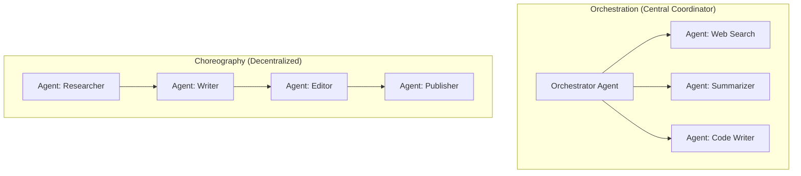

Both require A2A to work correctly at scale.

---

### 3. Difference Between MCP and A2A?

This is a very common interview question. Both are protocols in the agentic AI space but serve **fundamentally different purposes**.

| Dimension | MCP (Model Context Protocol) | A2A (Agent-to-Agent Protocol) |
|-----------|-------------------------------|-------------------------------|
| **Purpose** | Connects a model/agent to **tools and data sources** | Connects **agents to other agents** |
| **Direction** | Agent → Tool/Resource | Agent ↔ Agent |
| **Relationship** | Client-Server (agent is client, tool is server) | Peer-to-peer or hierarchical |
| **Designed by** | Anthropic (Nov 2024) | Google (Apr 2025) |
| **Focus** | Standardize tool/resource access | Standardize agent collaboration |
| **Primitives** | Resources, Tools, Prompts | Tasks, Artifacts, Messages |
| **Statefulness** | Mostly stateless per call | Stateful Tasks with lifecycle |
| **Discovery** | Tools defined in server manifest | Agent Cards in registries |
| **Primary Use** | Plug databases, APIs, files into agents | Delegate work between agents |

#### Deeper Analogy

- **MCP** is like a USB-C standard: it standardizes how a device (agent) connects to peripherals (tools/data)
- **A2A** is like an HTTP standard for internal services: it standardizes how services (agents) talk to each other

#### How They Work Together

In a production system, MCP and A2A are **complementary**:

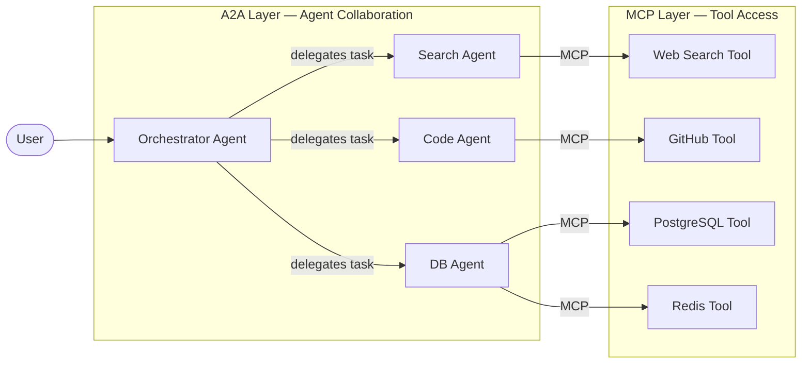

- **A2A** handles: "Hey Code Agent, please write a function for this spec"
- **MCP** handles: "Hey GitHub Tool, commit this file to this repo"

#### Key Insight for Interviews

> "MCP extends what an agent can **do** by giving it tools. A2A extends what a system can **accomplish** by enabling agents to collaborate. They solve orthogonal problems and are designed to work together."

---

### 4. Explain a Multi-Agent Collaboration Flow

Let's walk through a real-world example: **Automated Software Feature Delivery**

**Goal**: User asks: *"Add dark mode to our app and deploy it."*

#### Step-by-Step Flow

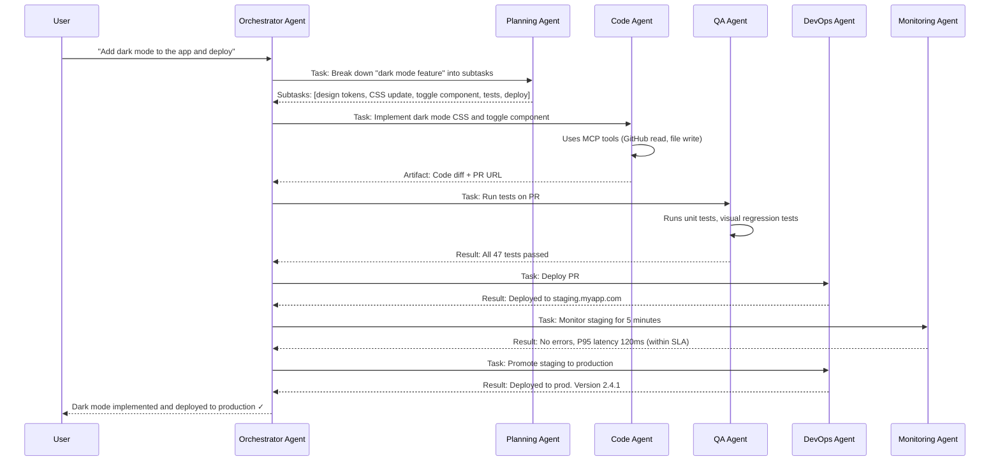

#### What's Happening Under the Hood

1. **Task Decomposition**: Orchestrator uses an LLM to break the user's request into subtasks
2. **Agent Discovery**: Orchestrator queries the agent registry to find capable agents
3. **Task Delegation**: Each task is sent as a structured `Task` object via A2A
4. **Artifact Passing**: Results (code, test reports, deployment URLs) are passed as artifacts
5. **Conditional Logic**: DevOps only deploys if QA passes
6. **Feedback Loop**: Monitoring result feeds back before final promotion

#### Task Object Structure (A2A Protocol)

```json
{
  "id": "task_abc123",
  "sessionId": "session_xyz",
  "status": { "state": "working" },
  "message": {
    "role": "user",
    "parts": [
      {
        "type": "text",
        "text": "Run tests on PR #847 in repo myapp"
      }
    ]
  },
  "artifacts": [],
  "metadata": {
    "priority": "high",
    "timeout_seconds": 300
  }
}
```

---

### 5. When Would You Use Multiple Agents?

Not every problem needs multiple agents. Here's a framework for deciding:

#### Use Multiple Agents When...

| Scenario | Reason |
|----------|--------|
| **Parallelizable work** | Different agents work on independent subtasks simultaneously |
| **Specialization needed** | Each subtask requires different tools, models, or expertise |
| **Security isolation** | Agents need different permission scopes (read-only DB agent vs. write-access deploy agent) |
| **Scale** | One agent can't handle the volume; fan out to multiple workers |
| **Long-running tasks** | Break into stages managed by specialized agents |
| **Different modalities** | Vision agent, audio agent, code agent — each specialized |
| **Reliability** | Different agents can retry independently; failures are isolated |

#### Don't Use Multiple Agents When...

- The task is simple and linear — one agent is sufficient
- Agents would spend more time coordinating than doing actual work
- The overhead of message passing and discovery outweighs benefits
- You need ultra-low latency (agent handoffs add latency)

#### Decision Framework

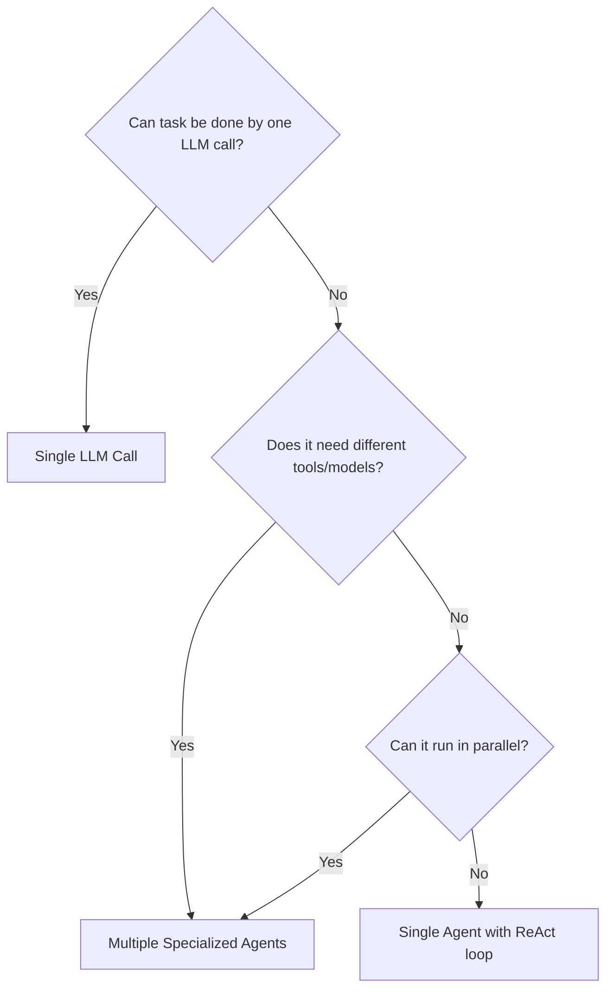

#### Real-World Example: When NOT to Use Multi-Agent

```
User: "Summarize this 500-word article"
→ Single LLM call. Adding a "SummaryAgent" is over-engineering.
```

#### Real-World Example: When to Use Multi-Agent

```
User: "Research the top 10 AI startups, analyze their financials,
       compare them, write a report, and email it to my team"
→ Research Agent (parallel web searches)
→ Financial Analysis Agent (structured data extraction)
→ Comparison Agent (cross-entity reasoning)
→ Report Writing Agent (long-form generation)
→ Email Agent (tool: SMTP/SendGrid)
```

---

## A2A Practical

---

### 1. How Do Agents Delegate Tasks?

Task delegation is the core mechanic of A2A systems. Here's how it works at a production level:

#### The Delegation Pattern

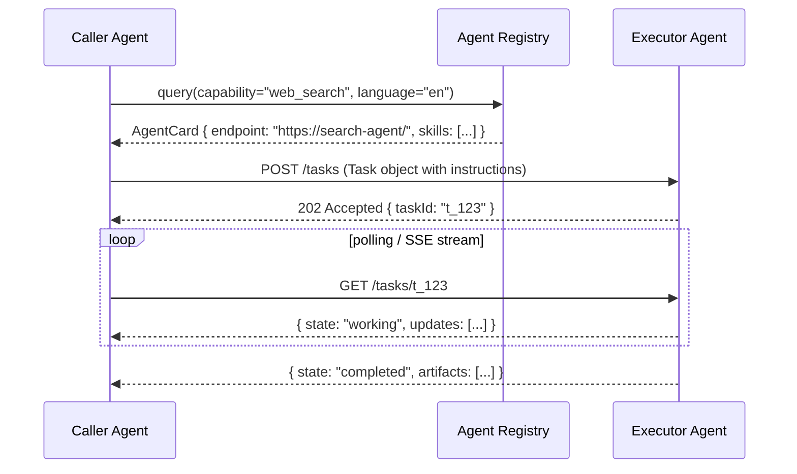

#### Synchronous Delegation

Simple request-response. Agent A blocks until Agent B responds.

```python
# Pseudocode
async def delegate_task(agent_url: str, instruction: str, context: dict):
    task = Task(
        message=Message(role="user", parts=[TextPart(text=instruction)]),
        metadata={"context": context}
    )
    response = await http_client.post(f"{agent_url}/tasks", json=task.dict())
    task_id = response.json()["id"]
    
    # Poll or stream until completion
    while True:
        status = await http_client.get(f"{agent_url}/tasks/{task_id}")
        if status.json()["state"] in ["completed", "failed", "cancelled"]:
            return status.json()
        await asyncio.sleep(1)
```

#### Asynchronous Delegation with Callbacks

For long-running tasks, use webhooks/push notifications:

```python
task = Task(
    message=...,
    metadata={
        "callback_url": "https://my-orchestrator.com/callbacks/t_123",
        "callback_auth": "Bearer eyJhbGci..."
    }
)
```

When Agent B finishes, it calls the callback URL — Agent A doesn't need to poll.

#### Delegation Best Practices

1. **Always set timeouts** — `timeout_seconds: 300`
2. **Pass task IDs** — for tracing and deduplication
3. **Include session context** — `sessionId` links related tasks
4. **Version your API** — `/v1/tasks` allows breaking changes without breaking existing agents
5. **Use idempotency keys** — prevent duplicate tasks on retry

---

### 2. How Do Agents Share Memory/Context?

Memory sharing is one of the hardest problems in multi-agent systems. There are four types of memory and multiple strategies for sharing them.

#### Types of Memory

| Type | Description | Example |
|------|-------------|---------|
| **In-context** | Current conversation/prompt window | Last 10 messages |
| **Episodic** | Past experiences, past task results | "Last time user asked X, we did Y" |
| **Semantic** | Long-term knowledge, facts | User preferences, domain knowledge |
| **Procedural** | How to do things (tool use patterns) | "Always use tool A before tool B" |

#### Memory Sharing Architecture

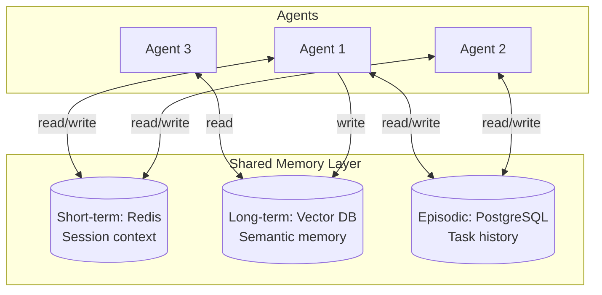

#### Strategy 1: Shared Session Store (Redis)

```python
class SharedSessionMemory:
    def __init__(self, session_id: str, redis_client):
        self.session_id = session_id
        self.redis = redis_client
        self.key = f"session:{session_id}:context"
    
    async def write(self, key: str, value: any):
        await self.redis.hset(self.key, key, json.dumps(value))
        await self.redis.expire(self.key, 3600)  # 1-hour TTL
    
    async def read(self, key: str) -> any:
        val = await self.redis.hget(self.key, key)
        return json.loads(val) if val else None
    
    async def get_full_context(self) -> dict:
        return await self.redis.hgetall(self.key)
```

All agents in a session share the same Redis hash — they can read what other agents have written.

#### Strategy 2: Artifact Passing (Structured Context)

Instead of a shared store, agents pass **artifacts** explicitly:

```json
{
  "id": "task_456",
  "message": { "parts": [{ "text": "Analyze this research summary" }] },
  "artifacts": [
    {
      "id": "art_001",
      "type": "text/plain",
      "title": "Research Summary from Agent 1",
      "content": "The study found that..."
    }
  ]
}
```

#### Strategy 3: Vector Memory for Semantic Retrieval

Long-term memory stored as embeddings, retrieved by semantic similarity:

```python
class VectorMemory:
    def store(self, agent_id: str, content: str, metadata: dict):
        embedding = embed(content)
        vector_db.upsert(
            id=f"{agent_id}:{uuid()}",
            vector=embedding,
            metadata={"agent": agent_id, "content": content, **metadata}
        )
    
    def recall(self, query: str, top_k=5) -> list[str]:
        query_vector = embed(query)
        results = vector_db.query(vector=query_vector, top_k=top_k)
        return [r.metadata["content"] for r in results]
```

#### Context Propagation Rules

1. **Immutable context**: Never let Agent B overwrite Agent A's core context
2. **Namespacing**: `agent_a.research_results` vs `agent_b.code_output`
3. **Versioning**: Context updates have timestamps
4. **TTL**: Short-term context expires; long-term is persisted

---

### 3. How Do You Prevent Duplicate Work Across Agents?

Duplicate work is a subtle but serious problem — especially when agents retry failed tasks or when multiple orchestrators run simultaneously.

#### Root Causes of Duplication

1. **Retries without idempotency** — Agent A retries a task that already completed in Agent B
2. **Race conditions** — Two orchestrators both delegate the same task
3. **Message replay** — A message queue delivers a message twice
4. **Failure recovery** — System restarts and re-runs tasks

#### Solution 1: Idempotency Keys

Every task gets a deterministic ID based on its inputs:

```python
import hashlib

def generate_task_id(instruction: str, context: dict) -> str:
    payload = json.dumps({"instruction": instruction, "context": context}, sort_keys=True)
    return "task_" + hashlib.sha256(payload.encode()).hexdigest()[:16]
```

If the same task is submitted twice, it gets the same ID. The executor checks if it already has a result for that ID.

#### Solution 2: Distributed Locking

Use Redis `SETNX` or `SET NX EX` to grab an exclusive lock before starting a task:

```python
async def execute_with_lock(task_id: str, work_fn):
    lock_key = f"task_lock:{task_id}"
    lock_acquired = await redis.set(lock_key, "locked", nx=True, ex=300)
    
    if not lock_acquired:
        # Another agent is already working on this
        return await wait_for_result(task_id)
    
    try:
        result = await work_fn()
        await store_result(task_id, result)
        return result
    finally:
        await redis.delete(lock_key)
```

#### Solution 3: Task State Machine

Track each task through a strict state machine:

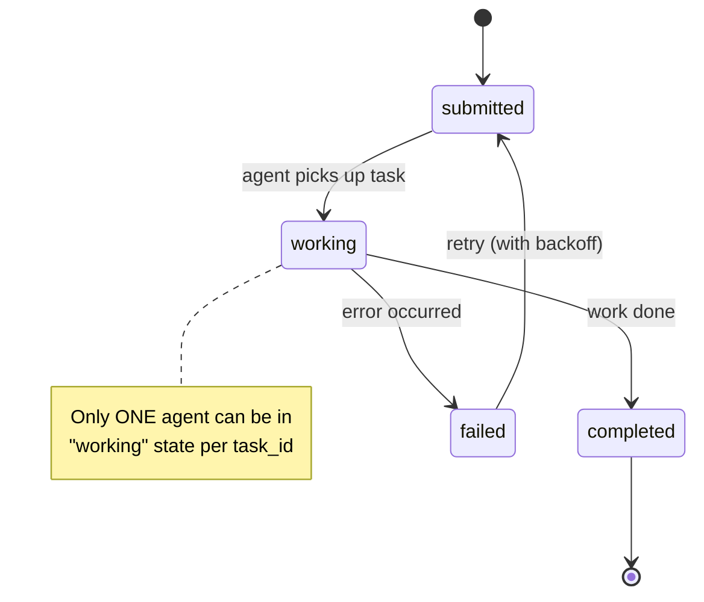

```sql
-- Atomic state transition using optimistic locking
UPDATE tasks
SET state = 'working', worker_id = $worker_id, updated_at = NOW()
WHERE id = $task_id 
  AND state = 'submitted'
  AND updated_at = $last_seen_at;
-- If 0 rows affected: another worker grabbed it first
```

#### Solution 4: Exactly-Once Message Processing

If using a message queue (Kafka, RabbitMQ, SQS):

1. **Kafka**: Use Kafka transactions + idempotent producers
2. **SQS**: Use FIFO queues with `MessageDeduplicationId`
3. **RabbitMQ**: Use consumer acknowledgments + idempotent handlers

```python
# SQS FIFO with deduplication
sqs.send_message(
    QueueUrl=QUEUE_URL,
    MessageBody=json.dumps(task),
    MessageGroupId="task-group",
    MessageDeduplicationId=task_id  # SQS deduplicates within 5 min window
)
```

---

### 4. How Do Agents Negotiate Tasks?

Negotiation in multi-agent systems happens when:
- Multiple agents are capable of the same task
- An agent needs to confirm its capacity before accepting
- Agents need to agree on a data format or protocol version

#### Capability Advertisement

Agents publish their capabilities via **Agent Cards**:

```json
{
  "name": "CodeAnalysisAgent",
  "version": "1.2.0",
  "url": "https://code-agent.internal/",
  "skills": [
    {
      "id": "analyze_python",
      "name": "Python Code Analysis",
      "description": "Static analysis and bug detection for Python code",
      "inputModes": ["text/plain", "application/json"],
      "outputModes": ["application/json"],
      "parameters": {
        "max_file_size_kb": 512,
        "supported_versions": ["3.8", "3.9", "3.10", "3.11", "3.12"]
      }
    }
  ],
  "authentication": { "type": "bearer" }
}
```

#### Bidding / Auction Pattern

For load balancing across multiple capable agents:

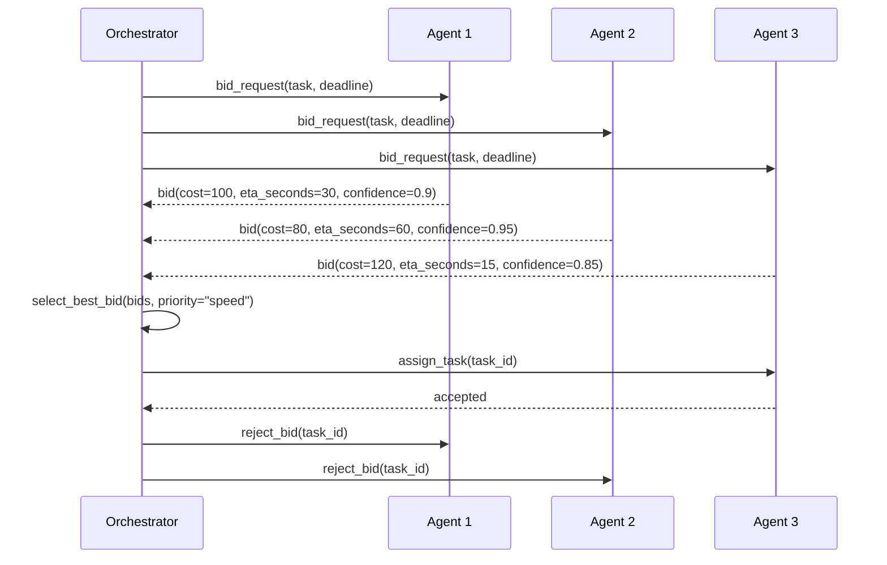

#### Capability Negotiation

When the orchestrator isn't sure if an agent can handle a task:

```python
async def negotiate_task(agent_url, task_spec):
    # Step 1: Check if agent can handle this task
    probe_response = await http.post(f"{agent_url}/tasks/check", json={
        "task_type": task_spec.type,
        "input_size_tokens": task_spec.estimated_tokens,
        "required_tools": task_spec.required_tools
    })
    
    if probe_response.json()["can_handle"]:
        # Step 2: Get capacity
        capacity = probe_response.json()["current_capacity"]
        if capacity > 0.2:  # 20% available
            return await submit_task(agent_url, task_spec)
    
    return None  # Find another agent
```

#### Protocol Version Negotiation

Like HTTP's `Accept` headers, agents negotiate data formats:

```http
POST /tasks HTTP/1.1
Content-Type: application/json
Accept: application/json
X-A2A-Protocol-Version: 1.2, 1.1, 1.0
X-Agent-Capabilities: streaming, artifacts, multimodal
```

---

### 5. How Do You Coordinate Asynchronous Agent Workflows?

Async coordination is crucial for long-running, multi-step workflows where agents run in parallel or in sequence.

#### Pattern 1: DAG-Based Workflow (Directed Acyclic Graph)

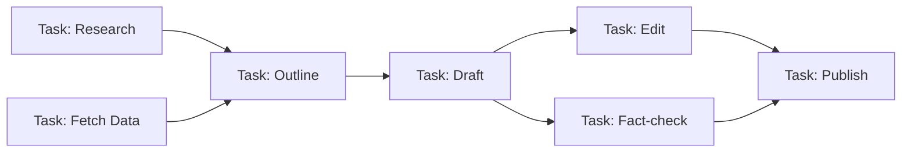

```python
class WorkflowEngine:
    def __init__(self):
        self.tasks = {}  # task_id -> Task
        self.deps = {}   # task_id -> [dep_task_ids]
        self.results = {}
    
    def add_task(self, task_id, agent, instruction, depends_on=[]):
        self.tasks[task_id] = {"agent": agent, "instruction": instruction}
        self.deps[task_id] = depends_on
    
    async def execute(self):
        # Topological sort
        order = topological_sort(self.deps)
        
        in_flight = set()
        completed = set()
        
        for batch in order:  # batch = tasks that can run in parallel
            futures = []
            for task_id in batch:
                if all(dep in completed for dep in self.deps[task_id]):
                    # Inject results from dependencies into context
                    context = {dep: self.results[dep] for dep in self.deps[task_id]}
                    futures.append(self.run_task(task_id, context))
            
            batch_results = await asyncio.gather(*futures)
            for task_id, result in zip(batch, batch_results):
                self.results[task_id] = result
                completed.add(task_id)
```

#### Pattern 2: Event-Driven via Message Queue

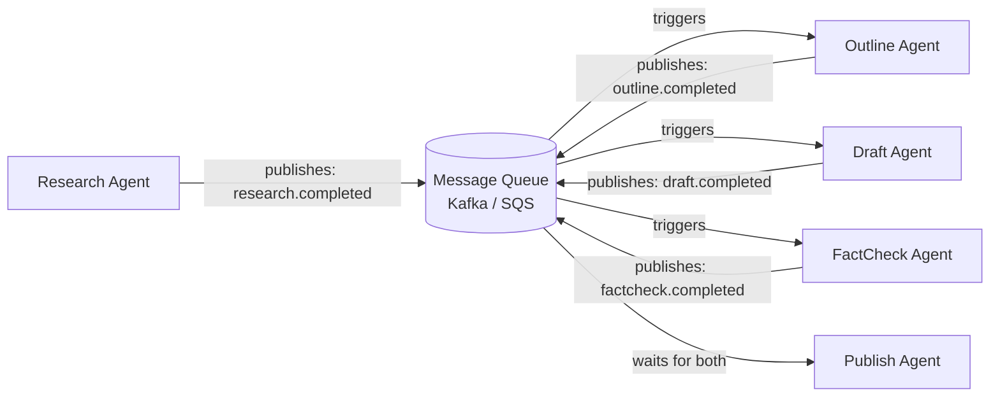

#### Pattern 3: Saga Pattern for Distributed Compensation

When a step fails mid-workflow, you need to undo previous steps:

```python
class AgentSaga:
    def __init__(self):
        self.steps = []  # (execute_fn, compensate_fn)
        self.executed = []
    
    def add_step(self, execute, compensate):
        self.steps.append((execute, compensate))
    
    async def run(self):
        for i, (execute, compensate) in enumerate(self.steps):
            try:
                result = await execute()
                self.executed.append((i, result, compensate))
            except Exception as e:
                # Roll back all previous steps in reverse order
                for _, _, comp_fn in reversed(self.executed):
                    await comp_fn()
                raise SagaFailed(f"Step {i} failed: {e}")

# Usage
saga = AgentSaga()
saga.add_step(
    execute=lambda: code_agent.generate_pr(),
    compensate=lambda: github_agent.close_pr(pr_id)
)
saga.add_step(
    execute=lambda: deploy_agent.deploy_to_staging(),
    compensate=lambda: deploy_agent.rollback_staging()
)
```

#### Pattern 4: Barrier Synchronization

Wait for multiple parallel agents before proceeding:

```python
async def parallel_with_barrier(tasks: list[Coroutine]) -> list:
    # asyncio.gather IS the barrier — wait for ALL to complete
    results = await asyncio.gather(*tasks, return_exceptions=True)
    
    # Check for failures
    failures = [r for r in results if isinstance(r, Exception)]
    if failures:
        raise WorkflowError(f"{len(failures)} agents failed: {failures}")
    
    return results
```

---

### 6. How Would You Implement Agent Discovery?

Agent discovery is how an orchestrator finds agents that can handle a specific task — similar to service discovery in microservices.

#### Option 1: Static Registry (Simple, Good for Small Systems)

```yaml
# agents_registry.yaml
agents:
  - name: WebSearchAgent
    url: https://search-agent.internal/
    capabilities: [web_search, news_search]
    max_concurrent_tasks: 10
    
  - name: CodeAgent
    url: https://code-agent.internal/
    capabilities: [python, javascript, code_review]
    max_concurrent_tasks: 5
```

```python
class StaticRegistry:
    def __init__(self, config_path: str):
        self.agents = yaml.safe_load(open(config_path))["agents"]
    
    def find(self, capability: str) -> list[dict]:
        return [a for a in self.agents if capability in a["capabilities"]]
```

#### Option 2: Dynamic Registry with Health Checks

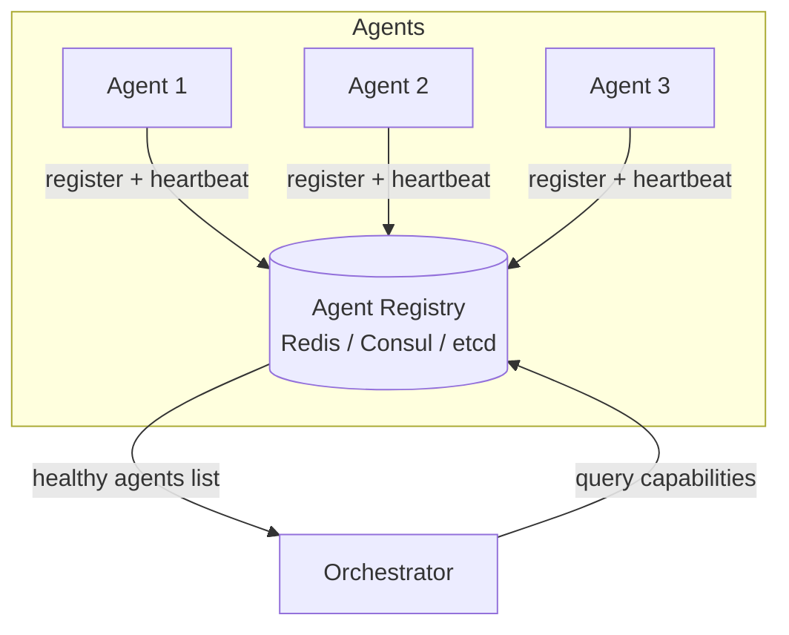

```python
class DynamicRegistry:
    def __init__(self, redis_client):
        self.redis = redis_client
    
    async def register(self, agent_card: AgentCard):
        key = f"agent:{agent_card.name}"
        await self.redis.hset(key, mapping={
            "url": agent_card.url,
            "capabilities": json.dumps(agent_card.capabilities),
            "version": agent_card.version
        })
        await self.redis.expire(key, 30)  # 30s TTL — must heartbeat to stay alive
    
    async def heartbeat(self, agent_name: str):
        await self.redis.expire(f"agent:{agent_name}", 30)
    
    async def find(self, capability: str) -> list[dict]:
        cursor = 0
        agents = []
        while True:
            cursor, keys = await self.redis.scan(cursor, "agent:*")
            for key in keys:
                agent = await self.redis.hgetall(key)
                caps = json.loads(agent["capabilities"])
                if capability in caps:
                    agents.append(agent)
            if cursor == 0:
                break
        return agents
```

#### Option 3: Agent Card via Well-Known URL

Inspired by OAuth `.well-known` endpoints. Each agent publishes its capabilities at a standardized URL:

```
GET https://my-agent.company.com/.well-known/agent.json
```

```json
{
  "name": "DatabaseQueryAgent",
  "version": "2.1.0",
  "description": "Translates natural language to SQL and executes queries",
  "url": "https://db-agent.company.com",
  "skills": [...],
  "authentication": { "type": "oauth2", "flows": {...} },
  "provider": { "organization": "ACME Corp", "contact": "ai-team@acme.com" }
}
```

Orchestrators can crawl known agent domains, or use a DNS-based registry that points to agent card URLs.

#### Option 4: Semantic Agent Discovery

Use vector embeddings to find agents by natural language capability description:

```python
class SemanticRegistry:
    def __init__(self, vector_db):
        self.vdb = vector_db
    
    def register(self, agent: AgentCard):
        # Embed the full capability description
        description = f"{agent.name}: {agent.description}. Skills: {agent.skills_summary}"
        embedding = embed(description)
        self.vdb.upsert(id=agent.name, vector=embedding, metadata=agent.to_dict())
    
    def find(self, task_description: str, top_k=3) -> list[AgentCard]:
        query_vec = embed(task_description)
        results = self.vdb.query(vector=query_vec, top_k=top_k)
        return [AgentCard.from_dict(r.metadata) for r in results]

# Usage
registry = SemanticRegistry(vector_db)
agents = registry.find("I need to analyze sentiment of customer reviews")
# Returns: SentimentAgent, TextAnalysisAgent, ReviewAgent
```

---

### 7. How Do You Manage Agent Permissions?

Agent permissions are critical for security — especially in enterprise environments where agents may have access to sensitive data, production systems, or financial operations.

#### Principle of Least Privilege

Every agent should have **only the permissions it needs** for its specific function:

| Agent | Allowed | Denied |
|-------|---------|--------|
| Research Agent | Read: web, internal docs | Write: databases, code repos |
| Code Agent | Read/Write: dev repo | Production repos, DBs |
| DB Agent | Read: analytics DB | Write access, user PII table |
| Deploy Agent | Deploy: staging env | Deploy: production (requires approval) |

#### Permission Model: Attribute-Based Access Control (ABAC)

```python
@dataclass
class AgentPermissions:
    agent_id: str
    allowed_actions: list[str]          # ["read:docs", "write:code", "execute:tests"]
    allowed_resources: list[str]        # ["repo:myapp/*", "db:analytics"]
    denied_resources: list[str]         # ["db:users.pii", "repo:*/main"]
    max_cost_per_task: float            # $5.00 max LLM cost per task
    requires_human_approval: list[str]  # ["deploy:production", "delete:*"]

class PermissionEnforcer:
    def check(self, agent_id: str, action: str, resource: str) -> bool:
        perms = self.load_permissions(agent_id)
        
        # Check explicit denies first
        if any(matches(resource, denied) for denied in perms.denied_resources):
            raise PermissionDenied(f"Agent {agent_id} denied access to {resource}")
        
        # Check allows
        if action not in perms.allowed_actions:
            raise PermissionDenied(f"Action {action} not allowed for {agent_id}")
        
        if not any(matches(resource, allowed) for allowed in perms.allowed_resources):
            raise PermissionDenied(f"Resource {resource} not in allowed list")
        
        return True
```

#### Token-Scoped Access

Each agent gets a **scoped token** that limits what it can access:

```python
# Orchestrator mints scoped tokens for sub-agents
def mint_agent_token(parent_token: str, agent_id: str, task_id: str, scopes: list[str]) -> str:
    # Scoped token inherits parent's permissions intersected with requested scopes
    parent_claims = decode_jwt(parent_token)
    agent_scopes = list(set(parent_claims["scopes"]) & set(scopes))  # Intersection only
    
    return create_jwt({
        "sub": agent_id,
        "parent": parent_claims["sub"],
        "task_id": task_id,
        "scopes": agent_scopes,
        "exp": time.time() + 3600  # 1 hour max
    })
```

#### Human-in-the-Loop for High-Risk Actions

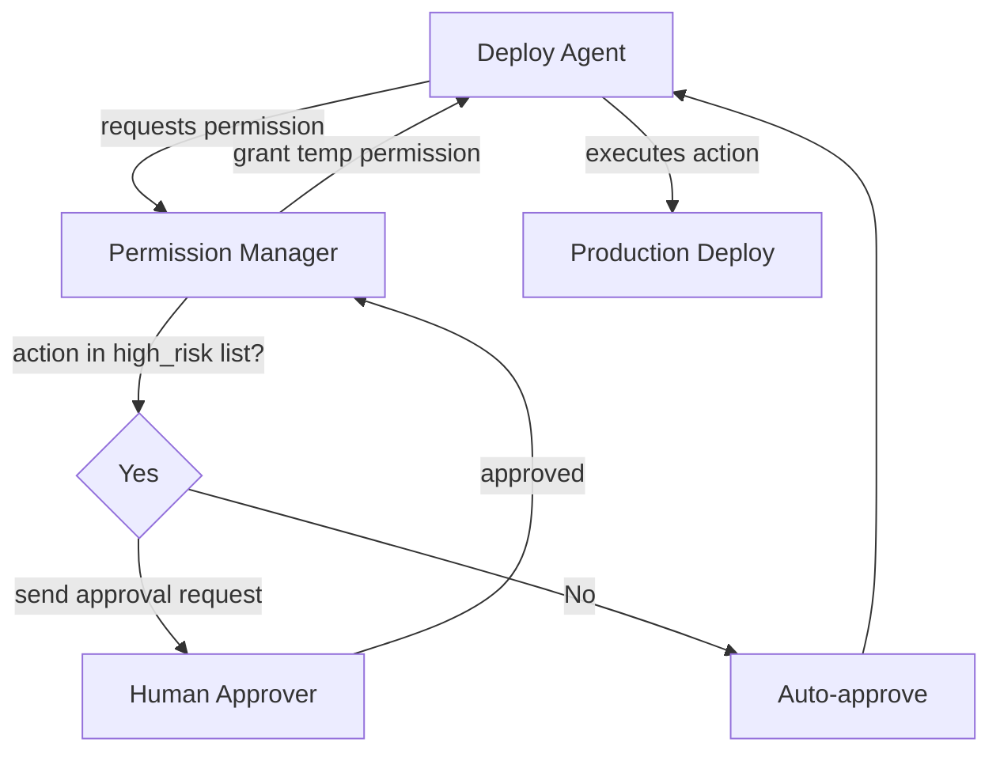

---

### 8. What Are Common Communication Patterns in A2A?

#### Pattern 1: Request-Response

The simplest pattern — one agent asks, another answers.

```
Agent A → [HTTP POST /tasks] → Agent B
Agent A ← [200 OK + result] ← Agent B
```

Use when: Task is quick (<5s), result is needed before proceeding.

#### Pattern 2: Publish-Subscribe (Event-Driven)

Agents emit events; interested agents subscribe.

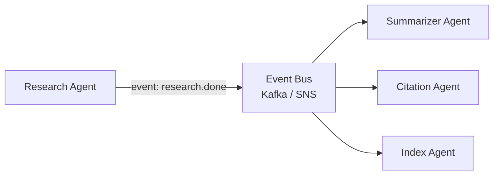

Use when: Multiple agents need to react to the same event; loose coupling desired.

#### Pattern 3: Pipeline / Chain

Output of one agent is the input to the next.

```
Web Search Agent → Summary Agent → Translation Agent → User
```

Use when: Sequential processing, each step transforms data.

#### Pattern 4: Fan-Out / Fan-In (Map-Reduce)

One orchestrator fans out work to many agents, collects results.

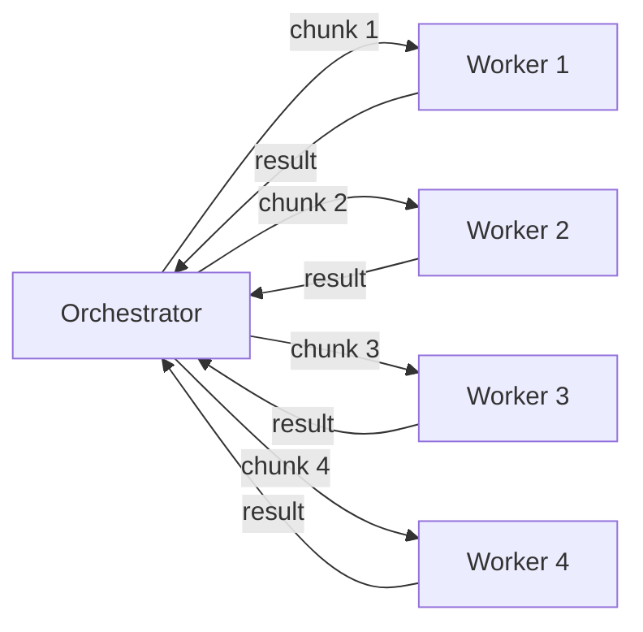

Use when: Large tasks can be parallelized (e.g., processing 1000 documents).

#### Pattern 5: Hierarchical Delegation

Multi-level agent trees:

```
CEO Agent → CTO Agent → Engineering Lead Agent → Dev Agent
                     → QA Lead Agent → QA Agent
          → CFO Agent → Budget Agent
```

#### Pattern 6: Streaming (SSE / WebSocket)

Agent B streams partial results back to Agent A in real-time.

```python
# Server-Sent Events streaming
async def stream_task_updates(task_id: str):
    async with aiohttp.ClientSession() as session:
        async with session.get(f"{agent_url}/tasks/{task_id}/stream") as resp:
            async for line in resp.content:
                if line.startswith(b"data:"):
                    event = json.loads(line[5:])
                    yield event
                    if event["state"] in ["completed", "failed"]:
                        break
```

---

### 9. How Do You Handle Failures Between Agents?

Distributed agent systems fail in interesting ways. Here's a comprehensive failure handling strategy:

#### Failure Taxonomy

| Failure Type | Example | Strategy |
|-------------|---------|----------|
| **Network timeout** | Agent B doesn't respond | Retry with exponential backoff |
| **Agent crash** | Agent B process dies mid-task | Resume from checkpoint |
| **Bad output** | Agent B returns malformed JSON | Output validation + retry with feedback |
| **Hallucination** | Agent B returns incorrect data | Cross-validation with another agent |
| **Capacity exceeded** | Agent B is at 100% capacity | Circuit breaker + fallback agent |
| **Auth failure** | Token expired mid-task | Token refresh + retry |
| **Cascading failure** | Agent B fails → Agent A fails → Workflow fails | Bulkheads + fallback |

#### Retry with Exponential Backoff

```python
import asyncio
from tenacity import retry, stop_after_attempt, wait_exponential, retry_if_exception_type

@retry(
    stop=stop_after_attempt(3),
    wait=wait_exponential(multiplier=1, min=1, max=30),
    retry=retry_if_exception_type((TimeoutError, NetworkError)),
    reraise=True
)
async def call_agent(agent_url: str, task: Task) -> TaskResult:
    async with asyncio.timeout(30):  # 30s per attempt
        response = await http_client.post(f"{agent_url}/tasks", json=task.dict())
        response.raise_for_status()
        return TaskResult(**response.json())
```

#### Circuit Breaker Pattern

Prevent hammering a failing agent:

```python
class CircuitBreaker:
    def __init__(self, failure_threshold=5, recovery_timeout=60):
        self.failures = 0
        self.threshold = failure_threshold
        self.recovery_timeout = recovery_timeout
        self.state = "closed"  # closed=normal, open=failing, half-open=testing
        self.last_failure_time = None
    
    async def call(self, fn):
        if self.state == "open":
            if time.time() - self.last_failure_time > self.recovery_timeout:
                self.state = "half-open"
            else:
                raise CircuitOpenError("Agent circuit breaker is open")
        
        try:
            result = await fn()
            if self.state == "half-open":
                self.reset()
            return result
        except Exception as e:
            self.record_failure()
            raise
    
    def record_failure(self):
        self.failures += 1
        self.last_failure_time = time.time()
        if self.failures >= self.threshold:
            self.state = "open"
    
    def reset(self):
        self.failures = 0
        self.state = "closed"
```

#### Fallback Agents

Always have a fallback for critical agent capabilities:

```python
async def execute_with_fallback(task, primary_agent, fallback_agent):
    try:
        return await primary_agent.execute(task)
    except (AgentUnavailable, CircuitOpenError) as e:
        logger.warning(f"Primary agent failed: {e}. Using fallback.")
        return await fallback_agent.execute(task)
```

#### Dead Letter Queue for Unrecoverable Tasks

```python
async def process_task(task):
    max_attempts = 3
    for attempt in range(max_attempts):
        try:
            return await execute_task(task)
        except Exception as e:
            if attempt == max_attempts - 1:
                # Send to DLQ for manual inspection
                await dead_letter_queue.send({
                    "task": task.dict(),
                    "error": str(e),
                    "failed_at": datetime.utcnow().isoformat(),
                    "attempts": max_attempts
                })
                raise
            await asyncio.sleep(2 ** attempt)
```

---

### 10. How Do You Track Distributed Agent Workflows?

Observability is critical. Without it, debugging a 10-agent workflow is nearly impossible.

#### The Three Pillars of Observability

1. **Logs** — What happened (structured JSON logs)
2. **Metrics** — How fast / how much (Prometheus/Grafana)
3. **Traces** — Why it happened (distributed tracing with OpenTelemetry)

#### Distributed Tracing with OpenTelemetry

Every task gets a `trace_id` that propagates through the entire workflow:

```python
from opentelemetry import trace
from opentelemetry.propagate import inject, extract

tracer = trace.get_tracer("agent.tracer")

async def delegate_task(agent_url: str, task: Task, parent_context=None):
    with tracer.start_as_current_span(
        "delegate_task",
        context=parent_context,
        attributes={
            "agent.url": agent_url,
            "task.id": task.id,
            "task.type": task.type,
        }
    ) as span:
        # Inject trace context into HTTP headers
        headers = {}
        inject(headers)
        
        try:
            response = await http_client.post(
                f"{agent_url}/tasks",
                json=task.dict(),
                headers=headers
            )
            span.set_attribute("task.result_status", response.status_code)
            return response.json()
        except Exception as e:
            span.record_exception(e)
            span.set_status(trace.Status(trace.StatusCode.ERROR))
            raise
```

The trace then looks like:

```
Trace: session_abc123 (total: 45.2s)
├─ Orchestrator.plan_workflow (0.8s)
├─ ResearchAgent.execute (12.1s)
│  ├─ WebSearchTool.search (3.2s)
│  ├─ WebSearchTool.search (2.9s)
│  └─ LLM.summarize (6.0s)
├─ CodeAgent.execute (18.4s)
│  ├─ GitHubTool.read_files (1.1s)
│  ├─ LLM.generate_code (15.2s)
│  └─ GitHubTool.create_pr (2.1s)
└─ QAAgent.execute (14.7s)
   ├─ TestRunner.run (12.0s)
   └─ LLM.analyze_results (2.7s)
```

#### Structured Logging Standard

Every agent logs in a consistent format:

```json
{
  "timestamp": "2025-05-23T01:22:45Z",
  "level": "INFO",
  "trace_id": "abc123def456",
  "span_id": "789xyz",
  "agent_id": "code-agent-v2",
  "task_id": "task_abc123",
  "session_id": "session_xyz",
  "event": "task_completed",
  "duration_ms": 18400,
  "token_usage": { "prompt": 2341, "completion": 876 },
  "cost_usd": 0.047
}
```

#### Workflow Dashboard (Metrics to Track)

| Metric | Description | Alert Threshold |
|--------|-------------|-----------------|
| `workflow.completion_rate` | % of workflows completing successfully | < 95% |
| `agent.task_duration_p99` | 99th percentile task duration | > 60s |
| `agent.error_rate` | Errors per agent per minute | > 5% |
| `agent.queue_depth` | Tasks waiting to be processed | > 100 |
| `agent.cost_per_workflow` | Total LLM cost per workflow | > $1.00 |
| `agent.token_usage` | Tokens consumed per agent | > 100k/min |

---

# Part 2 — RAG (Retrieval-Augmented Generation)

---

## RAG Basics

---

### 1. What is RAG?

**RAG (Retrieval-Augmented Generation)** is an AI architecture pattern that enhances LLM responses by retrieving relevant information from an external knowledge base at query time, and including that information in the prompt before generating a response.

**Without RAG:**
```
User: "What was our Q3 revenue?"
LLM: "I don't have access to your company's financial data." 
     OR worse: hallucinates a number
```

**With RAG:**
```
User: "What was our Q3 revenue?"
→ System retrieves: Q3 earnings report document (PDF)
→ LLM reads retrieved content
→ LLM: "Based on your Q3 earnings report, revenue was $42.3M, 
         up 18% YoY, driven by enterprise subscriptions."
```

#### The Core Insight

LLMs have two fundamental limitations:
1. **Knowledge cutoff** — They only know what they saw in training
2. **Context window** — They can't store your entire knowledge base in memory

RAG solves both by treating the LLM as a **reasoning engine** rather than a **knowledge store**. The knowledge lives externally; the LLM handles reasoning and synthesis.

#### RAG vs. Raw LLM

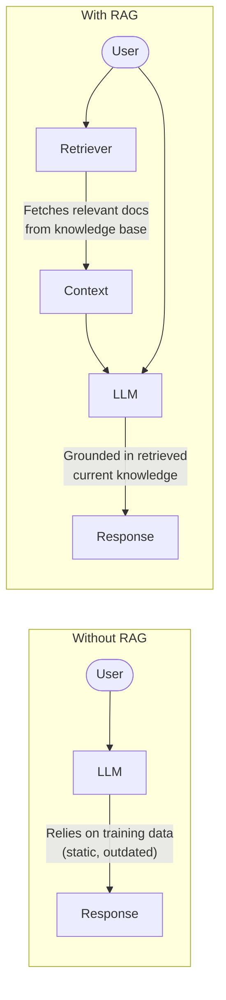

---

### 2. Why is RAG Needed?

#### Problem 1: Hallucination

LLMs confidently generate plausible-sounding but incorrect information. RAG grounds the model in actual documents, dramatically reducing hallucination on factual questions.

#### Problem 2: Outdated Knowledge

GPT-4's training cutoff is April 2023. RAG systems can incorporate documents updated yesterday.

#### Problem 3: Private/Proprietary Data

LLMs are trained on public internet data. Your company's internal documentation, customer data, proprietary research — LLMs know none of this. RAG is the standard way to inject this knowledge.

#### Problem 4: Context Window Limits

Even with 128k or 200k context windows, you can't fit:
- An entire company's knowledge base
- Years of customer support tickets  
- A complete codebase with all docs

RAG retrieves only the relevant subset.

#### Problem 5: Attribution and Verifiability

RAG enables **citations** — you can show users exactly which documents the answer came from, enabling verification. This is essential in regulated industries (healthcare, finance, law).

#### When RAG Is the Right Choice

| Scenario | RAG? |
|----------|------|
| Answer questions about internal company docs | ✅ Yes |
| Keep answers current (real-time knowledge) | ✅ Yes |
| Private/proprietary data | ✅ Yes |
| Need source attribution | ✅ Yes |
| General world knowledge questions | ❌ Fine-tuning or base LLM |
| Change model behavior/tone | ❌ Fine-tuning |
| Teach model a new language/domain syntax | ❌ Fine-tuning |

---

### 3. Difference Between Fine-Tuning and RAG?

This is a classic interview question. Most engineers conflate the two.

| Dimension | RAG | Fine-Tuning |
|-----------|-----|-------------|
| **What it changes** | What the model *knows at query time* | What the model *learned permanently* |
| **Data freshness** | Real-time (update docs anytime) | Requires retraining (expensive) |
| **Cost** | Low (retrieval infra) | High (GPU training hours) |
| **Time to update** | Minutes (re-index docs) | Days to weeks (retrain + evaluate) |
| **Interpretability** | High (shows source docs) | Low (black box) |
| **Hallucination risk** | Lower (grounded in docs) | Higher (bakes in model weights) |
| **Best for** | Factual Q&A, dynamic data | Style, format, behavior changes |
| **Examples** | Internal KB Q&A, support bots | Customer support tone, code style |

#### The Important Nuance

Fine-tuning teaches a model **how to reason or behave** in a certain way.
RAG teaches a model **what facts to use** when reasoning.

**Analogy**: 
- Fine-tuning is like giving someone a college education in law
- RAG is like giving a lawyer the specific case files for today's hearing

#### When to Combine Both

Use **both** when you need:
1. **Domain-specific reasoning style** (fine-tune): e.g., medical terminology, legal citation format
2. **Current factual knowledge** (RAG): e.g., today's drug database, this week's case law

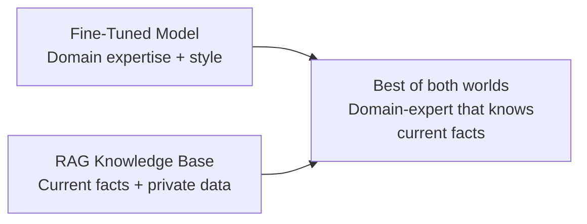

---

### 4. Explain the RAG Pipeline End-to-End

#### Offline Phase (Indexing)

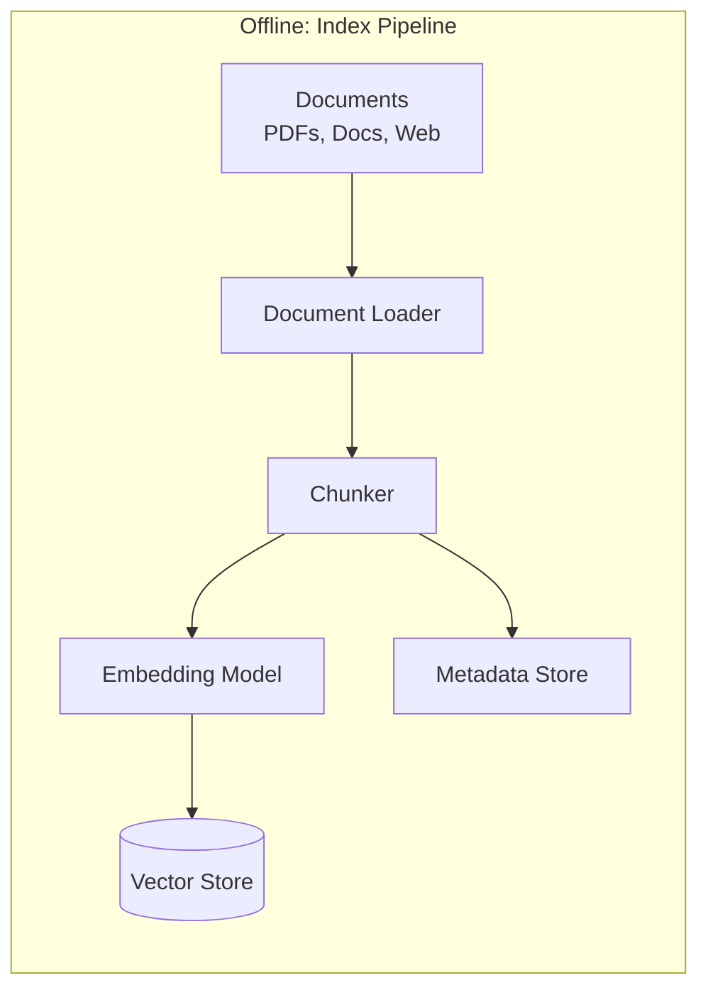

1. **Load** documents from various sources (PDF, web, database)
2. **Chunk** documents into manageable pieces
3. **Embed** each chunk using an embedding model
4. **Store** embeddings + text in a vector database

#### Online Phase (Query)

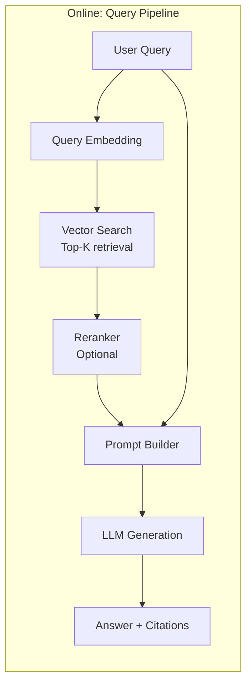

1. **Embed** the user's query using the same embedding model
2. **Retrieve** top-K most similar chunks from the vector store
3. **Rerank** (optional) — use a cross-encoder to re-score retrieved chunks
4. **Build prompt** — inject retrieved context into the prompt template
5. **Generate** — LLM reads context + question and produces grounded answer
6. **Return** answer with source citations

#### Full Code Example

```python
class RAGPipeline:
    def __init__(self, vector_db, embedding_model, llm, reranker=None):
        self.vdb = vector_db
        self.embedder = embedding_model
        self.llm = llm
        self.reranker = reranker
    
    # OFFLINE: Index documents
    def index(self, documents: list[Document]):
        for doc in documents:
            chunks = self.chunk_document(doc)
            for chunk in chunks:
                embedding = self.embedder.embed(chunk.text)
                self.vdb.upsert(
                    id=chunk.id,
                    vector=embedding,
                    metadata={
                        "text": chunk.text,
                        "source": doc.source,
                        "page": chunk.page,
                        "created_at": doc.created_at
                    }
                )
    
    # ONLINE: Answer queries
    def query(self, user_question: str, top_k: int = 5) -> RAGResponse:
        # Step 1: Embed query
        query_embedding = self.embedder.embed(user_question)
        
        # Step 2: Retrieve top-K chunks
        results = self.vdb.query(vector=query_embedding, top_k=top_k * 2)
        
        # Step 3: Rerank
        if self.reranker:
            results = self.reranker.rerank(user_question, results, top_n=top_k)
        else:
            results = results[:top_k]
        
        # Step 4: Build prompt
        context = "\n\n".join([
            f"[Source: {r.metadata['source']}, Page {r.metadata['page']}]\n{r.metadata['text']}"
            for r in results
        ])
        
        prompt = f"""You are a helpful assistant. Answer the question based ONLY on the provided context.
If the context doesn't contain the answer, say "I don't have information about that."

Context:
{context}

Question: {user_question}

Answer:"""
        
        # Step 5: Generate
        answer = self.llm.generate(prompt)
        
        return RAGResponse(
            answer=answer,
            sources=[r.metadata["source"] for r in results],
            retrieved_chunks=[r.metadata["text"] for r in results]
        )
```

---

### 5. What Are Embeddings?

**Embeddings** are dense numerical vector representations of text (or other data) that capture semantic meaning. Similar texts have vectors that are geometrically close to each other in high-dimensional space.

#### Intuition

```
"The dog barked at the mailman"    → [0.23, -0.45, 0.87, ...]  (768 dims)
"The canine howled at the postman" → [0.25, -0.43, 0.85, ...]  (very similar!)
"The stock market crashed today"   → [0.91, 0.12, -0.33, ...]  (very different)
```

The model has learned that "dog" ≈ "canine" and "mailman" ≈ "postman" — even though they're different words.

#### How Embeddings Are Created

Modern embedding models (like `text-embedding-3-large`, `bge-large`, `E5`) are transformer models trained with **contrastive learning**:

- Positive pairs (semantically similar texts) → trained to have **close** vectors
- Negative pairs (semantically different texts) → trained to have **distant** vectors

Training objective (simplified):
```
minimize distance(embed(text_A), embed(text_B_similar))
maximize distance(embed(text_A), embed(text_C_different))
```

#### Embedding Properties

| Property | Description |
|----------|-------------|
| **Dimensionality** | 256 to 3072 dimensions (more = richer but more expensive) |
| **Fixed-length** | No matter input length, output is always the same size |
| **Semantic similarity** | Cosine similarity measures semantic closeness |
| **Contextual** | The same word has different embeddings in different contexts |
| **Cross-lingual** | Multilingual models produce similar vectors across languages |

#### Practical Embedding Sizes

| Model | Dimensions | Use Case |
|-------|-----------|----------|
| `text-embedding-3-small` (OpenAI) | 1536 | Cost-efficient |
| `text-embedding-3-large` (OpenAI) | 3072 | High accuracy |
| `bge-large-en` (BGE) | 1024 | Open-source, high quality |
| `e5-mistral-7b` (Microsoft) | 4096 | State-of-the-art open |
| `nomic-embed-text` | 768 | Efficient, good quality |

---

## Chunking & Retrieval

---

### 1. How Do You Chunk Documents?

Chunking is one of the most impactful decisions in a RAG system. Poor chunking = poor retrieval, regardless of how good your embedding model is.

#### Why Chunking Matters

LLMs and embedding models have token limits. A 500-page PDF can't fit in one embedding. Chunking breaks it into pieces, each of which gets its own embedding.

#### Chunking Strategies

**1. Fixed-Size Chunking**

Split by a fixed number of tokens/characters:

```python
def fixed_size_chunk(text: str, chunk_size: int = 512, overlap: int = 50) -> list[str]:
    tokens = tokenize(text)
    chunks = []
    for i in range(0, len(tokens), chunk_size - overlap):
        chunk = detokenize(tokens[i:i + chunk_size])
        chunks.append(chunk)
    return chunks
```

- ✅ Simple, predictable
- ❌ May split sentences/ideas mid-thought

**2. Recursive Character Splitting**

Try to split at natural boundaries (paragraphs > sentences > words):

```python
separators = ["\n\n", "\n", ". ", " ", ""]
# Try "\n\n" first. If still too big, try "\n". Etc.
```

LangChain's `RecursiveCharacterTextSplitter` does this well.

**3. Semantic Chunking**

Split where the **semantic content changes significantly**:

```python
def semantic_chunk(sentences: list[str], threshold: float = 0.7) -> list[str]:
    chunks = []
    current_chunk = [sentences[0]]
    
    for i in range(1, len(sentences)):
        prev_embedding = embed(sentences[i-1])
        curr_embedding = embed(sentences[i])
        similarity = cosine_similarity(prev_embedding, curr_embedding)
        
        if similarity < threshold:
            # Topic changed — start new chunk
            chunks.append(" ".join(current_chunk))
            current_chunk = [sentences[i]]
        else:
            current_chunk.append(sentences[i])
    
    chunks.append(" ".join(current_chunk))
    return chunks
```

- ✅ Chunks contain coherent topics
- ❌ More expensive (requires embedding every sentence)

**4. Document-Structure-Aware Chunking**

Use document structure (headers, sections, tables):

```python
# For Markdown/HTML documents
def structure_aware_chunk(markdown_text: str) -> list[Chunk]:
    sections = split_by_headers(markdown_text)  # Split at # ## ### etc.
    chunks = []
    for section in sections:
        if len(section.content) <= MAX_CHUNK_TOKENS:
            chunks.append(Chunk(
                text=section.content,
                metadata={"header": section.header, "level": section.level}
            ))
        else:
            # Large sections: split into sub-chunks
            sub_chunks = recursive_split(section.content)
            for sub in sub_chunks:
                chunks.append(Chunk(
                    text=sub,
                    metadata={"header": section.header, "level": section.level}
                ))
    return chunks
```

**5. Proposition Chunking**

Extract atomic, self-contained factual propositions:

```
Original: "Paris, the capital of France, has a population of 2.1 million people 
           and is home to the Eiffel Tower, built in 1889."

→ Proposition 1: "Paris is the capital of France."
→ Proposition 2: "Paris has a population of 2.1 million people."  
→ Proposition 3: "The Eiffel Tower is in Paris."
→ Proposition 4: "The Eiffel Tower was built in 1889."
```

Each proposition gets its own embedding. Very high precision retrieval. Expensive (requires LLM to extract propositions).

---

### 2. What Chunk Size Works Best?

There is no universal "best" chunk size — it depends on your use case.

#### General Guidelines

| Use Case | Recommended Chunk Size |
|----------|------------------------|
| FAQ / Short Q&A | 128–256 tokens |
| Technical documentation | 512–768 tokens |
| Long-form content (books, reports) | 512–1024 tokens |
| Legal/medical (precise passages) | 256–512 tokens |
| Code | Function-level (variable) |

#### The Trade-Off

```
Small chunks (< 256 tokens)
├── ✅ High precision (retrieved chunk closely matches query)
└── ❌ Low recall (chunk may lack context to answer the question)

Large chunks (> 1024 tokens)
├── ✅ High recall (more information per chunk)
└── ❌ Low precision (much irrelevant content in each chunk)
         Also: hits embedding model token limits
```

#### The "Parent-Child" Chunking Strategy (Best of Both)

Index **small chunks** for precise retrieval, but **retrieve the parent chunk** (or surrounding context) for the LLM:

```python
class ParentChildChunker:
    def index(self, document: Document):
        # Create parent chunks (512 tokens)
        parent_chunks = split(document.text, size=512)
        
        for i, parent in enumerate(parent_chunks):
            parent_id = f"{document.id}_parent_{i}"
            
            # Create child chunks (128 tokens) within each parent
            child_chunks = split(parent, size=128)
            
            for j, child in enumerate(child_chunks):
                child_id = f"{parent_id}_child_{j}"
                embedding = embed(child)
                
                # Index child embedding, but store parent_id reference
                vector_db.upsert(
                    id=child_id,
                    vector=embedding,
                    metadata={
                        "text": child,          # child text for search
                        "parent_id": parent_id, # reference to parent
                        "parent_text": parent   # full context for LLM
                    }
                )
    
    def query(self, question: str) -> list[str]:
        query_vec = embed(question)
        child_results = vector_db.query(query_vec, top_k=5)
        
        # Deduplicate and return PARENT texts to LLM
        seen_parents = set()
        parent_texts = []
        for r in child_results:
            parent_id = r.metadata["parent_id"]
            if parent_id not in seen_parents:
                parent_texts.append(r.metadata["parent_text"])
                seen_parents.add(parent_id)
        
        return parent_texts
```

---

### 3. Overlapping Chunks vs Non-Overlapping?

#### Without Overlap (Non-Overlapping)

```
Document: [-----chunk1-----][-----chunk2-----][-----chunk3-----]
```

Problem: If a key sentence straddles the boundary between chunk1 and chunk2, it might be split in a way that makes neither chunk fully retrievable.

#### With Overlap

```
Document: [--chunk1--][--chunk2--][--chunk3--]
                 [--overlap--]        [--overlap--]
```

```python
# 512-token chunks with 100-token overlap
chunk1 = tokens[0:512]
chunk2 = tokens[412:924]    # starts 100 tokens before chunk1 ends
chunk3 = tokens[824:1336]   # etc.
```

**Benefits of Overlap:**
- Preserves context at chunk boundaries
- A sentence split across chunks will be fully contained in the overlapping chunk
- Better retrieval for queries about boundary content

**Costs:**
- More chunks to store and embed
- Higher storage and query cost
- Duplicate content in retrieved results (need to deduplicate)

**Rule of thumb:** Use 10-20% overlap (e.g., 50-100 tokens for 512-token chunks).

---

### 4. What is Semantic Search?

**Semantic search** finds documents based on **meaning**, not keyword matching. It uses embeddings + vector similarity to understand intent.

#### Classic vs. Semantic Search

```
Query: "How do I fix a broken arm?"

Keyword search returns:
→ "How to repair a broken robotic arm" (has exact words)
→ "Arm wrestling techniques" (has "arm")

Semantic search returns:
→ "Treatment options for fractured bones" (correct meaning!)
→ "Orthopedic care for upper limb injuries" (correct meaning!)
```

#### How Semantic Search Works

```mermaid
flowchart LR
    Q[Query:\n"fix a broken arm"] --> QE[Embed query\nq_vec = embed(Q)]
    QE --> SIM[Cosine similarity\nsim(q_vec, each doc_vec)]
    SIM --> RANK[Rank by similarity\nTop-K results]
    RANK --> DOCS[Relevant Documents]
```

1. Query is converted to an embedding vector
2. This vector is compared against all document embeddings
3. Documents with highest cosine similarity are returned

#### Why It Works

The embedding space captures semantic relationships:
- "fix" ≈ "treat" ≈ "repair" ≈ "heal"
- "broken arm" ≈ "fractured limb" ≈ "bone injury"

Documents about bone treatment will be geometrically close to queries about fixing arms.

---

### 5. Difference Between Keyword Search and Vector Search?

| Dimension | Keyword Search (BM25) | Vector Search |
|-----------|----------------------|---------------|
| **How it works** | Exact term matching + TF-IDF | Semantic similarity via embeddings |
| **Handles synonyms** | ❌ No (must specify) | ✅ Yes (learned) |
| **Handles typos** | ❌ Partial (fuzzy search) | ✅ Better (embedding is robust) |
| **Handles abbreviations** | ❌ No | ✅ Often yes |
| **Cross-lingual** | ❌ No | ✅ With multilingual models |
| **Exact term recall** | ✅ Very high | ❌ Can miss exact matches |
| **Speed** | Very fast (inverted index) | Slower (ANN search) |
| **Interpretability** | ✅ Easy to understand why doc returned | ❌ Black box |
| **Domain names, IDs** | ✅ Perfect for exact codes | ❌ Bad (codes don't embed well) |
| **Infrastructure** | Elasticsearch, Solr | Pinecone, Weaviate, pgvector |

#### Critical Insight for Production

Neither is universally better. **Hybrid search** (combining both) almost always outperforms either alone.

---

### 6. What is Hybrid Search?

**Hybrid search** combines keyword search (BM25) and vector search results, then merges them using a fusion strategy.

#### Why Hybrid?

| Query Type | Best Search |
|-----------|-------------|
| `"What is photosynthesis?"` | Vector (semantic) |
| `"RFC-7231 section 4.3.5"` | Keyword (exact) |
| `"error code E1205 in pump model XR-7"` | Keyword |
| `"How does the heart pump blood?"` | Vector |
| `"Einstein's special theory of relativity explained simply"` | Both (semantic meaning + exact terms) |

#### Hybrid Architecture

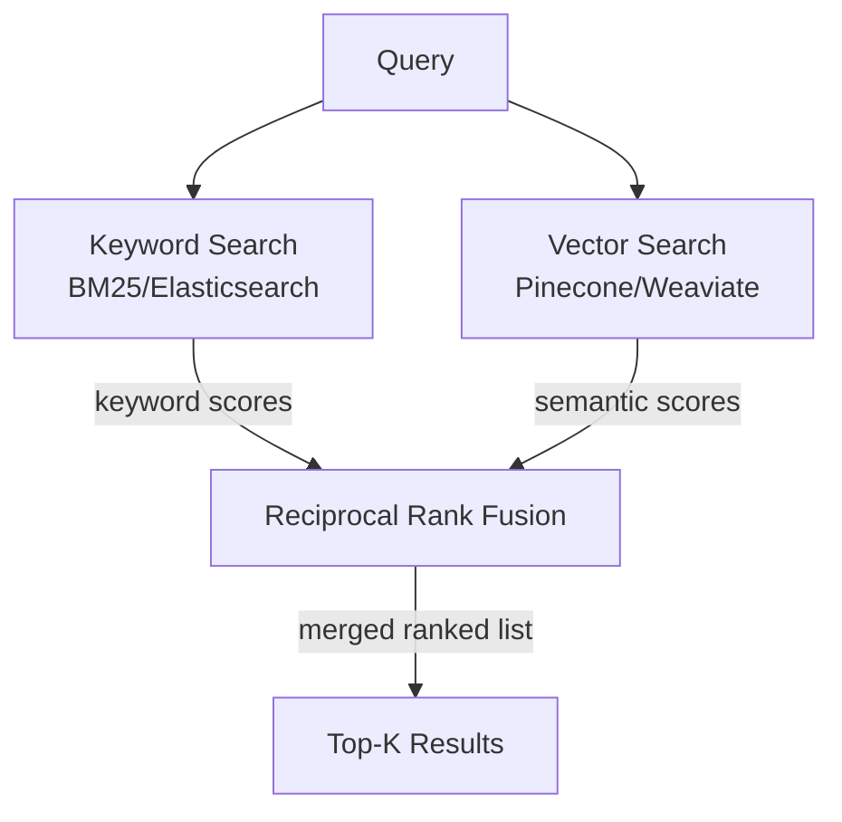

#### Reciprocal Rank Fusion (RRF)

The standard algorithm for merging ranked lists:

```python
def reciprocal_rank_fusion(
    keyword_results: list[str],
    vector_results: list[str],
    k: int = 60,
    alpha: float = 0.5  # weight for vector results
) -> list[str]:
    """
    Each document's score = sum of 1/(rank + k) across all result lists
    k=60 is the standard constant that prevents over-emphasis on top ranks
    """
    scores = {}
    
    for rank, doc_id in enumerate(keyword_results):
        scores[doc_id] = scores.get(doc_id, 0) + (1 - alpha) / (rank + k)
    
    for rank, doc_id in enumerate(vector_results):
        scores[doc_id] = scores.get(doc_id, 0) + alpha / (rank + k)
    
    return sorted(scores.keys(), key=lambda x: scores[x], reverse=True)
```

Weaviate, Qdrant, and Elasticsearch all support hybrid search natively.

---

### 7. What is Reranking?

**Reranking** is a second-stage retrieval pass that uses a more powerful (but slower) model to re-score retrieved chunks before passing them to the LLM.

#### Why Reranking?

Vector search uses **bi-encoders**: query and document are embedded independently. This is fast but less accurate.

Reranking uses **cross-encoders**: query and document are processed **together**, allowing attention across both. Much more accurate but too slow to run on the full corpus.

```mermaid
flowchart LR
    Q[Query] --> VDB[Vector Search\nTop 50 chunks\nfast bi-encoder]
    VDB --> RERANK[Cross-Encoder Reranker\nScore all 50 chunks\nagainst query]
    RERANK --> TOP5[Top 5 chunks\nhigh precision]
    TOP5 --> LLM[LLM Prompt]
```

#### The Two-Stage Strategy

```
Stage 1 (Recall): Vector search returns top 50 candidates quickly
Stage 2 (Precision): Cross-encoder reranks 50 → top 5 accurately
```

This gives you the **speed of vector search** with the **accuracy of cross-encoders**.

#### Popular Reranking Models

| Model | Type | Notes |
|-------|------|-------|
| Cohere Rerank | API | Best quality, easy to use |
| `bge-reranker-v2-m3` | Open source | High quality, multilingual |
| `ms-marco-MiniLM-L-12-v2` | Open source | Fast, good quality |
| Jina Reranker | API | Supports long context |

```python
import cohere

co = cohere.Client(api_key)

def rerank(query: str, documents: list[str], top_n: int = 5) -> list[str]:
    results = co.rerank(
        model="rerank-english-v3.0",
        query=query,
        documents=documents,
        top_n=top_n
    )
    return [documents[r.index] for r in results.results]
```

---

### 8. What Embedding Models Have You Used?

Here's a production-informed breakdown:

#### OpenAI

```python
from openai import OpenAI

client = OpenAI()
response = client.embeddings.create(
    input="Your text here",
    model="text-embedding-3-large"  # or text-embedding-3-small
)
embedding = response.data[0].embedding  # 3072-dim list
```

- `text-embedding-3-large`: 3072 dims, best quality, $0.00013/1K tokens
- `text-embedding-3-small`: 1536 dims, 5x cheaper, still very good
- Support **Matryoshka** embeddings: can truncate to smaller dims without re-embedding

#### Open Source Models (via HuggingFace + sentence-transformers)

```python
from sentence_transformers import SentenceTransformer

model = SentenceTransformer("BAAI/bge-large-en-v1.5")
embeddings = model.encode(["sentence 1", "sentence 2"])
```

| Model | Dims | MTEB Score | Best For |
|-------|------|-----------|---------|
| `BAAI/bge-large-en-v1.5` | 1024 | 63.5 | English, top open-source |
| `intfloat/e5-large-v2` | 1024 | 62.2 | Strong general purpose |
| `nomic-ai/nomic-embed-text-v1.5` | 768 | 62.3 | Efficient, long context |
| `Alibaba-NLP/gte-Qwen2-7B` | 3584 | 70.2 | SOTA but heavy |

#### Cohere Embed v3

```python
co = cohere.Client(api_key)
response = co.embed(
    texts=["text 1", "text 2"],
    model="embed-english-v3.0",
    input_type="search_document"  # or "search_query"
)
```

Key feature: Requires specifying `input_type` for better performance (query vs. document).

---

### 9. How Do You Improve Retrieval Accuracy?

Retrieval accuracy is the most impactful thing to optimize in a RAG system. Here's a systematic approach:

#### Level 1: Chunking Improvements

- Use **parent-child chunking** (small chunks for retrieval, large for LLM)
- Try **semantic chunking** to ensure coherent chunks
- Add **chunk headers** (prepend document title/section header to each chunk)

```python
# Adding context headers improves embedding quality
chunk_with_header = f"Document: {doc.title}\nSection: {section.name}\n\n{chunk.text}"
embedding = embed(chunk_with_header)
```

#### Level 2: Query Improvements

**Multi-Query RAG**: Generate multiple query variations and merge results

```python
def multi_query_retrieve(query: str, llm, vector_db) -> list[str]:
    # Generate 3 alternative phrasings of the query
    alternatives = llm.generate(f"""Generate 3 different phrasings of this question that capture the same intent:
Question: {query}
Return as JSON array.""")
    
    queries = [query] + json.loads(alternatives)
    
    # Retrieve for each query
    all_results = set()
    for q in queries:
        results = vector_db.query(embed(q), top_k=5)
        all_results.update([r.id for r in results])
    
    return list(all_results)
```

**HyDE (Hypothetical Document Embeddings)**: Generate a hypothetical answer and embed that instead of the question.

```python
def hyde_retrieve(query: str, llm, vector_db) -> list[str]:
    # Generate a hypothetical "ideal" answer
    hypothetical_answer = llm.generate(f"""Write a detailed answer to this question as if you had access to all relevant documents:
{query}
Answer:""")
    
    # Embed the hypothetical answer (documents are more similar to answers than to questions)
    query_embedding = embed(hypothetical_answer)
    return vector_db.query(query_embedding, top_k=10)
```

#### Level 3: Retrieval Improvements

- **Hybrid search**: Combine BM25 + vector
- **Reranking**: Cross-encoder rerank top-50 to top-5
- **Metadata filtering**: Pre-filter by date, category, author before vector search
- **MMR (Maximal Marginal Relevance)**: Diversify retrieved chunks to avoid redundancy

```python
def mmr_retrieve(query_vec, top_k=5, lambda_param=0.5):
    # Get 20 candidates
    candidates = vector_db.query(query_vec, top_k=20)
    selected = [candidates[0]]  # Always include top result
    candidates = candidates[1:]
    
    while len(selected) < top_k and candidates:
        # Score = relevance to query - similarity to already selected
        best_score = -inf
        best_doc = None
        
        for doc in candidates:
            relevance = cosine_sim(query_vec, doc.vector)
            redundancy = max(cosine_sim(doc.vector, s.vector) for s in selected)
            score = lambda_param * relevance - (1 - lambda_param) * redundancy
            
            if score > best_score:
                best_score = score
                best_doc = doc
        
        selected.append(best_doc)
        candidates.remove(best_doc)
    
    return selected
```

#### Level 4: Index Improvements

- **Fine-tune embedding model** on your domain data
- **Use domain-specific embedding models** if available
- **Augment chunks with LLM-generated questions** (index chunk + 5 questions that the chunk answers)

---

### 10. How Do You Reduce Hallucinations in RAG?

Hallucinations in RAG happen when the LLM ignores retrieved context and generates from its own (potentially wrong) knowledge.

#### Technique 1: Strict Grounding Instructions

```python
SYSTEM_PROMPT = """You are a factual assistant. Follow these rules strictly:
1. Answer ONLY using information from the provided context.
2. If the context doesn't contain the answer, say: "I don't have this information in my knowledge base."
3. Never infer, assume, or extrapolate beyond what's explicitly stated.
4. Always cite the specific source document for each claim."""
```

#### Technique 2: Self-Consistency Check

Generate multiple answers and pick the most consistent one:

```python
def answer_with_consistency_check(query, context, llm, n=3):
    answers = [llm.generate(prompt(query, context)) for _ in range(n)]
    
    # Check if answers agree on key claims
    consistency_prompt = f"""Do these {n} answers agree on the main facts? 
Answers: {answers}
If they agree, return the best one. If they disagree, return 'INCONSISTENT'."""
    
    result = llm.generate(consistency_prompt)
    if "INCONSISTENT" in result:
        return "I couldn't determine a consistent answer from the available sources."
    return result
```

#### Technique 3: Faithfulness Scoring

After generating, score how faithful the answer is to the retrieved context:

```python
def faithfulness_check(answer: str, retrieved_chunks: list[str], llm) -> float:
    all_claims_supported = llm.generate(f"""
Context:
{chr(10).join(retrieved_chunks)}

Answer: {answer}

For each claim in the answer, is it supported by the context? 
Return a score from 0 to 1 (0 = hallucinated, 1 = fully supported).""")
    
    return float(all_claims_supported)
```

Use frameworks like **RAGAS** for automated faithfulness evaluation.

#### Technique 4: Citation Enforcement

Force the model to cite sources for every claim:

```python
prompt = """Answer the question and cite your source for EACH sentence.
Format: "Claim [Source: document_name, page X]"

If a sentence cannot be sourced from the provided context, do NOT include it."""
```

#### Technique 5: Retrieval Quality Gate

If retrieved context relevance is too low, refuse to answer:

```python
def query_with_relevance_gate(query: str, threshold=0.7):
    results = retrieve(query, top_k=5)
    
    if not results or results[0].score < threshold:
        return "I don't have reliable information on this topic in my knowledge base."
    
    return generate_answer(query, results)
```

---

## RAG Production Questions

---

### 1. How Do You Update Embeddings When Documents Change?

Document updates are a critical operational challenge in RAG systems.

#### Change Detection Strategy

```python
class DocumentChangeDetector:
    def __init__(self, metadata_store):
        self.store = metadata_store
    
    def check_and_update(self, document: Document) -> UpdateAction:
        stored = self.store.get(document.id)
        
        if not stored:
            return UpdateAction.INSERT
        
        # Compare content hash
        new_hash = hashlib.md5(document.content.encode()).hexdigest()
        if stored["content_hash"] != new_hash:
            return UpdateAction.UPDATE
        
        return UpdateAction.NO_CHANGE
```

#### Update Strategy by Document Type

| Document Type | Update Strategy |
|---------------|-----------------|
| Versioned docs | Replace by version | 
| Append-only logs | Add new chunks only |
| Full document updates | Delete old chunks + re-index |
| Partial updates | Detect changed sections, re-index those |

#### Full Re-indexing Pipeline

```python
async def update_document(doc_id: str, new_content: str, vector_db, metadata_db):
    # Step 1: Get old chunk IDs
    old_chunks = await metadata_db.get_chunks_by_document(doc_id)
    old_chunk_ids = [c["id"] for c in old_chunks]
    
    # Step 2: Delete old vectors
    await vector_db.delete(ids=old_chunk_ids)
    
    # Step 3: Re-chunk new content
    new_chunks = chunker.chunk(new_content, doc_id=doc_id)
    
    # Step 4: Embed and index new chunks
    for chunk in new_chunks:
        embedding = await embedder.embed(chunk.text)
        await vector_db.upsert(id=chunk.id, vector=embedding, metadata=chunk.metadata)
    
    # Step 5: Update metadata
    await metadata_db.update_document_record(
        doc_id=doc_id,
        content_hash=md5(new_content),
        chunk_count=len(new_chunks),
        updated_at=datetime.utcnow()
    )
```

#### Change Data Capture (CDC) for Real-Time Updates

For databases connected to RAG, use CDC to stream changes:

```mermaid
flowchart LR
    DB[(Source Database)] -->|CDC stream\nDebezium/DMS| Q[Message Queue\nKafka]
    Q --> PROC[Update Processor]
    PROC -->|re-embed changed rows| VDB[(Vector DB)]
```

---

### 2. How Do You Handle Stale Data in RAG?

Stale data silently corrupts RAG output — the model gives confidently wrong answers based on outdated information.

#### Prevention: Document TTL

```python
# Mark documents with their validity window
vector_db.upsert(
    id=chunk_id,
    vector=embedding,
    metadata={
        "text": chunk_text,
        "created_at": "2025-01-01",
        "valid_until": "2025-12-31",  # TTL for temporal data
        "source": "Q1_2025_earnings_report"
    }
)

# Filter out expired documents at query time
results = vector_db.query(
    vector=query_embedding,
    filter={"valid_until": {"$gte": datetime.now().isoformat()}}
)
```

#### Detection: Staleness Scoring

```python
def compute_staleness_score(doc_date: datetime, query_date: datetime, doc_type: str) -> float:
    age_days = (query_date - doc_date).days
    
    # Different doc types have different staleness thresholds
    thresholds = {
        "news": 7,          # News > 7 days old is stale
        "earnings_report": 90,
        "policy_document": 365,
        "technical_spec": 180
    }
    
    threshold = thresholds.get(doc_type, 30)
    staleness = min(1.0, age_days / threshold)
    return staleness  # 0 = fresh, 1 = very stale

def retrieve_with_freshness_boost(query: str, recency_weight: float = 0.3):
    results = vector_db.query(embed(query), top_k=20)
    
    # Rerank with freshness consideration
    for r in results:
        staleness = compute_staleness_score(r.metadata["created_at"], datetime.now(), r.metadata["type"])
        r.final_score = (1 - recency_weight) * r.similarity_score + recency_weight * (1 - staleness)
    
    return sorted(results, key=lambda x: x.final_score, reverse=True)[:5]
```

#### Mitigation: Add Timestamps to Prompt

```python
context_with_dates = "\n".join([
    f"[Date: {r.metadata['created_at']}] {r.metadata['text']}"
    for r in results
])

prompt = f"""Today's date: {datetime.now().strftime('%Y-%m-%d')}
Context (note the dates of each source):
{context_with_dates}

When answering, flag if relevant information might be outdated."""
```

---

### 3. How Do You Optimize RAG Latency?

RAG latency = embed query + vector search + (optional rerank) + LLM generation

Each step can be optimized:

#### Benchmarks for Each Step

| Step | Typical Latency | Optimization Target |
|------|----------------|---------------------|
| Query embedding | 20-100ms | Smaller model, batching |
| Vector search | 5-50ms | ANN, sharding, caching |
| Reranking | 100-500ms | Skip if < 10 candidates |
| LLM generation | 500-5000ms | Streaming, smaller model |

#### Optimization 1: Query Embedding Cache

```python
from functools import lru_cache
import hashlib

class CachedEmbedder:
    def __init__(self, embedder, redis_client):
        self.embedder = embedder
        self.cache = redis_client
    
    async def embed(self, text: str) -> list[float]:
        cache_key = f"embed:{hashlib.md5(text.encode()).hexdigest()}"
        
        cached = await self.cache.get(cache_key)
        if cached:
            return json.loads(cached)
        
        embedding = await self.embedder.embed(text)
        await self.cache.setex(cache_key, 3600, json.dumps(embedding))
        return embedding
```

#### Optimization 2: Parallel Retrieval

```python
async def parallel_retrieve(query: str, top_k: int = 5):
    query_embedding = await embedder.embed(query)
    
    # Run keyword and vector search in parallel
    keyword_results, vector_results = await asyncio.gather(
        elasticsearch.search(query=query, top_k=top_k * 2),
        vector_db.query(vector=query_embedding, top_k=top_k * 2)
    )
    
    # Merge and rerank
    merged = rrf_merge(keyword_results, vector_results)
    return merged[:top_k]
```

#### Optimization 3: Streaming Responses

Don't wait for full LLM generation — stream tokens to the user:

```python
async def rag_with_streaming(query: str):
    # Retrieval is fast
    context = await retrieve(query)
    prompt = build_prompt(query, context)
    
    # Stream generation token by token
    async for token in llm.stream(prompt):
        yield token  # Send to client immediately
```

#### Optimization 4: Smaller LLM for Routing

Use a fast, cheap model to decide if RAG is even needed:

```python
def should_retrieve(query: str, small_llm) -> bool:
    response = small_llm.generate(f"""Does answering this question require looking up documents?
Question: {query}
Answer with 'yes' or 'no' only.""")
    return response.strip().lower() == "yes"
```

#### Optimization 5: Pre-computed Answer Cache

For frequently asked questions, cache the full RAG response:

```python
async def cached_rag_query(query: str):
    # Check semantic cache first
    cache_results = cache_vector_db.query(embed(query), top_k=1, threshold=0.95)
    
    if cache_results and cache_results[0].score > 0.95:
        # Semantically similar question asked before — return cached answer
        return cache_results[0].metadata["answer"]
    
    # Cache miss — do full RAG
    answer = await full_rag_pipeline(query)
    
    # Cache the result
    cache_vector_db.upsert(
        id=uuid(),
        vector=embed(query),
        metadata={"answer": answer, "query": query}
    )
    
    return answer
```

---

### 4. What Causes Poor Retrieval Quality?

Poor retrieval is the most common failure mode in production RAG. Here are the root causes:

#### Root Cause 1: Vocabulary Mismatch

Users ask in one vocabulary; documents use another:
- User: "How do I fix OOM errors?"
- Document: "Out-of-Memory Exceptions: Troubleshooting Guide"

**Fix**: Synonym expansion, query rewriting, HyDE, or hybrid search (keyword catches "OOM", vector catches "out of memory")

#### Root Cause 2: Bad Chunking

- Chunks split in the middle of key information
- Chunks too large (retrieval picks the right document but LLM is overwhelmed)
- Chunks too small (lack context, returned chunk doesn't answer the question alone)

**Fix**: Structure-aware chunking, parent-child chunking, experiment with chunk sizes

#### Root Cause 3: Embedding Model Mismatch

- Using a general-purpose embedding model for a specialized domain
- Query and documents embedded with different instructions (important for bi-encoder models like E5)

**Fix**: Domain-specific or fine-tuned embedding models; always use same model for indexing and querying

#### Root Cause 4: Missing Metadata Filtering

- Returning documents from all time periods when user wants recent ones
- Returning documents from all departments when user only has access to HR docs

**Fix**: Add metadata filters to queries

#### Root Cause 5: Semantic Redundancy

Retrieves 5 chunks that all say the same thing — wastes context window slots

**Fix**: MMR (Maximal Marginal Relevance) for diversity, or deduplicate before passing to LLM

#### Root Cause 6: No Reranking

Bi-encoder retrieval is approximate. Top-10 may not be the truly most relevant 10.

**Fix**: Add a cross-encoder reranker as a second stage

---

### 5. How Do You Evaluate RAG Systems?

RAG evaluation has multiple dimensions. Use the **RAGAS** framework (or build your own).

#### The RAGAS Metrics

| Metric | What It Measures | Ideal Score |
|--------|-----------------|-------------|
| **Faithfulness** | Are claims in the answer supported by retrieved context? | 1.0 |
| **Answer Relevance** | Is the answer actually relevant to the question? | 1.0 |
| **Context Precision** | Are retrieved chunks actually relevant to the question? | 1.0 |
| **Context Recall** | Does the retrieved context contain all needed info? | 1.0 |

#### Faithfulness

```
Answer: "The Eiffel Tower is 324 meters tall."
Context: "The Eiffel Tower stands 330 meters tall including antenna."
→ Claim about height is in context but wrong value → Faithfulness: 0.5
```

#### Context Precision

```
Query: "What is photosynthesis?"
Retrieved: [photosynthesis doc ✓, chlorophyll doc ✓, mitosis doc ✗, DNA doc ✗, plant doc ✓]
Context Precision = 3/5 = 0.6
```

#### Evaluation Pipeline

```python
from ragas import evaluate
from ragas.metrics import faithfulness, answer_relevancy, context_precision, context_recall

# Build evaluation dataset
eval_dataset = [
    {
        "question": "What is the capital of France?",
        "answer": "The capital of France is Paris.",
        "contexts": ["Paris is the capital city of France..."],
        "ground_truth": "Paris"
    },
    ...
]

result = evaluate(
    dataset=eval_dataset,
    metrics=[faithfulness, answer_relevancy, context_precision, context_recall]
)
print(result)
# {'faithfulness': 0.89, 'answer_relevancy': 0.91, 'context_precision': 0.78, 'context_recall': 0.83}
```

#### Human Evaluation Checklist

For production systems, combine automated + human evaluation:

| Question | Grade (1-5) |
|----------|-------------|
| Is the answer correct? | |
| Is the answer complete? | |
| Is the answer concise? | |
| Are the sources cited accurately? | |
| Would you trust this answer for a business decision? | |

---

### 6. What Metrics Are Important in RAG?

#### Retrieval Metrics

| Metric | Formula | Target |
|--------|---------|--------|
| **Precision@K** | Relevant retrieved / K | > 0.8 |
| **Recall@K** | Relevant retrieved / Total relevant | > 0.7 |
| **MRR (Mean Reciprocal Rank)** | Average of 1/rank of first relevant doc | > 0.7 |
| **NDCG (Normalized DCG)** | Graded relevance ranking quality | > 0.8 |

#### Generation Metrics

| Metric | What It Measures |
|--------|----------------|
| **BLEU / ROUGE** | n-gram overlap with reference answer |
| **BERTScore** | Semantic similarity to reference |
| **Faithfulness** | % of claims grounded in context |
| **Answer Relevancy** | Is the answer actually relevant? |

#### System Metrics

| Metric | Description |
|--------|-------------|
| **E2E Latency** | Time from query to response |
| **Retrieval Latency** | Time for retrieval step |
| **Cost per query** | Embedding + LLM API cost |
| **Cache hit rate** | % of queries served from cache |
| **Error rate** | Failed queries (retrieval or generation) |

---

### 7. How Do You Secure Enterprise Documents?

Enterprise RAG security is multi-layered. Never trust a single security control.

```mermaid
flowchart TB
    U[User] -->|1. Authenticate| AUTH[Auth Service\nOkta / Entra ID]
    AUTH -->|JWT with roles/groups| GW[API Gateway]
    GW -->|2. Authorize| AUTHZ[Authorization\nABAC/RBAC]
    AUTHZ -->|3. Filter by permissions| RAG[RAG Pipeline]
    RAG -->|4. Only retrieves allowed docs| VDB[(Vector DB\nwith ACL metadata)]
    RAG -->|5. Response| U
```

#### Key Security Controls

1. **Authentication**: OAuth2/OIDC via enterprise IdP (Okta, Azure AD)
2. **Authorization at retrieval**: Filter vector search results by user's permissions
3. **Document-level ACLs**: Each chunk stores who can access it
4. **PII redaction**: Strip sensitive data before indexing
5. **Audit logging**: Every query, every retrieved chunk, logged
6. **Encryption at rest**: Vector DB encrypted, metadata DB encrypted
7. **Network isolation**: RAG pipeline in private VPC

---

### 8. How Do You Implement Access Control in RAG?

#### Document-Level ACL in Vector DB

```python
# When indexing a document
vector_db.upsert(
    id=chunk_id,
    vector=embedding,
    metadata={
        "text": chunk_text,
        "source": "HR_Policy_2025.pdf",
        "allowed_groups": ["hr_team", "c_suite", "legal"],
        "allowed_users": ["user_123"],
        "classification": "confidential",
        "department": "HR"
    }
)

# When querying (user belongs to groups ["engineering", "all_staff"])
user_groups = get_user_groups(user_id)

results = vector_db.query(
    vector=embed(query),
    top_k=10,
    filter={
        "$or": [
            {"allowed_groups": {"$in": user_groups}},  # User's group has access
            {"allowed_users": {"$in": [user_id]}},      # User explicitly allowed
            {"classification": "public"}                # Public docs
        ]
    }
)
```

#### Row-Level Security (RLS) Pattern

For multi-tenant RAG where different customers can't see each other's data:

```python
def query_for_tenant(query: str, tenant_id: str) -> list:
    # ALWAYS include tenant_id in filter — never skip this
    results = vector_db.query(
        vector=embed(query),
        top_k=10,
        filter={"tenant_id": {"$eq": tenant_id}}  # Hard filter, not a soft hint
    )
    return results
```

---

### 9. How Do You Handle Multi-Tenant RAG?

Multi-tenant RAG means multiple organizations sharing the same RAG infrastructure without being able to access each other's data.

#### Architecture Options

**Option 1: Shared Vector DB with Namespace/Tenant Filter**

```
Pros: Simple, cost-effective for many small tenants
Cons: Noisy neighbor problem, harder to guarantee isolation
```

```python
# Pinecone namespaces (one namespace per tenant)
index = pinecone.Index("my-index")
index.upsert(vectors=chunks, namespace=f"tenant_{tenant_id}")
results = index.query(vector=query_vec, top_k=5, namespace=f"tenant_{tenant_id}")
```

**Option 2: Dedicated Index per Tenant**

```
Pros: Complete isolation, independent scaling
Cons: Expensive at scale (hundreds of tenants = hundreds of indexes)
```

**Option 3: Shared Cluster, Separate Collections (Qdrant)**

```python
qdrant_client.create_collection(
    collection_name=f"tenant_{tenant_id}",
    vectors_config=VectorParams(size=1536, distance=Distance.COSINE)
)
```

**Recommended Approach** (tiered):
- Small tenants (< 1000 docs): Shared index with metadata filtering
- Large tenants (> 10k docs): Dedicated collection/index
- Enterprise tenants: Dedicated cluster + VPC

#### Security Invariant

```python
class MultiTenantRAG:
    def query(self, user: User, question: str):
        # NEVER allow query without tenant binding
        tenant_id = self.get_tenant_id(user)
        if not tenant_id:
            raise SecurityError("Cannot query without tenant context")
        
        return self._query_with_tenant_isolation(question, tenant_id)
```

---

### 10. Explain Conversational RAG

Standard RAG processes each query independently. Conversational RAG maintains context across a multi-turn conversation.

#### The Challenge

```
Turn 1: "Who is the CEO of OpenAI?"
Turn 2: "What did he say about AGI?" ← "he" refers to CEO from Turn 1
```

If Turn 2 is embedded independently, "he" is meaningless — retrieval fails.

#### Solution 1: Query Rewriting

Rewrite each query using conversation history to make it self-contained:

```python
async def rewrite_query_with_history(query: str, chat_history: list[Message], llm) -> str:
    history_str = "\n".join([f"{m.role}: {m.content}" for m in chat_history[-5:]])
    
    rewritten = await llm.generate(f"""Rewrite the follow-up question as a standalone question.

Chat History:
{history_str}

Follow-up Question: {query}

Standalone Question (with all context included):""")
    
    return rewritten

# Turn 2: "What did he say about AGI?"
# → Rewrites to: "What did Sam Altman (CEO of OpenAI) say about AGI?"
```

#### Solution 2: History-Aware Retrieval

Include conversation history in the retrieval context:

```python
def build_retrieval_query(query: str, chat_history: list[Message]) -> str:
    # Combine last 3 turns with current query for embedding
    recent_history = " ".join([m.content for m in chat_history[-3:]])
    return f"{recent_history} {query}"
```

#### Full Conversational RAG Architecture

```mermaid
sequenceDiagram
    participant U as User
    participant QR as Query Rewriter
    participant RET as Retriever
    participant LLM as LLM
    participant MEM as Conversation Memory

    U->>QR: "What did he say about AGI?"
    QR->>MEM: Get last 5 turns
    MEM-->>QR: ["Who is CEO of OpenAI?", "Sam Altman is the CEO"]
    QR->>QR: Rewrite → "What did Sam Altman say about AGI?"
    QR->>RET: Rewritten query
    RET-->>LLM: Retrieved context
    MEM-->>LLM: Conversation history
    LLM->>U: Grounded answer with context
    LLM->>MEM: Store this turn
```

---

# Part 3 — Vector Databases

---

## Vector DB Basics

---

### 1. What is a Vector Database?

A **vector database** is a purpose-built database for storing, indexing, and querying high-dimensional vector embeddings — typically the output of machine learning models.

Traditional databases store structured data (strings, numbers, dates) and support exact-match queries. Vector databases store **dense float arrays** (embeddings) and support **approximate nearest neighbor (ANN)** queries — "find me the top-K most similar vectors to this query vector."

#### Core Operations

```python
# Upsert (insert/update)
vector_db.upsert(
    id="doc_001",
    vector=[0.23, -0.45, 0.87, ...],  # 1536 dimensions
    metadata={"text": "Paris is the capital of France", "source": "geography.pdf"}
)

# Query (similarity search)
results = vector_db.query(
    vector=[0.24, -0.44, 0.86, ...],  # Query embedding
    top_k=5,
    filter={"source": "geography.pdf"}  # Optional metadata filter
)
# Returns: [{id, score, metadata}, ...]

# Delete
vector_db.delete(ids=["doc_001", "doc_002"])
```

#### What Makes Vector DBs Special

| Feature | Traditional DB | Vector DB |
|---------|---------------|-----------|
| Query type | Exact match | Approximate nearest neighbor |
| Data type | Structured (strings, ints) | Dense float vectors |
| Indexing | B-trees, hash indexes | HNSW, IVF, LSH |
| Similarity | Equality (=) | Cosine, dot product, Euclidean |
| Scale | Billions of rows | Millions to billions of vectors |
| Main use case | CRUD, transactions | Semantic search, recommendations |

#### Popular Vector Databases

| Database | Type | Key Feature |
|----------|------|------------|
| **Pinecone** | Managed cloud | Zero ops, scales automatically |
| **Weaviate** | Open source / cloud | Built-in ML modules, GraphQL |
| **Qdrant** | Open source / cloud | Payload filtering, Rust-based |
| **Chroma** | Open source | Local-first, great for prototyping |
| **Milvus** | Open source | High scalability, enterprise |
| **pgvector** | PostgreSQL extension | SQL + vectors in one DB |
| **Faiss** | Library (Meta) | Fastest in-memory, no native persistence |

---

### 2. Why Not Use SQL DB for Embeddings?

SQL databases are fundamentally not designed for ANN search. Here's why:

#### Problem 1: No Native ANN Index

SQL databases use B-tree or hash indexes which are designed for exact lookups, not similarity search. Computing cosine similarity between a query vector and 10 million stored vectors requires a **full table scan** — O(n) time, not O(log n).

```sql
-- This query on PostgreSQL without pgvector is impossibly slow at scale:
SELECT id, (1 - cosine_similarity(embedding, $query_vector)) as distance
FROM documents
ORDER BY distance ASC
LIMIT 5;
-- Full scan of all 10M rows every single query!
```

#### Problem 2: Wrong Data Type

SQL stores vectors as JSON arrays or BLOB — no native float32 array type, no SIMD optimization, no specialized indexing.

#### Problem 3: No Approximate Search

SQL only does exact searches. ANN algorithms like HNSW trade a small accuracy loss for orders-of-magnitude speedup. SQL can't do this natively.

#### The Exception: pgvector

PostgreSQL with the `pgvector` extension is a valid choice for smaller scales:

```sql
-- With pgvector
CREATE EXTENSION vector;
CREATE TABLE documents (id TEXT, embedding vector(1536), metadata JSONB);
CREATE INDEX ON documents USING hnsw (embedding vector_cosine_ops);

-- Now this is fast!
SELECT id, metadata, 1 - (embedding <=> $1) as similarity
FROM documents
ORDER BY embedding <=> $1
LIMIT 5;
```

**When pgvector is appropriate:**
- < 1M vectors
- You already run PostgreSQL
- You need ACID transactions + vector search
- Simple deployment is more important than maximum performance

**When to move to a dedicated vector DB:**
- > 1M vectors
- Need sub-10ms query times
- Need advanced filtering + ANN simultaneously
- Need multi-tenancy at scale

---

### 3. What is Cosine Similarity?

**Cosine similarity** measures the cosine of the angle between two vectors — a measure of their **directional** similarity, independent of their magnitude.

#### Formula

```
cosine_similarity(A, B) = (A · B) / (||A|| × ||B||)

Where:
- A · B = dot product = Σ(Ai × Bi)
- ||A|| = magnitude of A = sqrt(Σ(Ai²))
```

#### Range and Interpretation

| Value | Meaning |
|-------|---------|
| **1.0** | Identical direction (semantically identical) |
| **0.8-1.0** | Very similar |
| **0.5-0.8** | Somewhat related |
| **0.0** | Orthogonal (no relationship) |
| **-1.0** | Opposite direction |

```python
import numpy as np

def cosine_similarity(a: np.ndarray, b: np.ndarray) -> float:
    return np.dot(a, b) / (np.linalg.norm(a) * np.linalg.norm(b))

# Example
v1 = np.array([0.23, 0.45, 0.87, 0.12])
v2 = np.array([0.24, 0.44, 0.86, 0.11])
print(cosine_similarity(v1, v2))  # Very close to 1.0 (very similar)
```

#### Why Cosine Over Raw Dot Product?

Dot product is sensitive to **magnitude**. A long document creates a large-magnitude embedding that dominates similarity scores even if it's less relevant.

Cosine similarity **normalizes** for length — only the **direction** matters, not the magnitude.

**However**: For normalized embeddings (||v|| = 1.0), cosine similarity and dot product are equivalent:
```
If ||A|| = ||B|| = 1:
cosine_similarity(A, B) = A · B
```

Most modern embedding models output normalized vectors — so most vector DBs use dot product internally (faster than computing cosine).

---

### 4. Difference Between Cosine Similarity and Euclidean Distance?

| Dimension | Cosine Similarity | Euclidean Distance |
|-----------|------------------|-------------------|
| **Measures** | Angle between vectors | Straight-line distance |
| **Scale sensitivity** | ❌ Not sensitive (normalized) | ✅ Sensitive to magnitude |
| **Range** | [-1, 1] (higher = more similar) | [0, ∞] (lower = more similar) |
| **Best for** | Text/semantic similarity | Dense numerical features, image similarity |
| **Computation** | Dot product / (mag × mag) | sqrt(Σ(Ai - Bi)²) |

#### Geometric Intuition

```
Vector A: "The dog barked"    → [0.23, 0.45, 0.87]
Vector B: "The dog barked"×2  → [0.46, 0.90, 1.74]  (same direction, twice as long)

Cosine Similarity(A, B) = 1.0  (identical angle)
Euclidean Distance(A, B) = large (different magnitude)
```

For semantically equivalent documents that differ in length, cosine similarity correctly scores them as identical.

#### When to Use Each

- **Text/semantic search**: Always use **cosine similarity** (or dot product with normalized vectors)
- **Anomaly detection**: Euclidean (distance from cluster center)
- **Image features**: Often Euclidean works well
- **Recommendation (collaborative filtering)**: Cosine (user preference direction matters, not magnitude)

---

### 5. What is ANN (Approximate Nearest Neighbor)?

**Exact Nearest Neighbor** search requires computing similarity between your query and **every single vector** in the database. At 10M vectors with 1536 dimensions, this is impossibly slow.

**ANN (Approximate Nearest Neighbor)** trades a small reduction in accuracy for massive speedup — typically 100-1000x faster while finding 95-99% of the true nearest neighbors.

#### The Speed-Accuracy Tradeoff

```
Exact NN:  100% recall, O(n) time      → 10 seconds per query at 10M vectors
ANN:        98% recall, O(log n) time  → 5ms per query at 10M vectors
```

For RAG use cases, 98% recall is perfectly acceptable.

#### How ANN Works (Conceptually)

Instead of checking every vector, ANN builds an **index structure** that allows you to skip most comparisons:

1. **HNSW**: Hierarchical graph where you can navigate quickly to nearby regions
2. **IVF**: Cluster vectors into buckets; search only the most relevant buckets
3. **LSH**: Hash similar vectors into the same buckets; search within matching buckets

The key insight: If you can get **into the right neighborhood** quickly, you only need to do exact comparisons within that small neighborhood.

```mermaid
flowchart LR
    subgraph Exact ["Exact NN: O(n)"]
        Q1[Query] --> ALL[Compare with ALL\n10M vectors]
        ALL --> R1[True top-5]
    end

    subgraph ANN ["ANN: O(log n)"]
        Q2[Query] --> NAV[Navigate graph/clusters\nto find nearby region]
        NAV --> LOCAL[Compare with ~1000\nnearby vectors]
        LOCAL --> R2[~98% accurate top-5]
    end
```

---

## Vector DB Practical

---

### 1. Which Vector DBs Have You Used?

Here's a senior engineer's perspective on each major option:

#### Pinecone

**Best for**: Production SaaS, zero-ops teams, prototyping to production

```python
from pinecone import Pinecone

pc = Pinecone(api_key="your_key")
index = pc.Index("my-rag-index")

# Upsert
index.upsert(vectors=[
    ("id1", [0.1, 0.2, ...], {"text": "...", "source": "doc1.pdf"})
])

# Query
results = index.query(vector=[0.1, 0.2, ...], top_k=5, include_metadata=True)
```

- ✅ Fully managed (no infra headaches)
- ✅ Scales automatically to billions of vectors
- ✅ Namespaces for multi-tenancy
- ❌ Expensive at scale
- ❌ No self-hosting option

#### Qdrant

**Best for**: Self-hosted production, complex filtering, Rust performance

```python
from qdrant_client import QdrantClient
from qdrant_client.models import Distance, VectorParams, PointStruct

client = QdrantClient(url="http://localhost:6333")

client.create_collection("my_collection", VectorParams(size=1536, distance=Distance.COSINE))

client.upsert("my_collection", points=[
    PointStruct(id=1, vector=[0.1, 0.2, ...], payload={"text": "..."})
])

results = client.search("my_collection", query_vector=[0.1, 0.2, ...], limit=5)
```

- ✅ Excellent filtering (complex boolean filters on payload)
- ✅ Self-hosted or cloud
- ✅ Rust-based — very fast
- ✅ Named vectors (multiple vector types per point)
- ❌ Smaller ecosystem than Pinecone

#### Weaviate

**Best for**: Hybrid search out-of-the-box, teams familiar with GraphQL

```python
import weaviate

client = weaviate.connect_to_local()
collection = client.collections.get("Document")

results = collection.query.hybrid(
    query="what is photosynthesis",
    alpha=0.5,  # 0=pure keyword, 1=pure vector
    limit=5
)
```

- ✅ Built-in hybrid search (BM25 + vector)
- ✅ Modules for automatic embedding generation
- ❌ GraphQL API can be verbose
- ❌ Memory-intensive

#### Chroma

**Best for**: Local development, prototyping, small-scale deployments

```python
import chromadb

client = chromadb.Client()
collection = client.create_collection("my_docs")

collection.add(
    documents=["Paris is in France", "Rome is in Italy"],
    metadatas=[{"source": "geo"}, {"source": "geo"}],
    ids=["id1", "id2"]
)

results = collection.query(query_texts=["capital of France"], n_results=2)
```

- ✅ Dead simple, great for demos
- ✅ Can run in-memory or persistent
- ❌ Not production-ready for large scale

#### Milvus

**Best for**: Large-scale enterprise (billions of vectors), complex deployments

- Kubernetes-native, horizontally scalable
- GPU-accelerated search
- More complex to operate than Pinecone/Qdrant

#### pgvector (PostgreSQL extension)

**Best for**: Teams that want SQL + vector in one system, < 1M vectors

```sql
CREATE EXTENSION vector;
CREATE TABLE items (id SERIAL PRIMARY KEY, embedding vector(1536), metadata JSONB);
CREATE INDEX ON items USING hnsw (embedding vector_cosine_ops) WITH (m=16, ef_construction=64);

-- Semantic search
SELECT id, metadata, 1 - (embedding <=> $1) AS similarity
FROM items
ORDER BY embedding <=> $1
LIMIT 5;
```

---

### 2. Difference Between Pinecone, Weaviate, Milvus, Qdrant, Chroma?

| Feature | Pinecone | Weaviate | Milvus | Qdrant | Chroma |
|---------|---------|---------|-------|-------|-------|
| **Type** | Managed cloud | OSS + cloud | OSS + cloud | OSS + cloud | OSS local |
| **Self-host** | ❌ | ✅ | ✅ | ✅ | ✅ |
| **Scale (vectors)** | Billions | Millions-Billions | Billions | Millions-Billions | Millions |
| **Hybrid search** | ❌ (v2 has sparse) | ✅ native | ✅ | ✅ | ❌ |
| **Filtering** | Good | Good | Good | Excellent | Basic |
| **Multi-vector** | ❌ | ✅ | ✅ | ✅ | ❌ |
| **GPU support** | N/A (cloud) | ❌ | ✅ | ❌ | ❌ |
| **Best for** | Zero-ops SaaS | Hybrid search | Enterprise scale | Self-hosted prod | Prototyping |
| **Pricing** | $ per vector | Free/OSS | Free/OSS | Free/OSS | Free/OSS |
| **Operations** | Zero | Medium | High | Low-Medium | Zero |

---

### 3. How Are Embeddings Indexed?

Raw vector storage without an index forces O(n) linear scan for every query. Indexes pre-organize vectors to enable fast approximate search.

#### The Challenge

```
10M vectors × 1536 dims × 4 bytes (float32) = ~61 GB of raw data
Linear scan at 10^10 FLOPS/sec → ~10 seconds per query
```

Indexes reduce this to **milliseconds**.

#### Index Types Overview

```mermaid
graph TD
    IDX[Vector Index Types]
    IDX --> HNSW[HNSW\nHierarchical Navigable\nSmall World]
    IDX --> IVF[IVF\nInverted File Index]
    IDX --> LSH[LSH\nLocality-Sensitive Hashing]
    IDX --> FLAT[FLAT\nBrute Force - No Index]

    HNSW -->|Best for| H1[General purpose\nHigh recall\nFast queries]
    IVF -->|Best for| I1[Large datasets\nLower memory\nGood tradeoff]
    LSH -->|Best for| L1[Very high dimensional\nSimple implementation]
    FLAT -->|Best for| F1[Small datasets\n< 10K vectors\nNeed exact results]
```

---

### 4. What is HNSW Indexing?

**HNSW (Hierarchical Navigable Small World)** is the most popular and generally best-performing ANN algorithm. It's used by default in Qdrant, Weaviate, pgvector, and many others.

#### Core Insight: Small World Networks

In a "small world network" (think: six degrees of separation), you can reach any node from any other node in O(log n) hops by navigating through high-degree "hub" nodes.

HNSW builds such a network from your vectors, enabling fast nearest-neighbor search.

#### Hierarchical Structure

```
Layer 2 (sparse):  A -------- D
                     \       / \
Layer 1 (medium):   A -- B - D - E
                     |   |   |   |
Layer 0 (dense):   A-B-C-D-E-F-G-H-I-J  (all vectors)
```

- **Layer 0**: Contains all vectors, densely connected
- **Higher layers**: Sparser graphs with "long-range" connections (like highway networks)
- **Search**: Start at the top layer, navigate to approximate position, descend layers, refine at bottom

#### Search Algorithm

```python
def hnsw_search(query_vector, top_k, entry_point, num_layers):
    current = entry_point
    
    # Phase 1: Coarse search — navigate from top layer down
    for layer in range(num_layers, 0, -1):
        current = greedy_search(query_vector, current, layer, ef=1)
    
    # Phase 2: Fine search — at layer 0 with larger ef (candidates to consider)
    candidates = greedy_search(query_vector, current, layer=0, ef=ef_search)
    
    return top_k_by_distance(candidates, query_vector, top_k)
```

#### HNSW Parameters

| Parameter | Description | Effect |
|-----------|-------------|--------|
| `M` | Max connections per node | Higher → better recall, more memory (typical: 16-64) |
| `ef_construction` | Candidates during build | Higher → better quality index, slower build (typical: 64-256) |
| `ef_search` | Candidates during query | Higher → better recall, slower query (typical: 50-200) |

```python
# Qdrant HNSW config
client.create_collection(
    "my_collection",
    hnsw_config=HnswConfigDiff(
        m=16,                    # 16 connections per node
        ef_construct=100,        # 100 candidates during build
    ),
    optimizers_config=OptimizersConfigDiff(
        indexing_threshold=20000  # Don't index until 20k vectors
    )
)

# Query time ef
client.search("my_collection", query_vector, limit=10, search_params=SearchParams(hnsw_ef=128))
```

#### HNSW Properties

- **Query time**: O(log n)
- **Build time**: O(n log n)
- **Memory**: High (stores graph connections + vectors)
- **Recall at M=16, ef=100**: ~95-99% for most datasets
- **Dynamic updates**: Supports adding/deleting vectors (unlike IVF)

---

### 5. What is IVF Indexing?

**IVF (Inverted File Index)** clusters vectors using k-means, then at query time only searches the most relevant clusters.

#### How IVF Works

```
Build Phase:
1. Run k-means clustering to create N clusters (e.g., N=1000)
2. Each vector is assigned to its nearest cluster centroid
3. Store: centroid → [list of vectors in this cluster]

Query Phase:
1. Find the nprobe closest centroids to the query vector
2. Search only within those nprobe clusters (not all N clusters)
3. Return top-K results from searched clusters
```

#### IVF Example

```python
import faiss
import numpy as np

d = 1536           # Dimension
n_clusters = 1000  # Number of clusters (IVF cells)

# Build index
quantizer = faiss.IndexFlatL2(d)   # Centroid search
index = faiss.IndexIVFFlat(quantizer, d, n_clusters)
index.train(training_vectors)       # Learn cluster centroids
index.add(all_vectors)              # Add all vectors to clusters

# Search
index.nprobe = 50   # Search top 50 clusters (out of 1000)
distances, indices = index.search(query_vector, k=10)
```

#### IVF Parameters

| Parameter | Description | Trade-off |
|-----------|-------------|-----------|
| `n_clusters` | Number of clusters | More → better recall, more build time |
| `nprobe` | Clusters searched per query | More → better recall, slower query |

**Rule of thumb:**
- `n_clusters` ≈ sqrt(N) where N = number of vectors
- `nprobe` = 5-10% of n_clusters (e.g., 50-100 out of 1000)

#### HNSW vs IVF Comparison

| Dimension | HNSW | IVF |
|-----------|------|-----|
| **Memory** | High (graph + vectors) | Lower (vectors + centroids) |
| **Build time** | Moderate | Fast (k-means is fast) |
| **Query time** | Very fast | Fast |
| **Recall** | Higher (95-99%) | Moderate (90-95%) |
| **Dynamic updates** | Good | Poor (re-clustering needed) |
| **Best for** | General purpose | Very large datasets, memory-constrained |

---

### 6. Tradeoff Between Speed vs Accuracy in Vector Search?

This is the fundamental tension in ANN search. Every parameter is a dial on this tradeoff:

#### The Speed-Recall Curve

```
100% recall │ ●  Exact (brute force)
             │  ●
             │    ●
 95% recall  │      ●  HNSW (ef=200)
             │        ●
 90% recall  │          ●  HNSW (ef=50)
             │            ●
 80% recall  │              ●  IVF (nprobe=10)
             │
             └──────────────────────────────
               0ms  5ms  20ms  50ms  200ms
                       Query Latency
```

#### Parameters that Move You on the Curve

**HNSW:**
- Increase `ef_search` → move up-left (better recall, slower)
- Decrease `ef_search` → move down-right (worse recall, faster)

**IVF:**
- Increase `nprobe` → move up-left
- Decrease `nprobe` → move down-right

#### Quantization: Move the Whole Curve

**Quantization** compresses vectors (e.g., float32 → int8) to trade a small accuracy loss for much faster computation and lower memory:

```python
# FAISS: Product Quantization (PQ)
# Compress each 1536-dim float32 vector to 96 bytes (16x compression)
d = 1536
M = 96  # Number of sub-quantizers
nbits = 8  # Bits per sub-quantizer

index = faiss.IndexIVFPQ(quantizer, d, n_clusters, M, nbits)
```

| Quantization | Compression | Speed | Recall Loss |
|-------------|-------------|-------|------------|
| Float32 (none) | 1x | Baseline | 0% |
| Float16 | 2x | 1.5x faster | ~0.1% |
| Int8 (SQ8) | 4x | 2x faster | ~1% |
| Product Quantization | 16-64x | 4x faster | 5-10% |
| Binary | 32x | 10x faster | 15-20% |

#### Choosing the Right Operating Point

For RAG use cases:
- **Target**: 95% recall, < 20ms query time
- **Solution**: HNSW with M=16, ef=100, optional Int8 quantization

For recommendation systems where speed dominates:
- **Target**: 85% recall, < 5ms query time
- **Solution**: IVF-PQ with aggressive quantization

---

### 7. How Do You Scale Vector Databases?

Scaling a vector database involves scaling **write throughput**, **read throughput**, and **storage**.

#### Horizontal Scaling: Sharding

Distribute vectors across multiple nodes:

```mermaid
flowchart LR
    Q[Query] --> LB[Load Balancer]
    LB --> S1[Shard 1\nVectors 0-2.5M]
    LB --> S2[Shard 2\nVectors 2.5M-5M]
    LB --> S3[Shard 3\nVectors 5M-7.5M]
    LB --> S4[Shard 4\nVectors 7.5M-10M]
    S1 -->|local top-5| AGG[Aggregator]
    S2 -->|local top-5| AGG
    S3 -->|local top-5| AGG
    S4 -->|local top-5| AGG
    AGG -->|global top-5| RESULT[Result]
```

Each shard returns its local top-K; the aggregator merges and returns the global top-K.

**Challenge**: More shards = more network hops + aggregation overhead.

#### Read Scaling: Replicas

Replicate each shard for parallel query serving:

```
Shard 1 Primary → Replica 1A, Replica 1B, Replica 1C
Shard 2 Primary → Replica 2A, Replica 2B, Replica 2C
```

Queries go to replicas; writes go to primaries and replicate asynchronously.

#### Scaling by Vector Database

**Pinecone**: Automatic scaling — just pay more, it scales
**Qdrant**: Configure `shard_number` at collection creation
**Milvus**: Kubernetes deployment with separate components (proxy, data node, index node, query node)
**Weaviate**: Horizontal scaling with replication factor settings

#### Storage Optimization

```python
# Qdrant: Use disk-based HNSW for huge datasets
client.create_collection(
    "huge_collection",
    vectors_config=VectorParams(size=1536, distance=Distance.COSINE),
    on_disk_payload=True,        # Store payloads on disk
    hnsw_config=HnswConfigDiff(
        on_disk=True             # Store HNSW graph on disk (lower memory)
    )
)
```

Trade-off: Disk-based storage uses 10x less RAM but queries are 2-3x slower.

#### Capacity Planning

```python
def estimate_vector_db_memory(
    num_vectors: int,
    dims: int = 1536,
    quantization: str = "float32"
) -> str:
    bytes_per_float = {"float32": 4, "float16": 2, "int8": 1}[quantization]
    raw_vectors_gb = (num_vectors * dims * bytes_per_float) / 1e9
    
    # HNSW graph overhead: ~M * 8 bytes per vector (M=16 → 128 bytes)
    hnsw_overhead_gb = (num_vectors * 16 * 8) / 1e9
    
    total_gb = raw_vectors_gb + hnsw_overhead_gb
    return f"{total_gb:.2f} GB RAM required"

print(estimate_vector_db_memory(10_000_000, 1536))  # 10M vectors
# → ~98 GB RAM required (recommend 128GB server)
```

---

### 8. How Do You Store Metadata With Embeddings?

Metadata is as important as vectors in production RAG. Every retrieved chunk needs context about where it came from, when it was created, who can access it, etc.

#### Metadata Design Principles

1. **Searchable metadata**: Fields used in filters
2. **Display metadata**: Fields returned to the user (source, page, title)
3. **System metadata**: Internal tracking (created_at, version, chunk_index)

#### Metadata Schema Example

```python
chunk_metadata = {
    # Searchable / filterable
    "tenant_id": "acme_corp",
    "department": "engineering",
    "document_type": "technical_spec",
    "created_at": "2025-05-01T00:00:00Z",
    "language": "en",
    "access_level": "internal",
    
    # Display / citation
    "source_file": "api_design_guide_v3.pdf",
    "title": "API Design Guide",
    "section": "Authentication",
    "page_number": 14,
    "url": "https://internal.company.com/docs/api_guide",
    
    # Content
    "text": "All API endpoints must implement OAuth2 Bearer token authentication...",
    "char_count": 247,
    
    # System
    "chunk_index": 23,
    "parent_chunk_id": "chunk_22",
    "embedding_model": "text-embedding-3-large",
    "indexed_at": "2025-05-23T01:00:00Z"
}
```

#### Storage Architecture Options

**Option 1: Metadata inline in vector DB** (simple, good for small metadata)

Most vector databases store metadata directly alongside vectors:

```python
# Pinecone: metadata stored inline (limit: ~40KB per vector)
index.upsert(vectors=[("id1", [0.1, ...], {"text": "...", "source": "..."})])
```

**Option 2: Hybrid storage** (recommended for large/complex metadata)

```python
# Store minimal metadata in vector DB for filtering
vector_db.upsert(id="doc_001", vector=embedding, metadata={
    "tenant_id": "acme",
    "created_at": "2025-01-01",
    "access_level": "internal"
})

# Store full metadata in PostgreSQL
postgres.execute("""
    INSERT INTO chunk_metadata (id, full_text, source_file, page, url, ...)
    VALUES ($1, $2, $3, $4, $5, ...)
""", chunk_id, full_text, source_file, page, url)

# Query: vector search for relevance, then join for full metadata
async def retrieve_with_metadata(query: str):
    vector_results = vector_db.query(embed(query), top_k=5)
    chunk_ids = [r.id for r in vector_results]
    
    full_metadata = await postgres.fetch(
        "SELECT * FROM chunk_metadata WHERE id = ANY($1)", chunk_ids
    )
    return merge(vector_results, full_metadata)
```

---

### 9. How Do Filters Work in Vector Search?

Metadata filters narrow the search space **before or after** the ANN search.

#### Filter Strategies

**Pre-filtering (Filter first, then search)**

```
Filter: only documents from "finance" department → 50k vectors
ANN search on 50k vectors → Top-5
```

- ✅ Exact filter semantics
- ❌ If filter is too restrictive (e.g., 100 vectors), ANN is ineffective
- ❌ If filter is too broad, full table scan risk

**Post-filtering (Search first, then filter)**

```
ANN search on all 10M vectors → Top-500
Filter: only "finance" department → might only leave 5 from the 500
```

- ✅ ANN always runs on full index
- ❌ May return fewer than top-K results (some filtered out)

**ACORN / Segment-based filtering (Modern approach)**

```
Build separate indexes per segment ("finance", "engineering", etc.)
Route query to correct segment → ANN within segment
```

Qdrant uses this approach, allowing accurate filtering without the pre/post-filter trade-offs.

#### Filter Syntax Examples

```python
# Qdrant: Complex filters
from qdrant_client.models import Filter, FieldCondition, MatchValue, Range, DatetimeRange

filter = Filter(
    must=[
        FieldCondition(key="tenant_id", match=MatchValue(value="acme")),
        FieldCondition(key="access_level", match=MatchAny(any=["internal", "public"])),
        FieldCondition(key="created_at", range=DatetimeRange(gte="2025-01-01"))
    ],
    must_not=[
        FieldCondition(key="document_type", match=MatchValue(value="draft"))
    ]
)

results = client.search("collection", query_vector, limit=5, query_filter=filter)
```

```python
# Pinecone: JSON-based metadata filters
results = index.query(
    vector=query_vec,
    top_k=10,
    filter={
        "$and": [
            {"tenant_id": {"$eq": "acme"}},
            {"created_at": {"$gte": "2025-01-01"}},
            {"category": {"$in": ["finance", "legal"]}}
        ]
    }
)
```

#### Best Practices for Filtering

1. **Index filterable fields**: Vector DBs often require explicitly declaring filterable fields for performance
2. **Use selective filters**: A filter that eliminates 90% of data improves both performance and precision
3. **Avoid high-cardinality string filters**: Use IDs or categories, not free-form text
4. **Cardinality awareness**: High cardinality (user_id with millions of unique values) can hurt filter index performance

---

### 10. How Do You Handle Millions of Vectors?

Scaling to millions of vectors requires a combination of infrastructure choices, algorithmic tuning, and operational practices.

#### The Key Challenges at Scale

| Challenge | Problem | Solution |
|-----------|---------|----------|
| **Memory** | 10M × 1536 dims × 4 bytes = 61 GB RAM | Quantization, disk offload |
| **Build time** | Indexing 10M vectors takes hours | Incremental indexing, batch processing |
| **Query throughput** | 1000 QPS × 50ms = 50 concurrent queries | Sharding, replicas, caching |
| **Write throughput** | Real-time updates to live index | WAL, background reindexing |
| **Cost** | RAM-based vector DBs are expensive | Tiered storage |

#### Tiered Storage Strategy

```mermaid
flowchart TB
    HOT[Hot Tier: In-Memory HNSW\nMost recent 1M vectors\nLatency: < 5ms]
    WARM[Warm Tier: SSD-backed\nLast 30 days, 10M vectors\nLatency: 10-30ms]
    COLD[Cold Tier: Object Storage S3\nHistorical, billions of vectors\nLatency: 500ms+]

    Q[Query] --> ROUTE{Router}
    ROUTE -->|recent queries| HOT
    ROUTE -->|historical queries| WARM
    ROUTE -->|archive queries| COLD
```

#### Quantization at Scale

At 10M+ vectors, quantization is often mandatory to fit in memory:

```python
import faiss

# Scalar Quantization (SQ8): 4x compression, ~1% recall loss
index = faiss.IndexIVFScalarQuantizer(
    quantizer, d=1536, nlist=4096,
    qtype=faiss.ScalarQuantizer.QT_8bit
)

# Product Quantization (PQ): 16-64x compression, 5-10% recall loss
index = faiss.IndexIVFPQ(quantizer, d=1536, nlist=4096, M=96, nbits=8)
# 10M × 1536 dims × 4 bytes = 61GB → 10M × 96 bytes = 960MB (64x smaller!)
```

#### Batch Indexing Pipeline

```python
import asyncio
from concurrent.futures import ProcessPoolExecutor

async def batch_index_pipeline(documents: list[Document], batch_size: int = 1000):
    """
    Efficient pipeline for indexing millions of documents
    """
    batches = [documents[i:i+batch_size] for i in range(0, len(documents), batch_size)]
    
    # CPU-bound embedding in parallel
    with ProcessPoolExecutor(max_workers=8) as executor:
        for batch in batches:
            # Chunk batch
            chunks = []
            for doc in batch:
                chunks.extend(chunker.chunk(doc))
            
            # Batch embed (much faster than one-by-one)
            texts = [c.text for c in chunks]
            embeddings = await embedder.embed_batch(texts, batch_size=100)
            
            # Batch upsert to vector DB
            vectors = list(zip(
                [c.id for c in chunks],
                embeddings,
                [c.metadata for c in chunks]
            ))
            vector_db.upsert(vectors=vectors)
```

#### Monitoring at Scale

```python
# Key alerts for large-scale vector DB
alerts = [
    Alert("index_build_lag_seconds > 300",     # Indexing falling behind writes
          severity="warning", action="scale_up_indexers"),
    Alert("query_p99_latency_ms > 100",         # Slow queries
          severity="warning", action="check_shards_and_ef"),
    Alert("recall_at_10 < 0.90",               # Poor search quality
          severity="critical", action="rebuild_index"),
    Alert("memory_usage_pct > 85",             # OOM risk
          severity="critical", action="add_shard_or_quantize"),
    Alert("replication_lag_seconds > 60",       # Stale replicas
          severity="warning", action="check_network"),
]
```

#### Operational Checklist for Production

- [ ] Set up monitoring: query latency, recall, throughput, memory
- [ ] Configure sharding from day 1 (harder to shard later)
- [ ] Enable WAL (Write-Ahead Log) for durability
- [ ] Set up regular backups of both vectors and metadata
- [ ] Test disaster recovery procedures
- [ ] Configure auto-scaling triggers
- [ ] Set up A/B testing for index configuration changes
- [ ] Document your capacity model: vectors/day × avg_size × safety_factor

---

# Summary Cheat Sheet

## A2A Quick Reference

| Topic | Key Point |
|-------|-----------|
| A2A Purpose | Enable agents to discover, communicate, and delegate tasks |
| vs MCP | MCP = agent→tools; A2A = agent↔agent |
| Task Delegation | HTTP POST with Task object; async with callbacks |
| Memory Sharing | Redis session store + Vector memory + Artifact passing |
| Deduplication | Idempotency keys + distributed locks + state machines |
| Agent Discovery | Agent Cards at `.well-known/agent.json` or dynamic registry |
| Failure Handling | Retry + circuit breaker + fallback + saga compensation |
| Observability | OpenTelemetry traces with `trace_id` propagated through agents |

## RAG Quick Reference

| Topic | Key Point |
|-------|-----------|
| RAG vs Fine-tuning | RAG = dynamic facts; Fine-tuning = behavior/style |
| Best chunk size | 512 tokens with 10-20% overlap for most use cases |
| Improve recall | Hybrid search, query rewriting, HyDE, parent-child chunking |
| Reduce hallucination | Strict grounding instructions, faithfulness scoring, citation enforcement |
| Evaluate RAG | RAGAS: faithfulness, answer_relevancy, context_precision, context_recall |
| Handle staleness | TTL on metadata, freshness scoring, CDC for real-time updates |
| Latency | Cache embeddings, stream generation, skip reranking if < 10 candidates |

## Vector DB Quick Reference

| Topic | Key Point |
|-------|-----------|
| Why not SQL | No native ANN index; full scan = O(n) per query |
| Cosine vs Euclidean | Cosine for text (direction matters); Euclidean for geometric features |
| HNSW | Best general-purpose; graph navigation; high recall; dynamic updates |
| IVF | Cluster-based; lower memory; best for static, large datasets |
| Speed vs Accuracy | ef_search (HNSW) and nprobe (IVF) are the main dials |
| Scale to millions | Quantization + sharding + tiered storage + batch indexing |
| Filtering | Pre-filter (selective) vs post-filter (broad) vs segment-based (Qdrant) |
| Best DB for... | Pinecone: zero-ops; Qdrant: self-hosted; Chroma: prototyping; pgvector: SQL+vector |

---

*End of Guide — Senior Engineer Interview Reference for A2A, RAG, and Vector Databases*
