# Agentic AI Architecture: A Senior Engineer's Deep Dive

> A comprehensive reference for understanding, designing, and shipping production-grade AI agent systems — written the way you'd explain it in a senior engineering interview.

---

## Table of Contents

**Basics**
1. [What is Agentic AI?](#1-what-is-agentic-ai)
2. [AI Workflow vs AI Agent](#2-ai-workflow-vs-ai-agent)
3. [What Makes an AI System "Autonomous"?](#3-what-makes-an-ai-system-autonomous)
4. [When to Use Agents Instead of Simple Prompts?](#4-when-to-use-agents-instead-of-simple-prompts)
5. [Core Components of an AI Agent Architecture](#5-core-components-of-an-ai-agent-architecture)

**Architecture & Flow**
1. [Typical Multi-Agent Architecture](#6-typical-multi-agent-architecture)
2. [How Do Agents Communicate?](#7-how-do-agents-communicate-with-each-other)
3. [Memory in Agents](#8-how-do-you-maintain-memory-in-agents)
4. [Short-term vs Long-term Memory](#9-short-term-vs-long-term-memory-in-agents)
5. [Preventing Hallucinations](#10-how-do-you-prevent-hallucinations-in-agents)
6. [Controlling Agent Execution Loops](#11-how-do-you-control-agent-execution-loops)
7. [Retries and Fallback](#12-how-do-you-implement-retries-and-fallback)
8. [Tracking Agent Reasoning](#13-how-do-you-track-agent-reasoning)
9. [Tool Calling](#14-what-is-tool-calling)
10. [Function Calling in LLMs](#15-how-does-function-calling-work-in-llms)
11. [How Agents Decide Which Tool to Call](#16-how-do-agents-decide-which-tool-to-call)
12. [Avoiding Infinite Agent Loops](#17-how-do-you-avoid-infinite-agent-loops)
13. [Context Window Limitations](#18-how-do-you-manage-context-window-limitations)
14. [Scaling an Agent System](#19-how-would-you-scale-an-agent-system)
15. [Observability in AI Agents](#20-how-do-you-implement-observability-in-ai-agents)

---

# PART 1: BASICS

---

## 1. What is Agentic AI?

Agentic AI refers to AI systems that can **autonomously pursue goals** through a series of decisions, tool invocations, and feedback loops — without requiring a human to guide every single step.

The word *agentic* comes from "agency" — the capacity to act independently in an environment. A traditional LLM call is reactive: you give it a prompt, it gives you a response, done. An agentic system is **proactive**: given a high-level goal, it plans, executes, observes outcomes, and adapts until the task is complete.

### The Core Distinction

A standard LLM interaction looks like this:

```
User prompt → LLM → Response
```

An agentic AI interaction looks like this:

```
Goal → Agent → Plan → Tool Call → Observe → Reflect → Next Action → ... → Final Answer
```

The agent operates in a **sense → think → act → observe loop**, often called the **ReAct loop** (Reasoning + Acting), popularized by Yao et al., 2022.

### Key Characteristics of Agentic AI

**Goal-directedness**: The system is given an objective and works backward to figure out how to achieve it. It doesn't just answer a question — it solves a problem.

**Tool use**: Agents can call external tools — search engines, databases, code interpreters, APIs, file systems. They are not limited to their training data.

**Multi-step reasoning**: Agents can break a complex task into subtasks, handle each, and synthesize results. This is qualitatively different from chain-of-thought prompting which still produces a single output.

**Self-correction**: If a tool call fails or an intermediate result is wrong, the agent can recognize that, reason about what went wrong, and try a different approach.

**Persistence**: Agents maintain state across multiple steps. Memory — both short-term (in-context) and long-term (external storage) — allows them to carry context through a workflow.

### A Concrete Example

Consider the task: *"Research the top 5 competitors of Stripe, summarize their pricing models, and draft a competitive analysis report in markdown."*

A simple LLM call would produce a hallucinated, potentially outdated answer from training data. An agentic system would:

1. Use a web search tool to find current competitors
2. For each competitor, fetch their pricing page
3. Extract and structure the pricing data
4. Synthesize a comparative analysis
5. Write and format the final report

That's 10–15 steps, dynamic tool use, external data retrieval, and structured synthesis — all driven autonomously from a single high-level instruction.

### The Spectrum of Agency

Agency isn't binary. Think of it as a spectrum:

```
Low Agency                                              High Agency
    |                                                        |
    v                                                        v
Single LLM → Chain-of-Thought → RAG → Tool Use → ReAct → Multi-Agent
  prompt        prompting       pipeline  agent    agent    systems
```

As you move right, the system gains more autonomy, flexibility, and capability — but also more complexity, cost, and failure modes to manage.

### Why Now?

Three things converged to make agentic AI practical in 2023–2025:

- **Better instruction-following**: Models like GPT-4, Claude 3+, and Gemini can reliably follow complex, structured instructions and produce consistent tool-call JSON.
- **Native function calling**: OpenAI, Anthropic, and Google all added first-class function-calling APIs, making tool use reliable and structured.
- **Ecosystem maturity**: Frameworks like LangChain, LlamaIndex, AutoGen, and CrewAI abstracted the boilerplate, allowing teams to ship agents faster.

---

## 2. AI Workflow vs AI Agent

This is one of the most important distinctions in the space, and it's frequently conflated — even in production systems. Let me give you a precise answer.

### AI Workflow (Deterministic Pipeline)

An AI workflow is a **predefined sequence of steps** where the control flow is fixed by the engineer. The LLM is one node in a graph, not the decision-maker about graph traversal.

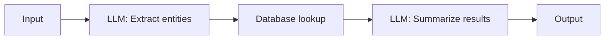

Characteristics:
- The sequence of steps is hardcoded
- Branching (if any) is via explicit `if/else` in code
- The LLM is a processing unit, not an orchestrator
- Predictable, auditable, easy to test
- Cannot handle unexpected situations

### AI Agent (Dynamic Decision-Maker)

An AI agent uses the LLM itself to decide **what to do next** at each step. The control flow emerges from the model's reasoning, not from hardcoded logic.

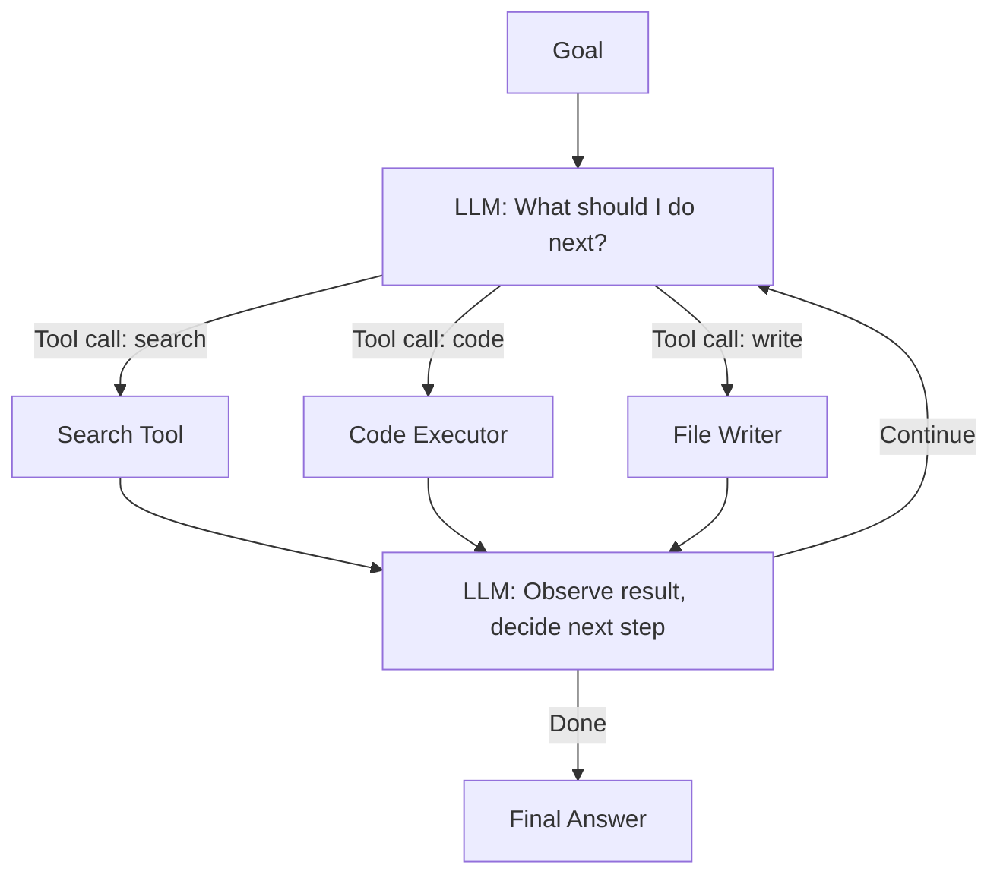

Characteristics:
- The LLM decides which tools to call, in what order, with what arguments
- Can handle novel situations not anticipated at design time
- Non-deterministic — two runs with the same input may take different paths
- Harder to test, audit, and debug
- More capable for open-ended tasks

### The Critical Difference: Who Decides?

| Dimension | Workflow | Agent |
|-----------|----------|-------|
| Control flow owner | Engineer (code) | LLM (reasoning) |
| Step sequence | Fixed at design time | Dynamic at runtime |
| Tool selection | Predetermined | Chosen by LLM |
| Adaptability | Low | High |
| Predictability | High | Low |
| Failure modes | Well-understood | Can surprise you |
| Cost | Lower (fewer LLM calls) | Higher (more tokens) |
| Use case fit | Structured, repetitive tasks | Open-ended, complex tasks |

### The Hybrid Reality

In practice, most production systems are **hybrid**: they use workflows as the outer skeleton and embed agents at specific nodes where dynamic reasoning is needed.

For example, a customer support pipeline might be a workflow (intake → classify → route), but the resolution step might be an agent (given a support ticket, autonomously look up the account, check order history, draft a response, and decide whether to escalate).

### When to Use Each

Use a **workflow** when:
- The task is well-defined and repetitive
- You need predictable, auditable behavior
- Latency and cost are primary constraints
- The failure modes must be tightly controlled (e.g., financial transactions)

Use an **agent** when:
- The task is open-ended or variable
- The steps can't be fully enumerated at design time
- The system needs to handle unexpected inputs gracefully
- Capability matters more than strict predictability

---

## 3. What Makes an AI System "Autonomous"?

Autonomy in AI systems is not a switch you flip — it's a set of capabilities that, in combination, let a system pursue goals without constant human intervention. Let me break this down precisely.

### The Four Pillars of Autonomy

**1. Goal-directed planning**

An autonomous system can take a high-level goal and decompose it into actionable subtasks. This is different from following instructions — it requires the system to *reason about what needs to happen* to achieve an outcome.

Planning can be:
- **Single-shot**: Generate the full plan upfront, then execute (less adaptive)
- **Iterative**: Plan one step, execute, observe, plan next (more robust but more LLM calls)
- **Hierarchical**: A high-level plan with each step sub-planned by specialized agents

**2. Environmental perception**

The system can observe the state of the world — through tool outputs, API responses, file contents, database results. It can interpret these observations and update its internal understanding accordingly.

Without perception, an agent is flying blind — it can't know whether a step succeeded, what data it retrieved, or what errors occurred.

**3. Action execution**

The system can take actions that have real effects: writing files, calling APIs, executing code, sending emails, modifying databases. The key word is *real* — these are not simulated responses, they are actual state changes in external systems.

**4. Feedback and self-correction**

This is the hardest pillar. A truly autonomous system can:
- Recognize when an action failed or produced unexpected results
- Diagnose what went wrong
- Adjust its approach accordingly
- Know when to escalate to a human

Without self-correction, you have a brittle automation, not an autonomous agent. The system will plunge ahead even when things go wrong.

### Autonomy Requires Controllability

Here's the engineering insight that's often missed: **autonomy and controllability are not opposites — they need to co-exist**. A fully autonomous system that can't be paused, audited, or overridden is a liability, not an asset.

Production agentic systems implement what I call the **autonomy dial**:


- **Human-in-the-loop**: Every action requires approval (good for high-stakes, irreversible actions)
- **Human-on-the-loop**: Agent acts freely but sends alerts for anomalies; human can interrupt
- **Fully autonomous**: Agent completes the task end-to-end without human involvement (appropriate for low-risk, reversible tasks)

### The Autonomy Threshold Problem

A key engineering decision is: *what level of confidence or step type requires human approval?* This is the **autonomy threshold**.

You define autonomy thresholds by:
- **Action reversibility**: Can this action be undone? (Sending an email cannot; writing a draft file can)
- **Scope of impact**: Is this action scoped to one record, or does it affect millions?
- **Confidence score**: If the LLM itself expresses low confidence, pause
- **Resource cost**: Actions that spend money, compute, or API quota above a threshold pause for approval

### What "Autonomous" Does NOT Mean

- It does not mean *unmonitored*. Production agents have comprehensive logging, tracing, and alerting.
- It does not mean *infallible*. Autonomous systems fail — the goal is graceful degradation.
- It does not mean *ungoverned*. Well-designed agents have explicit permission systems and sandboxed tool access.

---

## 4. When Should You Use Agents Instead of Simple Prompts?

This is the question every team should ask before building an agent, because agents are expensive, complex, and hard to debug. The answer requires clear thinking about the nature of the task.

### Use a Simple Prompt When...

The task is a single-turn transformation: given input X, produce output Y. Examples:
- Summarize this document
- Translate this text
- Classify this customer feedback as positive/negative/neutral
- Extract the named entities from this paragraph
- Rewrite this email in a professional tone

These are **stateless, single-step tasks**. Adding an agent loop would be pure overhead — more latency, more cost, more complexity, zero benefit.

### Use an Agent When...

The task has one or more of these properties:

**Multi-step with dynamic branching**: The path to completion depends on intermediate results. You don't know upfront whether you'll need to search the web, query a database, or run code — that decision depends on what you find.

**Tool use is required**: The task requires access to external information or systems that are not in the LLM's context: current web data, a company database, a code execution environment, an external API.

**The task is open-ended**: You can describe the goal but not enumerate all the steps. "Research this topic and write a report" is different from "summarize this text" — the research path is unknown upfront.

**Error handling is non-trivial**: If a step fails, the system needs to reason about why and try something else. This requires the reflective capability of an agent loop.

**The task has memory**: The system needs to remember information across multiple steps — what it found, what it tried, what worked and what didn't.

### The Decision Framework

Here's a practical decision tree I use:

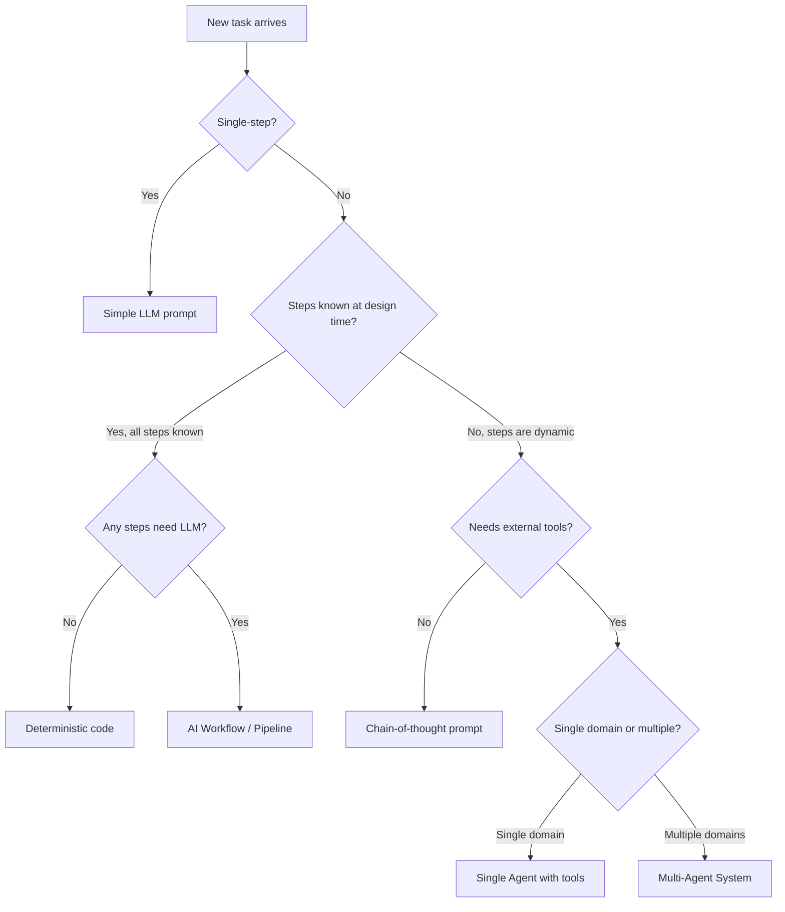

### The Cost-Benefit Reality

Let me be concrete about the trade-offs:

| Factor | Simple Prompt | Single Agent | Multi-Agent |
|--------|--------------|--------------|-------------|
| Latency | 1–3 seconds | 10–120 seconds | 30–600 seconds |
| Cost per run | $0.001–$0.01 | $0.05–$2 | $0.50–$20+ |
| Reliability | Very high | Medium | Complex |
| Capability | Limited to one step | Multi-step, tool-using | Parallel, specialized |
| Debugging effort | Low | Medium | High |

The key insight: **start with the simplest thing that could work**. Teams consistently over-engineer by jumping to multi-agent systems when a single well-crafted prompt with a bit of RAG would do the job.

### Red Flags You're Overusing Agents

- Your agent consistently completes tasks in exactly 1 step (just use a prompt)
- You're using an agent for classification or extraction tasks (use structured output calls)
- Your agent never calls more than one unique tool per run
- You've added an agent framework but haven't implemented memory or feedback loops

---

## 5. Core Components of an AI Agent Architecture

Every agent system — from the simplest single-agent to the most complex multi-agent network — is built from the same fundamental components. Understanding these is like understanding data structures: the specific implementations vary, but the concepts are universal.

### The Five Core Components

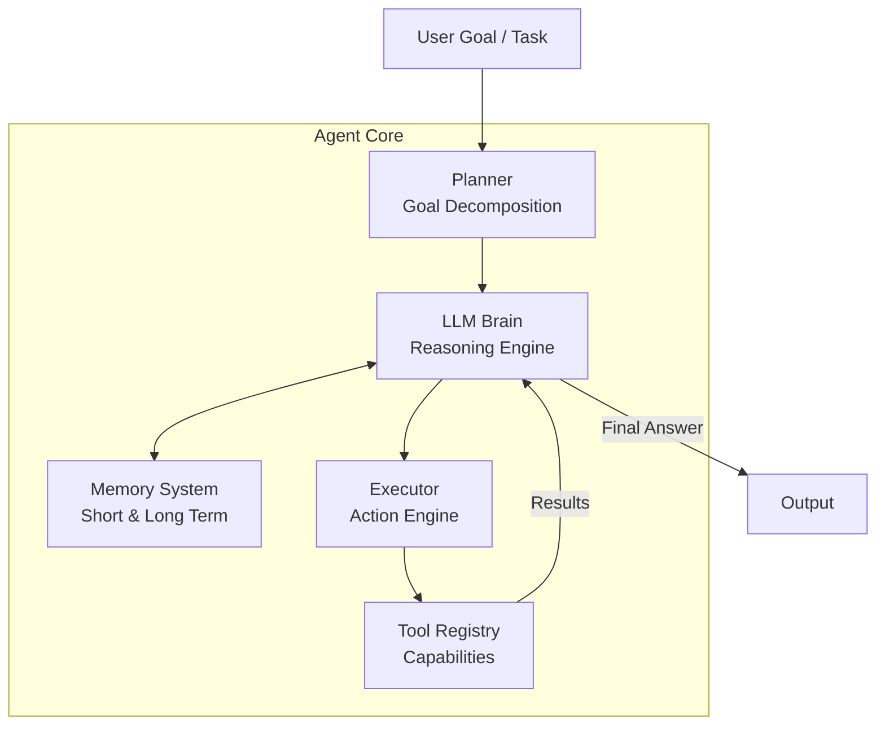

### Component 1: The LLM (Reasoning Engine)

The LLM is the cognitive core — the system's "brain." It's responsible for:
- Interpreting the goal
- Deciding what to do next
- Interpreting tool outputs
- Recognizing when the task is complete

The LLM receives a carefully constructed prompt at each step containing: the original goal, the conversation history, available tools, memory context, and the results of previous actions. It then produces either a tool call or a final answer.

**Model selection matters**: For agents, you generally want the most capable model you can afford for the reasoning/planning steps, and potentially cheaper models for tool-execution steps or subtasks.

**System prompt design**: The agent's "personality," constraints, and capabilities are encoded in the system prompt. This is where you define: what the agent can and cannot do, how it should handle uncertainty, what format tool calls should be in, and when it should stop and ask the user for clarification.

### Component 2: Memory System

Memory allows the agent to maintain state across steps and across conversations. There are four types (detailed in questions 8 and 9):

- **In-context (working memory)**: The current conversation — everything in the context window
- **External short-term**: Temporary key-value stores (Redis) for the current session
- **External long-term**: Vector databases (Pinecone, Weaviate) or relational databases for persistent facts
- **Episodic memory**: Logs of past agent runs that can be retrieved and learned from

### Component 3: Tool Registry

Tools are the agent's hands — how it interacts with the world beyond text generation. The tool registry is the catalog of what the agent is allowed to do.

Each tool has:
- **Name**: A unique identifier (e.g., `web_search`, `run_sql`, `send_email`)
- **Description**: A natural-language description of what the tool does — this is what the LLM reads to decide whether to use it
- **Schema**: The JSON schema defining required and optional parameters with types and descriptions
- **Implementation**: The actual code that executes when the tool is called
- **Permissions**: Who/what is allowed to invoke this tool (important for security)

**Critical insight**: Tool descriptions are load-bearing. If the description is vague or ambiguous, the LLM will misuse the tool or call the wrong one. Tool design is prompt engineering.

Common tool categories:
- **Information retrieval**: Web search, document retrieval, database queries, vector search
- **Computation**: Code execution, math operations, data analysis
- **Communication**: Email, Slack, SMS
- **Storage**: File read/write, database mutations
- **External APIs**: Payment systems, CRMs, internal services

### Component 4: Planner

The planner handles goal decomposition — breaking a high-level goal into a sequence of achievable steps. Planning approaches:

**ReAct (Reason + Act)**: The most common pattern. At each step, the LLM writes out its reasoning (thought), then emits an action. The action result is fed back, and the loop continues.

```
Thought: I need to find information about X first
Action: web_search("X current information")
Observation: [search results]
Thought: I found Y, now I need to look up Z to complete the analysis
Action: database_query("SELECT * FROM Z WHERE ...")
...
```

**Plan-and-Execute**: Generate a full plan upfront, then execute each step sequentially. More predictable, but less adaptive to unexpected results.

**Tree of Thought**: Generate multiple possible next steps, evaluate each, and pursue the most promising branch. More expensive, but better for problems with complex solution spaces.

### Component 5: Executor

The executor is responsible for actually running tool calls — dispatching function calls, handling errors, retrying on transient failures, and enforcing timeouts and rate limits.

Key responsibilities:
- **Dispatch**: Route tool calls to the correct implementation
- **Validation**: Validate arguments against the tool's schema before execution
- **Error handling**: Catch exceptions, categorize as transient vs permanent, retry appropriately
- **Timeout enforcement**: Kill long-running tool calls before they block the agent
- **Rate limiting**: Respect API rate limits for external services
- **Result formatting**: Return results in a format the LLM can effectively reason over

### How It All Fits Together: The Step Loop

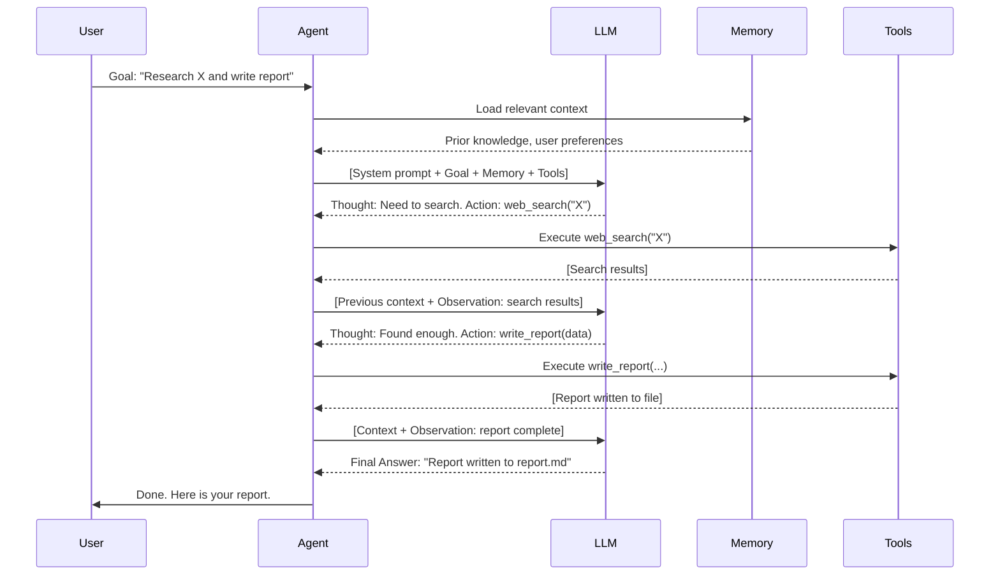

---

# PART 2: ARCHITECTURE & FLOW

---

## 6. Typical Multi-Agent Architecture

Multi-agent systems distribute cognitive work across specialized agents, each with a focused responsibility. Think of it like a well-run engineering org: you have a manager who coordinates, and specialists who execute.

### The Orchestrator-Worker Pattern

This is the most common production multi-agent pattern:

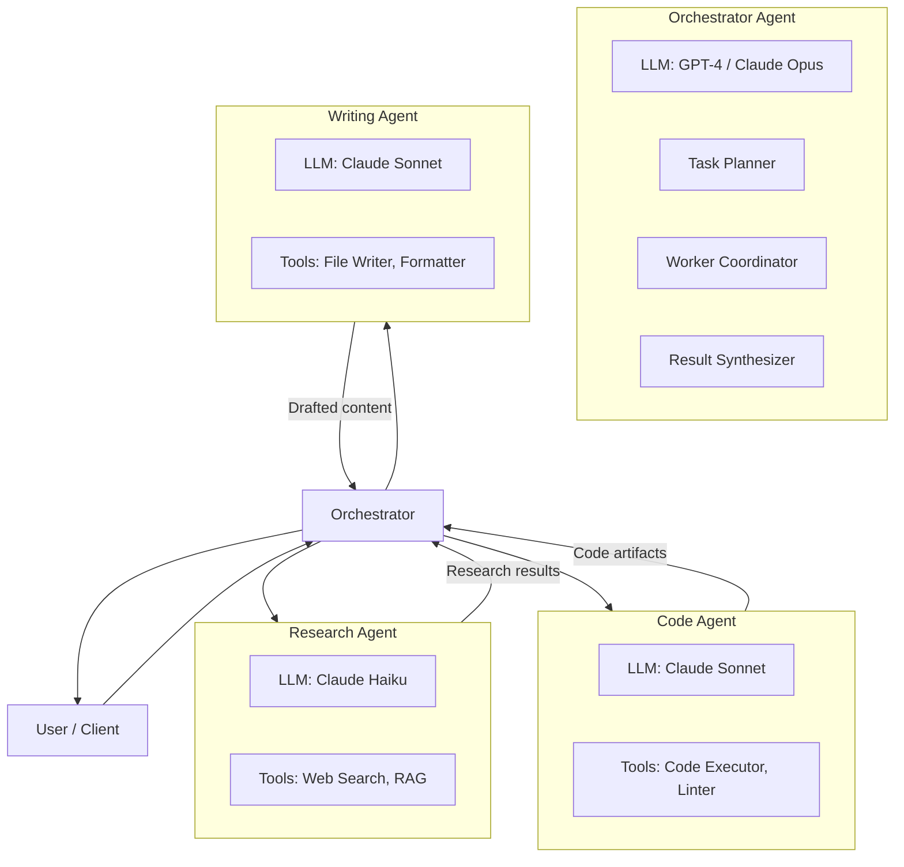

**Orchestrator responsibilities**:
- Receives the user goal
- Decomposes it into parallel or sequential subtasks
- Assigns subtasks to the right worker agents
- Monitors worker progress
- Synthesizes results into a final response

**Worker responsibilities**:
- Receive a specific, scoped subtask
- Execute it using their specialized tool set
- Return structured results to the orchestrator
- Are stateless — they don't need to know about other workers

### The Peer-to-Peer Pattern

In more complex systems, agents communicate directly rather than through a central orchestrator. This is more flexible but harder to reason about:

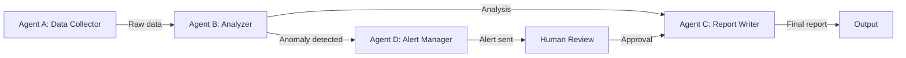

This is a **DAG (Directed Acyclic Graph) of agents**, where the output of one agent feeds into the input of another.

### The Hierarchical Pattern

For very large tasks, you can have multiple levels of orchestration:

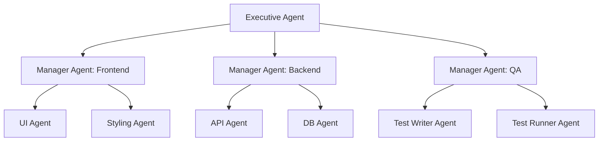

This mirrors a software engineering org: an executive/PM layer, a team lead layer, and individual contributor agents.

### Key Design Decisions in Multi-Agent Systems

**Agent granularity**: How specialized should each agent be? Too coarse and you lose the benefits of specialization. Too fine and coordination overhead swamps the system. A good rule: an agent should be able to complete its task in 3–10 steps.

**Synchronous vs asynchronous execution**: Workers can be called sequentially (simpler, more predictable) or in parallel (faster, but results arrive out-of-order). Use async for independent subtasks, sync for dependent ones.

**Shared vs isolated context**: Should agents share a memory store, or operate in isolation and only communicate through structured messages? Shared memory enables richer collaboration but creates race conditions and coherence challenges.

**Task routing**: How does the orchestrator decide which agent handles which task? Options: explicit rule-based routing (task type → agent), LLM-based routing (give the orchestrator a list of agents and their capabilities), or embedding-based semantic routing (match task embedding to agent capability embeddings).

---

## 7. How Do Agents Communicate With Each Other?

Agent communication is essentially a distributed systems problem mapped onto LLM-based components. The same patterns apply: message passing, shared state, event queues — but with the added complexity of natural language as the data format.

### Communication Mechanisms

**1. Direct function calls (synchronous)**

The simplest approach: the orchestrator calls a worker agent's function directly, waits for a result, and processes it.

```python
result = research_agent.run(task="Find competitors of Stripe")
synthesis_result = writer_agent.run(task=f"Write report based on: {result}")
```

Pros: Simple, easy to debug, deterministic ordering.
Cons: Blocking, doesn't scale to parallel workloads.

**2. Message queues (asynchronous)**

Agents publish tasks to a queue; worker agents consume from the queue and publish results back. This is the pattern for high-throughput, parallel agent systems.

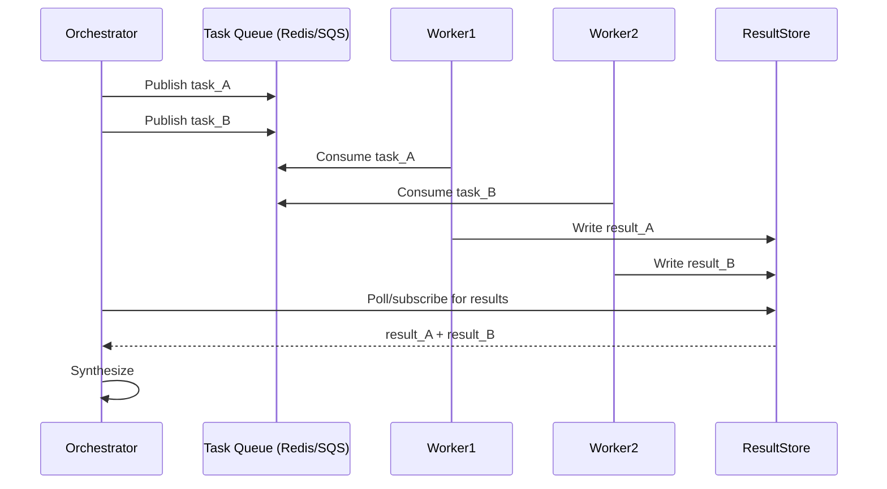

Tools: Redis Streams, AWS SQS, RabbitMQ, Kafka for high-throughput.

**3. Shared state / blackboard**

Agents read from and write to a shared store (a database, a vector store, or an in-memory object). Each agent reads what it needs, does its work, and writes results back.

```python
blackboard = SharedMemoryStore()

# Research agent reads goal, writes findings
blackboard.write("research_findings", research_agent.run(goal))

# Analysis agent reads findings, writes analysis
blackboard.write("analysis", analysis_agent.run(blackboard.read("research_findings")))

# Writer reads analysis, produces report
writer_agent.run(blackboard.read("analysis"))
```

**4. Structured message passing**

Agents exchange typed, structured messages rather than raw strings. This reduces ambiguity and makes inter-agent communication more reliable.

```python
@dataclass
class AgentMessage:
    sender: str
    recipient: str
    task_id: str
    message_type: Literal["task", "result", "error", "question"]
    payload: dict
    timestamp: datetime
    parent_message_id: Optional[str]
```

Using structured messages gives you:
- A clear audit trail of who said what to whom
- The ability to serialize/deserialize messages for async delivery
- Easy filtering and routing in a message bus

### The Protocol Layer

For robust multi-agent systems, define a communication protocol — an agent-to-agent API contract:

**Task assignment message**:
```json
{
  "type": "task_assignment",
  "task_id": "uuid-1234",
  "sender": "orchestrator",
  "recipient": "research_agent",
  "priority": "high",
  "deadline_ms": 30000,
  "payload": {
    "goal": "Find top 5 competitors of Stripe",
    "constraints": ["Use only sources from last 6 months"],
    "output_format": "json_list"
  }
}
```

**Result message**:
```json
{
  "type": "task_result",
  "task_id": "uuid-1234",
  "sender": "research_agent",
  "recipient": "orchestrator",
  "status": "success",
  "payload": {
    "results": [...],
    "sources": [...],
    "confidence": 0.87,
    "steps_taken": 5
  }
}
```

**Error message**:
```json
{
  "type": "task_error",
  "task_id": "uuid-1234",
  "sender": "research_agent",
  "error_code": "TOOL_TIMEOUT",
  "error_message": "Web search timed out after 30s",
  "is_retryable": true,
  "suggested_retry_after_ms": 5000
}
```

### Grounding Communication in Context

One of the trickiest aspects: each agent call is stateless at the LLM level. When an orchestrator calls a worker, the worker's LLM doesn't have access to the orchestrator's full reasoning history. You need to be deliberate about what context to pass in each message.

The rule: **pass the minimum context the recipient needs to do its job**. Don't dump your entire conversation history into every worker call — it wastes tokens and can confuse the worker's reasoning. Instead, summarize: "Your task is X. Here's the relevant background: Y. Here are your constraints: Z."

---

## 8. How Do You Maintain Memory in Agents?

Memory is what separates a stateless chatbot from a persistent, intelligent agent. There are fundamentally different memory mechanisms, and choosing the right one — or combining them — is a key architectural decision.

### The Four Memory Types

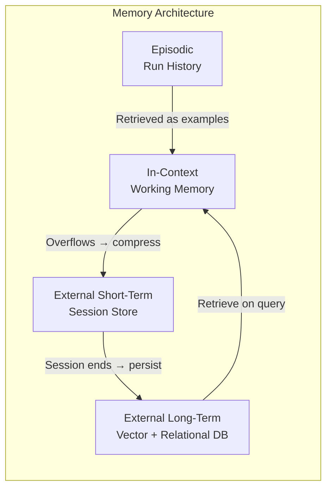

### Type 1: In-Context Memory (Working Memory)

This is the agent's active working memory — everything currently in the LLM's context window. It includes: the system prompt, conversation history, tool call results, and any retrieved memories.

**Size constraint**: This is limited by the model's context window. GPT-4o and Claude 3.5 support ~128K–200K tokens, which sounds large but fills up fast in long agent runs with tool outputs.

**Management strategy**: Maintain a sliding window — keep the most recent N messages verbatim, and summarize older ones. Or use hierarchical summarization: summarize every K steps, then summarize the summaries.

```python
class ContextManager:
    def __init__(self, max_tokens: int = 100_000, summary_threshold: int = 80_000):
        self.messages = []
        self.summaries = []

    def add_message(self, message: dict):
        self.messages.append(message)
        if self._estimate_tokens() > self.summary_threshold:
            self._compress_oldest()

    def _compress_oldest(self):
        # Take oldest 20% of messages, summarize them, replace with summary
        to_summarize = self.messages[:len(self.messages)//5]
        summary = self.llm.summarize(to_summarize)
        self.messages = self.messages[len(self.messages)//5:]
        self.summaries.append(summary)

    def get_context(self) -> list:
        summary_messages = [{"role": "system", "content": f"Earlier context summary: {s}"} for s in self.summaries]
        return summary_messages + self.messages
```

### Type 2: External Short-Term Memory

Session-scoped memory stored externally (Redis, in-memory store). Survives context window limits, scoped to a single user session or agent run.

Use cases:
- Intermediate results between agent steps
- User preferences within a session
- State of in-progress tasks

```python
# Store intermediate research findings
redis_client.setex(
    f"session:{session_id}:research_findings",
    ttl=3600,  # 1 hour
    value=json.dumps(findings)
)

# Retrieve in next agent step
findings = json.loads(redis_client.get(f"session:{session_id}:research_findings"))
```

### Type 3: External Long-Term Memory

Persistent storage that survives across sessions. This is where the agent "remembers" things about the user, the domain, and past work.

**Vector memory**: Store semantic embeddings of important facts, documents, or past interactions. Retrieve via similarity search.

```python
# Store a fact in long-term memory
embedding = embed("User prefers concise, bullet-point summaries")
vector_store.upsert(
    id=f"user_{user_id}_pref_001",
    vector=embedding,
    metadata={"type": "user_preference", "user_id": user_id}
)

# Retrieve relevant memories at start of each session
query_embedding = embed(user_goal)
relevant_memories = vector_store.query(query_embedding, top_k=5, filter={"user_id": user_id})
```

**Relational memory**: Structured facts stored in SQL for precise lookups.

```sql
-- Agent stores structured facts
INSERT INTO agent_facts (agent_id, user_id, fact_type, fact_key, fact_value, confidence, created_at)
VALUES ('research_agent', 'user_123', 'user_preference', 'output_format', 'markdown', 0.95, NOW());
```

### Type 4: Episodic Memory

A log of past agent runs — what task was given, what steps were taken, what worked, what failed. This is retrieved as "few-shot examples" to guide current behavior.

```python
# After each successful run, store the episode
episode = {
    "task": original_goal,
    "plan": steps_taken,
    "outcome": "success",
    "total_steps": 7,
    "tools_used": ["web_search", "code_executor"],
    "key_decisions": reasoning_trace
}

# Embed the task description for retrieval
episode_embedding = embed(original_goal)
episode_store.upsert(episode_id, episode_embedding, metadata=episode)

# At the start of a new similar task, retrieve relevant episodes
similar_episodes = episode_store.query(embed(new_goal), top_k=3)
# Inject these as examples into the system prompt
```

---

## 9. Short-term vs Long-term Memory in Agents

Let's go deeper on this specific distinction, because it has direct architectural implications.

### Short-Term Memory: The Working Set

Short-term memory is **task-scoped** — it exists to support the completion of the current task and is generally discarded afterward. It's analogous to RAM in a computer.

**Characteristics**:
- Fast to read and write
- Small in capacity (context window limit, or a modest Redis store)
- Not persisted beyond the current session/task
- Unstructured or lightly structured
- High-fidelity — no compression or approximation

**What goes in short-term memory**:
- Current conversation history
- Intermediate tool call results
- Hypothesis being tested
- Current plan steps and their status
- Working variables (e.g., "the user's target company is Stripe")

**Implementation patterns**:

```python
class ShortTermMemory:
    """Redis-backed session memory with automatic TTL."""

    def __init__(self, session_id: str, ttl_seconds: int = 3600):
        self.session_id = session_id
        self.redis = redis.Redis()
        self.ttl = ttl_seconds

    def store(self, key: str, value: Any):
        full_key = f"stm:{self.session_id}:{key}"
        self.redis.setex(full_key, self.ttl, json.dumps(value))

    def retrieve(self, key: str) -> Optional[Any]:
        full_key = f"stm:{self.session_id}:{key}"
        val = self.redis.get(full_key)
        return json.loads(val) if val else None

    def get_all(self) -> dict:
        pattern = f"stm:{self.session_id}:*"
        keys = self.redis.keys(pattern)
        return {k.decode().split(":")[-1]: json.loads(self.redis.get(k)) for k in keys}
```

### Long-Term Memory: The Knowledge Base

Long-term memory is **persistent, cross-session, and user/domain-scoped**. It's analogous to disk storage. The key challenge is retrieval: unlike short-term memory where you often retrieve everything, long-term memory must be selectively retrieved — you can't put 10GB of facts into a context window.

**Characteristics**:
- Slow to write (involves embedding, indexing)
- High capacity (bounded by storage, not RAM)
- Persists indefinitely (with explicit retention policies)
- May involve compression or summarization
- Retrieved semantically, not by exact key lookup

**What goes in long-term memory**:
- User preferences and patterns
- Domain knowledge the agent has learned
- Results from past significant tasks
- Factual knowledge extracted from documents
- Agent's learned heuristics ("tool X tends to fail for query type Y")

**The Retrieval Challenge**:

Long-term memory is only useful if you can retrieve the right memories at the right time. The naive approach is to dump everything into context — that's actually what RAG (Retrieval-Augmented Generation) does, but even RAG needs a good retrieval strategy.

```python
class LongTermMemory:
    """Vector database-backed persistent memory with semantic retrieval."""

    def __init__(self, user_id: str):
        self.user_id = user_id
        self.vector_store = Pinecone(index_name="agent-memory")
        self.embedder = OpenAIEmbeddings()

    def store(self, content: str, memory_type: str, metadata: dict = {}):
        embedding = self.embedder.embed(content)
        self.vector_store.upsert(
            vectors=[(str(uuid4()), embedding, {
                "user_id": self.user_id,
                "content": content,
                "memory_type": memory_type,
                "timestamp": datetime.now().isoformat(),
                **metadata
            })]
        )

    def retrieve(self, query: str, memory_type: str = None, top_k: int = 5) -> list[str]:
        query_embedding = self.embedder.embed(query)
        filters = {"user_id": self.user_id}
        if memory_type:
            filters["memory_type"] = memory_type

        results = self.vector_store.query(
            vector=query_embedding,
            top_k=top_k,
            filter=filters,
            include_metadata=True
        )
        return [r.metadata["content"] for r in results.matches]
```

### Memory Consolidation: Moving from Short to Long

A well-designed agent system implements **memory consolidation** — at the end of a session or after key milestones, it extracts important facts from short-term memory and writes them to long-term storage.

```python
class MemoryConsolidator:
    """Runs at end of each session to extract persistent knowledge."""

    def consolidate(self, session: Session, ltm: LongTermMemory):
        # Use LLM to extract important facts from the session
        consolidation_prompt = f"""
        Review this agent session and extract:
        1. User preferences discovered
        2. Important facts learned about the domain
        3. Successful strategies used
        4. Mistakes to avoid

        Session summary: {session.get_summary()}
        Output as JSON with keys: preferences, facts, strategies, mistakes
        """
        extracted = self.llm.call(consolidation_prompt)
        facts = json.loads(extracted)

        for preference in facts["preferences"]:
            ltm.store(preference, memory_type="user_preference")
        for fact in facts["facts"]:
            ltm.store(fact, memory_type="domain_fact")
        for strategy in facts["strategies"]:
            ltm.store(strategy, memory_type="agent_strategy")
```

---

## 10. How Do You Prevent Hallucinations in Agents?

Hallucinations in agents are more dangerous than in simple LLM calls because agents can act on hallucinated information — calling the wrong tool, passing incorrect parameters, making decisions based on fabricated facts. The downstream effects can cascade through multiple steps before anyone notices.

### Root Causes of Hallucinations in Agents

- **Outdated training data**: The model "knows" a fact that's no longer true
- **Context overload**: Too much information in the context causes the model to confuse or blend facts
- **Prompt ambiguity**: The model fills in gaps with plausible-sounding but incorrect information
- **Tool output misinterpretation**: The model misreads a tool result and draws wrong conclusions
- **Eager completion**: The model "wants" to be done and stops searching/verifying prematurely

### Prevention Strategy 1: Ground Truth Through Tool Use

The single most effective anti-hallucination technique: **don't let the agent rely on its own knowledge for factual claims**. Force it to retrieve information from authoritative sources.

```
System prompt:
"IMPORTANT: Never state facts from memory alone. 
If you need current information, use the search tool.
If you need data, use the database_query tool.
Always cite the source of any factual claim."
```

This doesn't eliminate all hallucinations, but it dramatically reduces them for factual content. The model's role becomes reasoning and synthesis, not fact recall.

### Prevention Strategy 2: Self-Verification Steps

Explicitly build verification into the agent loop:

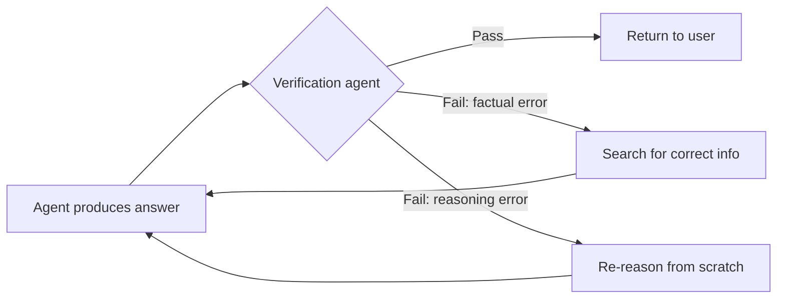

```python
class VerificationAgent:
    """A specialized agent that checks another agent's output for accuracy."""

    def verify(self, claim: str, source_context: str) -> VerificationResult:
        prompt = f"""
        Claim: {claim}
        Source context: {source_context}

        Evaluate:
        1. Is this claim directly supported by the source context? (yes/no)
        2. Does it contradict any part of the source context? (yes/no)
        3. Does it add information not in the source context? (yes/no)

        If any answer to 2 or 3 is yes, the claim is potentially hallucinated.
        Respond with JSON: {{ "supported": bool, "issues": [str], "confidence": float }}
        """
        return self.llm.call_structured(prompt, VerificationResult)
```

### Prevention Strategy 3: Structured Output Constraints

Use structured output modes (JSON schema enforcement) to prevent the model from "wandering" into hallucinated territory:

```python
# Instead of free-form text, require structured output
response = llm.call(
    prompt="Extract competitor data",
    response_format={
        "type": "json_schema",
        "json_schema": {
            "name": "CompetitorData",
            "schema": {
                "type": "object",
                "properties": {
                    "competitor_name": {"type": "string"},
                    "source_url": {"type": "string"},
                    "pricing_verified": {"type": "boolean"},
                    "confidence_score": {"type": "number", "minimum": 0, "maximum": 1}
                },
                "required": ["competitor_name", "source_url", "pricing_verified", "confidence_score"]
            }
        }
    }
)
```

The `confidence_score` field is particularly useful — instruct the model that anything below 0.7 should trigger additional verification steps.

### Prevention Strategy 4: Chain-of-Verification (CoVe)

For critical information, use Chain-of-Verification: generate an answer, then generate verification questions, answer each independently, then use those answers to revise the original.

```
Step 1: Initial answer → "Stripe was founded in 2010"
Step 2: Generate verification questions:
   - "What year was Stripe founded?"
   - "Who founded Stripe?"
Step 3: Answer each using search tool:
   - Search: "Stripe founding year" → "2010"
   - Search: "Stripe founders" → "Patrick and John Collison"
Step 4: Revise if verification contradicts initial answer
```

### Prevention Strategy 5: Confidence Thresholding

Instruct the agent to express and act on confidence levels:

```
System prompt:
"When uncertain about a fact (confidence < 70%), you must:
1. Flag the uncertainty explicitly
2. Search for the information before proceeding
3. If still uncertain after searching, say 'I'm not certain about X' rather than stating it as fact"
```

### Prevention Strategy 6: Grounding with RAG

For domain-specific agents, pre-load a vector store with authoritative documents and instruct the agent to query it before answering domain questions. The retrieval provides grounding; the LLM provides synthesis.

```python
def handle_query(query: str) -> str:
    # Retrieve relevant authoritative context
    docs = vector_store.similarity_search(query, k=5)
    context = "\n\n".join([doc.page_content for doc in docs])

    # Agent reasons over retrieved context, not raw memory
    return llm.call(
        system="Answer using ONLY the provided context. If the answer isn't in the context, say so.",
        user=f"Context:\n{context}\n\nQuestion: {query}"
    )
```

---

## 11. How Do You Control Agent Execution Loops?

Without control mechanisms, agents can run indefinitely — hitting infinite loops, making thousands of API calls, or spending enormous amounts of money on a single task. Control is not optional; it's a first-class engineering concern.

### Control Mechanism 1: Step Limit

The simplest and most important control: set a hard maximum on the number of steps (LLM calls + tool calls) an agent can take.

```python
class AgentExecutor:
    def __init__(self, max_steps: int = 25):
        self.max_steps = max_steps
        self.current_step = 0

    def run(self, goal: str) -> AgentResult:
        while self.current_step < self.max_steps:
            action = self.llm.next_action(self.get_context())

            if action.type == "final_answer":
                return AgentResult(answer=action.content, steps=self.current_step, success=True)

            result = self.execute_tool(action)
            self.add_to_context(action, result)
            self.current_step += 1

        # Graceful termination at step limit
        return AgentResult(
            answer=self.synthesize_partial_results(),
            steps=self.current_step,
            success=False,
            reason="step_limit_reached"
        )
```

### Control Mechanism 2: Time Budget

Wall-clock time limits are critical, especially for real-time user interactions:

```python
import asyncio

async def run_with_timeout(agent: Agent, goal: str, timeout_seconds: int = 60) -> AgentResult:
    try:
        result = await asyncio.wait_for(
            agent.run_async(goal),
            timeout=timeout_seconds
        )
        return result
    except asyncio.TimeoutError:
        # Agent exceeded time budget
        partial = agent.get_partial_result()
        return AgentResult(
            answer=partial or "Could not complete in time",
            success=False,
            reason="timeout"
        )
```

### Control Mechanism 3: Cost Budget

Track token usage and estimated cost; stop if it exceeds a budget:

```python
class BudgetTracker:
    def __init__(self, max_cost_usd: float = 1.0):
        self.max_cost = max_cost_usd
        self.total_cost = 0.0

    def record_call(self, prompt_tokens: int, completion_tokens: int, model: str):
        cost = self._estimate_cost(prompt_tokens, completion_tokens, model)
        self.total_cost += cost
        if self.total_cost > self.max_cost:
            raise BudgetExceededError(
                f"Agent exceeded cost budget: ${self.total_cost:.4f} > ${self.max_cost}"
            )
```

### Control Mechanism 4: Loop Detection

Detect when the agent is repeating the same actions in a cycle:

```python
class LoopDetector:
    def __init__(self, window_size: int = 5):
        self.action_history = deque(maxlen=window_size)

    def check_and_record(self, action: Action) -> bool:
        action_signature = f"{action.tool}:{json.dumps(action.args, sort_keys=True)}"

        if action_signature in self.action_history:
            return True  # Loop detected

        self.action_history.append(action_signature)
        return False
```

### Control Mechanism 5: Termination Conditions

Define explicit, checkable conditions under which the agent should stop — beyond just "LLM says it's done":

```python
class TerminationChecker:
    def should_terminate(self, state: AgentState) -> Tuple[bool, str]:
        # Check explicit conditions
        if state.steps >= state.max_steps:
            return True, "step_limit"
        if state.elapsed_seconds >= state.timeout:
            return True, "timeout"
        if state.total_cost >= state.budget:
            return True, "budget_exceeded"
        if self.loop_detector.is_looping():
            return True, "loop_detected"

        # Check quality conditions: did the LLM signal completion?
        if state.last_action.type == "final_answer":
            return True, "success"

        # Check for repeated failures
        consecutive_failures = self._count_consecutive_failures(state)
        if consecutive_failures >= 3:
            return True, "repeated_failures"

        return False, ""
```

### Control Mechanism 6: Human-in-the-Loop Checkpoints

For high-stakes or irreversible actions, pause and require human approval:

```python
HIGH_RISK_TOOLS = {"send_email", "delete_record", "execute_payment", "deploy_to_production"}

class HumanApprovalGate:
    def should_pause_for_approval(self, action: Action) -> bool:
        return action.tool in HIGH_RISK_TOOLS or action.estimated_impact == "high"

    async def request_approval(self, action: Action, context: str) -> bool:
        approval_request = {
            "action": action.to_dict(),
            "context": context,
            "reasoning": action.reasoning
        }
        # Send to approval UI, wait for response
        response = await self.approval_service.request(approval_request, timeout=300)
        return response.approved
```

---

## 12. How Do You Implement Retries and Fallback?

Agents call external services — LLMs, APIs, databases — and these fail. Transient failures (network hiccup, rate limit, temporary overload) should be retried. Permanent failures (bad input, missing resource) should fall back gracefully. The key is distinguishing between them quickly.

### Retry Strategy: Exponential Backoff with Jitter

```python
import random
import time
from functools import wraps

def with_retry(
    max_attempts: int = 3,
    base_delay: float = 1.0,
    max_delay: float = 60.0,
    retryable_exceptions: tuple = (RateLimitError, ServiceUnavailableError)
):
    def decorator(func):
        @wraps(func)
        def wrapper(*args, **kwargs):
            last_exception = None
            for attempt in range(max_attempts):
                try:
                    return func(*args, **kwargs)
                except retryable_exceptions as e:
                    last_exception = e
                    if attempt < max_attempts - 1:
                        # Exponential backoff with full jitter
                        delay = min(base_delay * (2 ** attempt), max_delay)
                        jitter = random.uniform(0, delay)
                        time.sleep(jitter)
                except Exception as e:
                    # Non-retryable exception — fail immediately
                    raise
            raise last_exception
        return wrapper
    return decorator

@with_retry(max_attempts=3, base_delay=2.0)
def call_llm(prompt: str) -> str:
    return llm_client.complete(prompt)
```

### Error Classification

Before retrying, classify the error:

```python
class ErrorClassifier:
    RETRYABLE = {
        "rate_limit_exceeded",
        "service_unavailable",
        "timeout",
        "connection_error",
        "internal_server_error"
    }

    PERMANENT = {
        "invalid_api_key",
        "invalid_request",
        "context_length_exceeded",
        "model_not_found",
        "permission_denied"
    }

    def classify(self, error: Exception) -> Literal["retryable", "permanent", "unknown"]:
        error_code = getattr(error, "code", None) or str(type(error).__name__)
        if error_code in self.RETRYABLE:
            return "retryable"
        if error_code in self.PERMANENT:
            return "permanent"
        return "unknown"  # Be conservative — treat as retryable with low max_attempts
```

### Tool-Level Fallback

When a primary tool fails permanently, fall back to an alternative:

```python
class ToolWithFallback:
    def __init__(self, primary: Tool, fallbacks: List[Tool]):
        self.primary = primary
        self.fallbacks = fallbacks

    def execute(self, args: dict) -> ToolResult:
        # Try primary
        try:
            return self.primary.execute(args)
        except PermanentToolError as e:
            logger.warning(f"Primary tool {self.primary.name} failed: {e}. Trying fallbacks.")

        # Try fallbacks in order
        for fallback in self.fallbacks:
            try:
                result = fallback.execute(args)
                result.metadata["used_fallback"] = fallback.name
                return result
            except Exception as e:
                logger.warning(f"Fallback {fallback.name} failed: {e}")

        raise AllToolsFailed(f"All tools failed for args: {args}")

# Example: Primary search with fallbacks
web_search_tool = ToolWithFallback(
    primary=BraveSearchTool(),
    fallbacks=[GoogleSearchTool(), DuckDuckGoTool()]
)
```

### Agent-Level Fallback

When an agent fails, fall back to a simpler strategy:

```python
class AgentWithFallback:
    def run(self, goal: str) -> AgentResult:
        # Try full agentic approach
        try:
            result = self.full_agent.run(goal)
            if result.success:
                return result
        except Exception as e:
            logger.error(f"Full agent failed: {e}")

        # Fallback 1: Single LLM call with RAG
        try:
            context = self.rag.retrieve(goal)
            answer = self.llm.call(f"Context: {context}\n\nQuestion: {goal}")
            return AgentResult(answer=answer, success=True, used_fallback="rag_only")
        except Exception:
            pass

        # Fallback 2: Cached answers or static response
        cached = self.cache.get_similar(goal)
        if cached:
            return AgentResult(answer=cached, success=True, used_fallback="cache")

        # Final fallback: Graceful degradation
        return AgentResult(
            answer="I was unable to complete this task. Please try again or contact support.",
            success=False,
            used_fallback="graceful_degradation"
        )
```

### Circuit Breaker Pattern

Prevent cascading failures when a dependency is consistently failing:

```python
class CircuitBreaker:
    """Trips open after N consecutive failures; resets after a cooldown."""

    def __init__(self, failure_threshold: int = 5, recovery_timeout: int = 60):
        self.failure_count = 0
        self.failure_threshold = failure_threshold
        self.recovery_timeout = recovery_timeout
        self.state = "closed"  # closed=normal, open=failing, half-open=testing
        self.last_failure_time = None

    def call(self, func, *args, **kwargs):
        if self.state == "open":
            if time.time() - self.last_failure_time > self.recovery_timeout:
                self.state = "half-open"
            else:
                raise CircuitOpenError("Circuit breaker is open")

        try:
            result = func(*args, **kwargs)
            self._on_success()
            return result
        except Exception as e:
            self._on_failure()
            raise

    def _on_success(self):
        self.failure_count = 0
        self.state = "closed"

    def _on_failure(self):
        self.failure_count += 1
        self.last_failure_time = time.time()
        if self.failure_count >= self.failure_threshold:
            self.state = "open"
```

---

## 13. How Do You Track Agent Reasoning?

Tracking agent reasoning is both a debugging tool and a trust-building mechanism. In production, you need to know *why* the agent did what it did — for debugging, auditing, compliance, and user trust.

### Approach 1: Explicit Chain-of-Thought Logging

Prompt the LLM to externalize its reasoning using a structured format, then capture and store it:

```python
AGENT_SYSTEM_PROMPT = """
At each step, you must output your reasoning in this format:

<thought>
What I'm trying to accomplish and why I'm taking this action.
</thought>
<action>
{
  "tool": "tool_name",
  "args": {...},
  "expected_outcome": "what I expect this tool call to return"
}
</action>

After receiving a tool result:

<observation>
What the tool returned and what it tells me.
</observation>
<reflection>
Does this move me toward my goal? What should I do next?
</reflection>
"""
```

Capture these structured tags server-side:

```python
class ReasoningCapture:
    def parse_and_store(self, llm_output: str, step_id: str):
        thought = self._extract_tag(llm_output, "thought")
        action = self._extract_tag(llm_output, "action")
        reflection = self._extract_tag(llm_output, "reflection")

        self.reasoning_store.save({
            "step_id": step_id,
            "timestamp": datetime.now().isoformat(),
            "thought": thought,
            "action": json.loads(action) if action else None,
            "reflection": reflection
        })
```

### Approach 2: Structured Trace Format

Every agent run produces a trace — a structured log of every step:

```json
{
  "run_id": "run_abc123",
  "goal": "Research top 5 Stripe competitors",
  "started_at": "2025-01-15T10:00:00Z",
  "completed_at": "2025-01-15T10:02:34Z",
  "status": "success",
  "steps": [
    {
      "step_id": 1,
      "type": "thought",
      "content": "I need to find current competitors of Stripe. I'll start with a web search.",
      "tokens_used": 150,
      "timestamp": "2025-01-15T10:00:02Z"
    },
    {
      "step_id": 2,
      "type": "tool_call",
      "tool": "web_search",
      "args": {"query": "Stripe payment processing competitors 2025"},
      "result_preview": "Found 10 results: Adyen, Square, Braintree...",
      "latency_ms": 823,
      "success": true,
      "timestamp": "2025-01-15T10:00:05Z"
    },
    {
      "step_id": 3,
      "type": "observation",
      "content": "Found 5 strong competitors. Now need to check each one's pricing page.",
      "timestamp": "2025-01-15T10:00:07Z"
    }
  ],
  "total_tokens": 12500,
  "total_cost_usd": 0.087,
  "tools_called": ["web_search", "web_fetch", "write_file"],
  "final_answer_summary": "Report written to competitors.md"
}
```

### Approach 3: LangSmith / OpenTelemetry Integration

In production, integrate with tracing systems:

```python
from opentelemetry import trace
from opentelemetry.trace import SpanKind

tracer = trace.get_tracer("agent-service")

class InstrumentedAgent:
    def run(self, goal: str) -> AgentResult:
        with tracer.start_as_current_span("agent.run", kind=SpanKind.SERVER) as span:
            span.set_attribute("agent.goal", goal)
            span.set_attribute("agent.version", self.version)

            step = 0
            while not done:
                with tracer.start_as_current_span(f"agent.step.{step}") as step_span:
                    action = self.get_next_action()
                    step_span.set_attribute("action.tool", action.tool)
                    step_span.set_attribute("action.reasoning", action.thought)

                    result = self.execute(action)
                    step_span.set_attribute("result.success", result.success)
                    step_span.set_attribute("result.latency_ms", result.latency)
                step += 1

            span.set_attribute("agent.steps_taken", step)
            span.set_attribute("agent.total_tokens", self.token_counter.total)
```

---

## 14. What is Tool Calling?

Tool calling is the mechanism by which an LLM can request that an external function be executed on its behalf, receive the result, and incorporate it into its reasoning. It's the bridge between the LLM's language capabilities and the real world.

### The Conceptual Model

Think of tool calling as the LLM saying: *"I don't have this information in my context, but I know there's a function that can get it. Here's how to call it."*

The LLM doesn't execute the tool itself — it generates a structured description of what it wants called, and your application code does the actual execution.

```
LLM output: "I need to search the web. Here's my tool call:
{
  'tool': 'web_search',
  'arguments': {'query': 'current Stripe pricing 2025'}
}"

→ Your code receives this
→ Executes web_search("current Stripe pricing 2025")
→ Gets back search results
→ Feeds results back to LLM as tool result
→ LLM continues reasoning
```

### Why Tool Calling is More Than Just Function Invocation

Tool calling solves a fundamental limitation of LLMs: they know what they knew at training time. Tool calling makes them **dynamic** — they can access current information, interact with live systems, and take actions in the world.

The key capabilities unlocked by tool calling:
- **Information retrieval**: Search engines, databases, APIs, document stores
- **Computation**: Code execution, complex calculations, data transformation
- **State mutation**: Writing to databases, sending messages, creating files
- **System interaction**: Browser control, OS operations, process management

---

## 15. How Does Function Calling Work in LLMs?

Function calling (the model-provider term for tool calling) is a specific inference mode where the model is aware of available functions, their schemas, and when to invoke them.

### The Mechanics: Request → Decision → Response

**Step 1: Provide function definitions in the API call**

```python
response = openai_client.chat.completions.create(
    model="gpt-4o",
    messages=[{"role": "user", "content": "What's the weather in Delhi?"}],
    tools=[
        {
            "type": "function",
            "function": {
                "name": "get_current_weather",
                "description": "Get the current weather in a given location. Use when the user asks about weather.",
                "parameters": {
                    "type": "object",
                    "properties": {
                        "location": {
                            "type": "string",
                            "description": "The city and state/country, e.g. Delhi, India"
                        },
                        "unit": {
                            "type": "string",
                            "enum": ["celsius", "fahrenheit"],
                            "description": "Temperature unit to use"
                        }
                    },
                    "required": ["location"]
                }
            }
        }
    ],
    tool_choice="auto"  # Let model decide when to call tools
)
```

**Step 2: Model decides to call a function**

The model's response contains a tool_calls array instead of (or in addition to) content:

```json
{
  "role": "assistant",
  "content": null,
  "tool_calls": [
    {
      "id": "call_abc123",
      "type": "function",
      "function": {
        "name": "get_current_weather",
        "arguments": "{\"location\": \"Delhi, India\", \"unit\": \"celsius\"}"
      }
    }
  ]
}
```

**Step 3: Your code executes the function**

```python
def dispatch_tool_call(tool_call):
    function_name = tool_call.function.name
    arguments = json.loads(tool_call.function.arguments)

    if function_name == "get_current_weather":
        return get_current_weather(**arguments)
    elif function_name == "web_search":
        return web_search(**arguments)
    else:
        raise ValueError(f"Unknown function: {function_name}")

tool_result = dispatch_tool_call(response.choices[0].message.tool_calls[0])
```

**Step 4: Feed the result back to the model**

```python
messages = [
    {"role": "user", "content": "What's the weather in Delhi?"},
    response.choices[0].message,  # The assistant's tool call message
    {
        "role": "tool",
        "tool_call_id": "call_abc123",
        "content": json.dumps({"temperature": 32, "condition": "sunny", "humidity": 45})
    }
]

# Second API call — model now has the tool result
final_response = openai_client.chat.completions.create(
    model="gpt-4o",
    messages=messages
)
# → "The current weather in Delhi is 32°C and sunny, with 45% humidity."
```

### Parallel Tool Calls

Modern models support calling multiple tools simultaneously:

```python
# Model can return multiple tool_calls in one response
tool_calls = response.choices[0].message.tool_calls
# [get_weather(Delhi), get_weather(Mumbai), get_weather(Bangalore)]

# Execute in parallel
import asyncio
results = await asyncio.gather(*[execute_tool_async(tc) for tc in tool_calls])

# Return all results
tool_result_messages = [
    {"role": "tool", "tool_call_id": tc.id, "content": json.dumps(result)}
    for tc, result in zip(tool_calls, results)
]
```

### Anthropic's Tool Use Format

Claude uses a slightly different format but the same conceptual model:

```python
response = anthropic_client.messages.create(
    model="claude-opus-4-20250514",
    max_tokens=1024,
    tools=[{
        "name": "web_search",
        "description": "Search the web for current information",
        "input_schema": {
            "type": "object",
            "properties": {
                "query": {"type": "string", "description": "The search query"}
            },
            "required": ["query"]
        }
    }],
    messages=[{"role": "user", "content": "What are Stripe's competitors?"}]
)

# Claude returns tool_use content blocks
for block in response.content:
    if block.type == "tool_use":
        result = execute_tool(block.name, block.input)
        # Continue with tool_result message
```

---

## 16. How Do Agents Decide Which Tool to Call?

The tool selection mechanism is one of the most nuanced aspects of agent design. It's entirely LLM-driven — the model reads the tool descriptions and decides which one is most appropriate for the current situation.

### The Role of Tool Descriptions

Tool descriptions are **not just documentation — they are prompts**. The model reads them to decide whether and how to use each tool. Poorly written tool descriptions are one of the most common causes of incorrect tool selection.

**Bad tool description**:
```json
{
  "name": "search",
  "description": "Search for things"
}
```

**Good tool description**:
```json
{
  "name": "web_search",
  "description": "Search the internet for current information about any topic. Use this when you need: (1) current news or events, (2) information that may have changed since your training data, (3) specific facts about real-world entities like companies, people, or products. Do NOT use for mathematical calculations or code execution."
}
```

The good description tells the model: when to use it, what it's good for, and what it's NOT good for.

### The Decision Process Inside the LLM

The model reasons about tool selection roughly like this:

```
1. What is my current goal/subgoal?
2. What information or capability do I need to achieve it?
3. Which available tool provides that capability?
4. Are the required arguments for that tool available in my context?
5. If yes → call that tool with the appropriate arguments
6. If no → either gather the prerequisite info first, or indicate I can't complete this step
```

This reasoning happens implicitly — the model doesn't output these steps explicitly unless prompted to.

### Influencing Tool Selection

**1. Tool names matter**: `get_stock_price` is clearer than `finance_api`. Names should describe what the tool does, not what API it uses.

**2. Tool ordering**: List more commonly used tools first. Models tend to prefer tools listed earlier when multiple options seem equally applicable.

**3. Example calls in descriptions**: Include example invocations in your tool descriptions:

```json
{
  "name": "database_query",
  "description": "Execute a SQL SELECT query against the company database. Returns results as a JSON array. Example: query='SELECT name, email FROM users WHERE created_at > \"2024-01-01\"'",
  "parameters": {
    "query": {
      "type": "string",
      "description": "A valid SQL SELECT statement. Only SELECT is permitted — no INSERT, UPDATE, or DELETE."
    }
  }
}
```

**4. Negative examples**: Tell the model what NOT to use the tool for. This is as important as the positive description.

**5. Confidence-based selection**: For ambiguous cases, ask the model to reason about its choice:

```
System prompt addition:
"Before calling a tool, briefly state WHY you're choosing it over alternatives.
If multiple tools could work, explain your selection rationale."
```

### Semantic Routing for Large Tool Sets

When you have many tools (50+), the model may not reliably select the right one based on descriptions alone. Use semantic routing: pre-filter the tool set before the LLM sees it.

```python
class SemanticToolRouter:
    def __init__(self, tools: List[Tool]):
        self.tools = tools
        # Pre-embed all tool descriptions
        self.tool_embeddings = {
            tool.name: embedder.embed(f"{tool.name}: {tool.description}")
            for tool in tools
        }

    def get_relevant_tools(self, current_goal: str, top_k: int = 5) -> List[Tool]:
        goal_embedding = embedder.embed(current_goal)

        # Score each tool by semantic similarity to the current goal
        scores = {
            name: cosine_similarity(goal_embedding, emb)
            for name, emb in self.tool_embeddings.items()
        }

        # Return top_k most relevant tools
        top_tool_names = sorted(scores, key=scores.get, reverse=True)[:top_k]
        return [t for t in self.tools if t.name in top_tool_names]

# At each step, only show the LLM the most relevant tools
relevant_tools = router.get_relevant_tools(current_reasoning_context, top_k=5)
response = llm.call(prompt, tools=relevant_tools)
```

---

## 17. How Do You Avoid Infinite Agent Loops?

Infinite loops in agents are a real production risk. They burn tokens, incur cost, and produce no useful output. They typically manifest as: the agent repeatedly calling the same tool with the same or similar arguments, cycling between two approaches without making progress, or keeping searching without synthesizing what it's found.

### Detection Patterns

**Pattern 1: Identical action detection**

```python
from collections import Counter

class InfiniteLoopDetector:
    def __init__(self, duplicate_threshold: int = 2):
        self.action_history = []
        self.threshold = duplicate_threshold

    def check(self, action: Action) -> bool:
        signature = self._action_signature(action)
        self.action_history.append(signature)

        # Check if this exact action has been taken before
        action_counts = Counter(self.action_history)
        if action_counts[signature] >= self.threshold:
            return True  # Loop detected

        return False

    def _action_signature(self, action: Action) -> str:
        return f"{action.tool}:{json.dumps(action.args, sort_keys=True)}"
```

**Pattern 2: Semantic similarity detection (near-duplicate actions)**

```python
class SemanticLoopDetector:
    def __init__(self, similarity_threshold: float = 0.92):
        self.action_embeddings = []
        self.threshold = similarity_threshold

    def check(self, action: Action) -> bool:
        current_embedding = embedder.embed(str(action))

        for past_embedding in self.action_embeddings:
            similarity = cosine_similarity(current_embedding, past_embedding)
            if similarity > self.threshold:
                return True  # Semantically similar action detected

        self.action_embeddings.append(current_embedding)
        return False
```

**Pattern 3: Progress detection**

Track whether the agent is making progress toward the goal:

```python
class ProgressTracker:
    def __init__(self, stagnation_limit: int = 4):
        self.previous_states = []
        self.stagnation_count = 0

    def check_progress(self, current_context_summary: str) -> bool:
        if self.previous_states:
            similarity = self._similarity(current_context_summary, self.previous_states[-1])
            if similarity > 0.9:  # Context hasn't meaningfully changed
                self.stagnation_count += 1
            else:
                self.stagnation_count = 0

        self.previous_states.append(current_context_summary)

        if self.stagnation_count >= self.stagnation_limit:
            return True  # Agent is stagnating
        return False
```

### Prevention Strategies

**1. Diversified retry prompts**: When a tool fails or a step is repeated, inject an explicit prompt instructing the agent to try something different:

```python
if loop_detector.check(next_action):
    # Inject a "try something different" message
    messages.append({
        "role": "system",
        "content": f"""
        NOTICE: You've called {next_action.tool} with similar arguments multiple times.
        This approach isn't working. Try a fundamentally different approach.
        Options to consider: {self.suggest_alternatives(next_action)}
        """
    })
```

**2. State summarization**: Periodically ask the LLM to summarize what it's accomplished and what's left, which forces it to reflect on progress:

```python
if step % 5 == 0:  # Every 5 steps
    progress_prompt = f"""
    Goal: {original_goal}
    Steps taken so far: {step}

    Please summarize:
    1. What have you accomplished so far?
    2. What remains to be done?
    3. Are you making progress? If not, what's blocking you?
    """
    progress_summary = llm.call(progress_prompt)
    # If the LLM says it's blocked, trigger fallback or escalation
```

**3. Anti-loop system prompt instructions**:

```
System prompt:
"If you find yourself about to take an action you've already taken:
- STOP and reflect on why the previous attempt didn't work
- Consider whether you have a different approach available
- If you cannot make progress with available tools, output STUCK: [reason]
  rather than repeating the same action"
```

**4. Step-budget awareness**: Tell the agent how many steps it has left:

```python
def build_prompt_with_budget(self, step: int, max_steps: int) -> str:
    remaining = max_steps - step
    if remaining <= 3:
        budget_notice = f"URGENT: You have only {remaining} steps remaining. You must synthesize your findings and provide a final answer now."
    elif remaining <= 10:
        budget_notice = f"Note: You have {remaining} steps remaining. Be efficient."
    else:
        budget_notice = ""

    return budget_notice
```

---

## 18. How Do You Manage Context Window Limitations?

The context window is the agent's working memory — and it fills up. Managing it well is the difference between an agent that degrades gracefully as tasks grow longer and one that crashes or starts hallucinating.

### Why Context Windows Fill Up Quickly

In an agent loop, each step adds:
- The LLM's reasoning (thoughts)
- The tool call (function + arguments)
- The tool result (can be very large — think a web page fetch returning 50KB of text)
- The observation/reflection

Over 20 steps, you can easily accumulate 100K+ tokens, especially with document retrieval tools.

### Strategy 1: Sliding Window with Summarization

Keep the most recent steps verbatim, and compress older steps into summaries:

```python
class SlidingWindowContext:
    def __init__(self, max_tokens: int = 80_000, recent_steps_to_keep: int = 5):
        self.messages = []
        self.summaries = []
        self.max_tokens = max_tokens
        self.recent_window = recent_steps_to_keep

    def add_step(self, messages: List[dict]):
        self.messages.extend(messages)

        if self._estimate_tokens() > self.max_tokens:
            self._compress()

    def _compress(self):
        # Keep the last N steps verbatim
        recent = self.messages[-(self.recent_window * 3):]  # rough step size
        older = self.messages[:-(self.recent_window * 3)]

        if older:
            summary = self.summarizer.summarize(older)
            self.summaries.append(summary)
            self.messages = recent

    def get_full_context(self) -> List[dict]:
        summary_blocks = [{
            "role": "system",
            "content": f"[Summary of earlier steps]: {s}"
        } for s in self.summaries]
        return summary_blocks + self.messages
```

### Strategy 2: Tool Result Truncation

Tool outputs are often much larger than what the agent needs. Truncate aggressively:

```python
class TruncatingToolWrapper:
    def __init__(self, tool: Tool, max_result_tokens: int = 2000):
        self.tool = tool
        self.max_tokens = max_result_tokens

    def execute(self, args: dict) -> str:
        result = self.tool.execute(args)
        result_str = json.dumps(result) if isinstance(result, dict) else str(result)

        # Truncate to token limit
        if self._estimate_tokens(result_str) > self.max_tokens:
            truncated = self._smart_truncate(result_str, self.max_tokens)
            return truncated + f"\n[Result truncated. Full result: {len(result_str)} chars. Shown: first {self.max_tokens} tokens]"

        return result_str

    def _smart_truncate(self, text: str, max_tokens: int) -> str:
        # Prefer keeping the beginning (most relevant) but also keep tail for structured data
        chars_to_keep = max_tokens * 4  # rough chars-per-token estimate
        return text[:chars_to_keep]
```

### Strategy 3: External Working Memory

Instead of keeping all intermediate results in the context, store them externally and retrieve only what's needed:

```python
class ExternalWorkingMemory:
    """Stores large intermediate results externally; injects summaries into context."""

    def __init__(self):
        self.store = {}  # key → (full_content, summary)

    def store_result(self, key: str, content: str) -> str:
        """Store content, return a compact reference."""
        summary = self.summarizer.summarize(content, max_tokens=200)
        self.store[key] = (content, summary)
        return f"[Stored as '{key}': {summary}. Retrieve with retrieve('{key}') for full content]"

    def retrieve(self, key: str) -> str:
        """Get full content when needed for a specific step."""
        if key in self.store:
            return self.store[key][0]
        raise KeyError(f"No stored result for key: {key}")

# In the agent's tool set, expose retrieve() as a tool
# The agent can store large search results and retrieve them only when needed
```

### Strategy 4: Hierarchical Context

For very long tasks, use a two-level context: a high-level plan tracker in the system prompt, and step-level detail in recent messages only.

```python
def build_hierarchical_context(plan: AgentPlan, current_step: int) -> List[dict]:
    # High-level plan always in context
    plan_summary = {
        "role": "system",
        "content": f"""
        Overall goal: {plan.goal}

        Plan:
        {chr(10).join(f"Step {i+1} [{'✓' if i < current_step else '○'}]: {step.description}"
                      for i, step in enumerate(plan.steps))}

        Currently on step {current_step + 1}.
        """
    }

    # Only include the last 3 steps' details
    recent_step_details = plan.get_step_details(
        start=max(0, current_step - 2),
        end=current_step + 1
    )

    return [plan_summary] + recent_step_details
```

### Strategy 5: RAG for Background Knowledge

Instead of including large documents in context upfront, retrieve relevant chunks only when needed:

```python
class DynamicContextBuilder:
    def build_context_for_step(self, current_goal: str, step_context: str) -> List[dict]:
        # Retrieve only what's relevant to the current step
        relevant_chunks = self.vector_store.similarity_search(
            query=f"{current_goal} {step_context}",
            k=3,  # Only top 3 most relevant chunks
            max_tokens=2000  # Cap total retrieved context
        )

        return [{
            "role": "system",
            "content": f"Relevant background: {chunk}"
        } for chunk in relevant_chunks]
```

---

## 19. How Would You Scale an Agent System?

Scaling an agent system is fundamentally a distributed systems problem with an extra dimension: each "request" is not a simple HTTP call but a multi-step, stateful workflow that might run for minutes or hours.

### Scaling Dimensions

There are three things you need to scale independently:

- **Throughput**: How many concurrent agent runs can the system handle?
- **Task duration**: Can the system handle tasks that run for hours without timeouts?
- **Agent complexity**: Can you add more agents and tools without the system collapsing under coordination overhead?

### Architecture for Scale

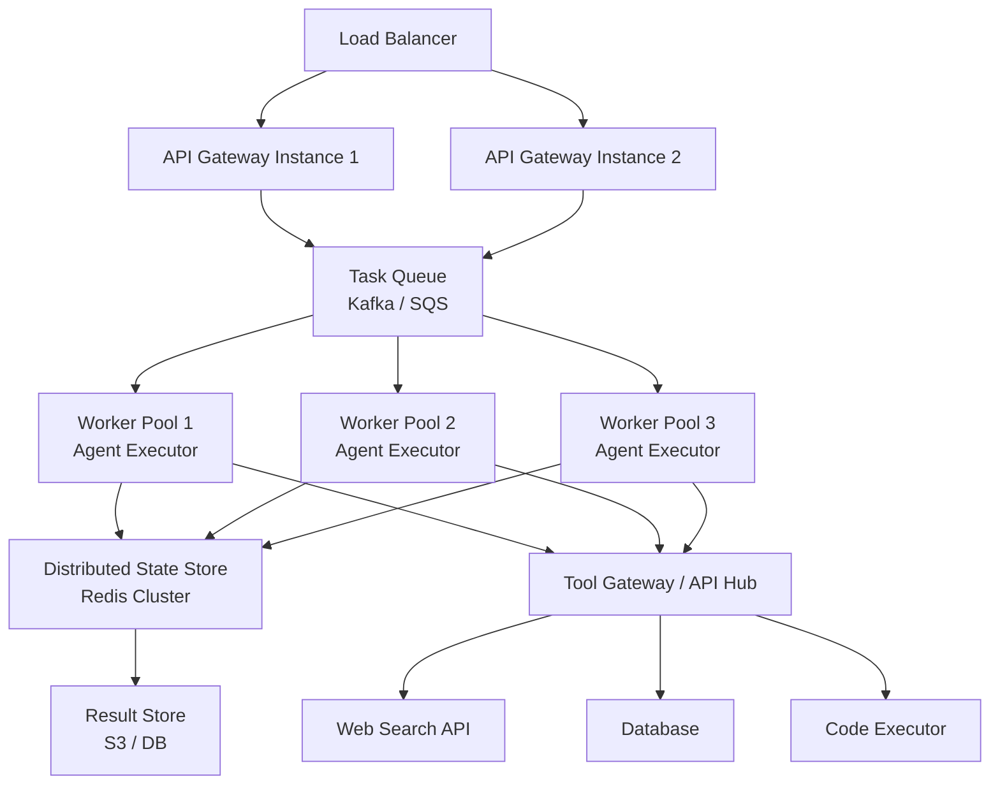

### Pattern 1: Stateless Workers with External State

Agent worker processes should be **stateless** — all agent state is stored externally (Redis, database). This means any worker can pick up any task, which is essential for fault tolerance and horizontal scaling.

```python
class StatelessAgentWorker:
    """Worker that is fully replaceable — state lives in Redis."""

    def process_task(self, task_id: str):
        # Load all state from external store
        state = self.state_store.load(task_id)

        # Process next step
        next_action = self.llm.next_action(state.context)
        result = self.tool_executor.execute(next_action)

        # Update state in external store
        state.add_step(next_action, result)
        state.current_step += 1
        self.state_store.save(task_id, state)

        # Enqueue next step (or mark complete)
        if not state.is_complete():
            self.task_queue.enqueue(task_id, delay=0)
        else:
            self.result_store.finalize(task_id, state.final_answer)
```

### Pattern 2: Task Sharding for Long-Running Agents

For tasks that run for a long time, break them into chunks that can be checkpointed:

```python
class CheckpointedAgent:
    """Agent that saves state at each step for fault tolerance."""

    CHECKPOINT_EVERY_N_STEPS = 5

    def run_step(self, task_id: str):
        state = self.state_store.load(task_id)

        # Execute one step
        action = self.next_action(state)
        result = self.execute(action)
        state.update(action, result)

        # Checkpoint periodically
        if state.step % self.CHECKPOINT_EVERY_N_STEPS == 0:
            self.state_store.checkpoint(task_id, state)

        # If worker dies here, another picks up from last checkpoint
        self.state_store.save_current(task_id, state)
```

### Pattern 3: LLM Rate Limit Management

The LLM API is typically the bottleneck at scale. Manage it carefully:

```python
class LLMRateLimiter:
    """Token bucket rate limiter for LLM API calls."""

    def __init__(self, requests_per_minute: int = 500, tokens_per_minute: int = 2_000_000):
        self.request_bucket = TokenBucket(requests_per_minute, refill_rate=requests_per_minute/60)
        self.token_bucket = TokenBucket(tokens_per_minute, refill_rate=tokens_per_minute/60)

    async def call_llm(self, prompt: str, estimated_tokens: int) -> str:
        await self.request_bucket.consume(1)
        await self.token_bucket.consume(estimated_tokens)
        return await self.llm_client.call(prompt)
```

### Pattern 4: Prioritized Task Queues

Not all agent tasks are equal. A user waiting for a real-time response needs prioritization over a background batch task:

```python
# Task queue with multiple priority lanes
class PrioritizedTaskQueue:
    QUEUES = {
        "realtime": {"priority": 0, "max_latency_ms": 5000},
        "interactive": {"priority": 1, "max_latency_ms": 30000},
        "background": {"priority": 2, "max_latency_ms": 600000},
        "batch": {"priority": 3, "max_latency_ms": 3600000}
    }

    def enqueue(self, task: Task, priority: str = "interactive"):
        queue_config = self.QUEUES[priority]
        self.redis.zadd(
            f"queue:{priority}",
            {task.serialize(): time.time()}  # Score = enqueue time
        )
```

### Scaling the Tool Layer

Tools are also a scaling concern — web search APIs have rate limits, code executors need CPU/memory, database queries need connection pools.

```python
class ToolGateway:
    """Central hub for tool execution with rate limiting and circuit breaking."""

    def __init__(self):
        self.tools = {}
        self.rate_limiters = {}
        self.circuit_breakers = {}
        self.connection_pools = {}

    def execute(self, tool_name: str, args: dict) -> ToolResult:
        # Rate limit check
        self.rate_limiters[tool_name].check()

        # Circuit breaker check
        return self.circuit_breakers[tool_name].call(
            self.tools[tool_name].execute, args
        )
```

---

## 20. How Do You Implement Observability in AI Agents?

Observability in agent systems is harder than in traditional microservices because:
- Execution is non-deterministic (same input, different steps)
- The "logic" is inside the LLM (opaque)
- A single user interaction can spawn dozens of sub-calls
- Failures are often subtle (wrong reasoning, not just errors)

You need three pillars: **traces** (what happened), **metrics** (aggregate health), and **logs** (detailed events).

### Pillar 1: Distributed Tracing

Every agent run should produce a trace that captures the full execution tree, including LLM calls, tool calls, and sub-agent calls.

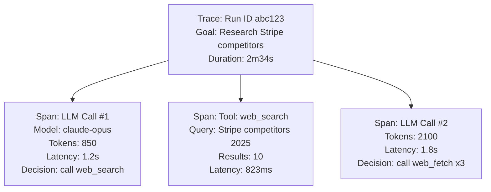

Implementation using OpenTelemetry:

```python
from opentelemetry import trace
from opentelemetry.sdk.trace import TracerProvider
from opentelemetry.sdk.trace.export import BatchSpanProcessor
from opentelemetry.exporter.otlp.proto.grpc.trace_exporter import OTLPSpanExporter

# Setup
provider = TracerProvider()
provider.add_span_processor(BatchSpanProcessor(OTLPSpanExporter()))
trace.set_tracer_provider(provider)
tracer = trace.get_tracer("agent.tracer")

class ObservableAgent:
    def run(self, goal: str, run_id: str) -> AgentResult:
        with tracer.start_as_current_span("agent.run") as run_span:
            run_span.set_attribute("agent.run_id", run_id)
            run_span.set_attribute("agent.goal", goal[:200])  # truncate for storage
            run_span.set_attribute("agent.version", self.version)

            step = 0
            while True:
                with tracer.start_as_current_span(f"agent.step") as step_span:
                    step_span.set_attribute("step.number", step)

                    with tracer.start_as_current_span("llm.call") as llm_span:
                        llm_span.set_attribute("llm.model", self.model)
                        llm_span.set_attribute("llm.prompt_tokens", self.last_prompt_tokens)
                        action = self.get_next_action()
                        llm_span.set_attribute("llm.completion_tokens", self.last_completion_tokens)
                        llm_span.set_attribute("llm.decision", action.type)

                    if action.type == "final_answer":
                        run_span.set_attribute("agent.outcome", "success")
                        run_span.set_attribute("agent.steps_taken", step)
                        break

                    with tracer.start_as_current_span("tool.execute") as tool_span:
                        tool_span.set_attribute("tool.name", action.tool)
                        tool_span.set_attribute("tool.args_keys", list(action.args.keys()))
                        result = self.execute_tool(action)
                        tool_span.set_attribute("tool.success", result.success)
                        if not result.success:
                            tool_span.set_status(trace.StatusCode.ERROR, result.error)

                    step += 1
```

### Pillar 2: Metrics

Track quantitative signals that indicate system health over time:

```python
from prometheus_client import Counter, Histogram, Gauge

# Run-level metrics
agent_runs_total = Counter("agent_runs_total", "Total agent runs", ["status", "agent_type"])
agent_run_duration = Histogram("agent_run_duration_seconds", "Agent run duration",
                               buckets=[5, 10, 30, 60, 120, 300, 600])
agent_steps_per_run = Histogram("agent_steps_per_run", "Steps taken per run",
                                buckets=[1, 3, 5, 10, 20, 50])
active_agent_runs = Gauge("active_agent_runs", "Currently running agents")

# Token/cost metrics
tokens_used_total = Counter("tokens_used_total", "Total tokens consumed", ["model", "type"])
estimated_cost_total = Counter("estimated_cost_usd_total", "Estimated cost in USD", ["model"])

# Tool metrics
tool_calls_total = Counter("tool_calls_total", "Total tool calls", ["tool_name", "status"])
tool_call_duration = Histogram("tool_call_duration_seconds", "Tool call latency", ["tool_name"])

# Quality metrics
agent_success_rate = Gauge("agent_success_rate", "Rolling success rate")
hallucination_flags = Counter("hallucination_flags_total", "Flagged potential hallucinations")
loop_detections = Counter("loop_detections_total", "Detected agent loops")
```

### Pillar 3: Structured Logging

Every meaningful event in the agent lifecycle should produce a structured log event:

```python
import structlog

logger = structlog.get_logger()

class LoggingAgent:
    def on_step_start(self, step: int, run_id: str):
        logger.info("agent.step.start",
                    run_id=run_id,
                    step=step,
                    context_tokens=self.context_manager.token_count())

    def on_tool_call(self, run_id: str, tool: str, args: dict):
        logger.info("agent.tool.call",
                    run_id=run_id,
                    tool=tool,
                    # Don't log sensitive args
                    args_keys=list(args.keys()),
                    args_preview=self._safe_preview(args))

    def on_tool_result(self, run_id: str, tool: str, success: bool, latency_ms: int):
        level = logger.info if success else logger.warning
        level("agent.tool.result",
              run_id=run_id,
              tool=tool,
              success=success,
              latency_ms=latency_ms)

    def on_llm_call(self, run_id: str, model: str, prompt_tokens: int, completion_tokens: int, latency_ms: int):
        logger.info("agent.llm.call",
                    run_id=run_id,
                    model=model,
                    prompt_tokens=prompt_tokens,
                    completion_tokens=completion_tokens,
                    total_tokens=prompt_tokens + completion_tokens,
                    latency_ms=latency_ms,
                    estimated_cost_usd=self._estimate_cost(model, prompt_tokens, completion_tokens))

    def on_run_complete(self, run_id: str, success: bool, steps: int, total_tokens: int, duration_ms: int, reason: str):
        logger.info("agent.run.complete",
                    run_id=run_id,
                    success=success,
                    steps=steps,
                    total_tokens=total_tokens,
                    duration_ms=duration_ms,
                    termination_reason=reason)
```

### The Reasoning Audit Log

For compliance and debugging, maintain a separate reasoning audit log that captures the LLM's thoughts at each step:

```python
class ReasoningAuditLogger:
    """Immutable audit log of agent reasoning — append-only, tamper-evident."""

    def log_reasoning_step(self, run_id: str, step: int, thought: str, decision: str):
        entry = {
            "run_id": run_id,
            "step": step,
            "timestamp": datetime.utcnow().isoformat(),
            "thought": thought,
            "decision": decision,
            "hash": self._compute_hash(run_id, step, thought, decision)
        }
        self.audit_store.append(entry)  # Append-only store (e.g., S3, CloudWatch Logs)

    def get_reasoning_trace(self, run_id: str) -> List[dict]:
        return self.audit_store.query(run_id=run_id)
```

### Alerting on Agent Health

Set up alerts on key signals:

```python
ALERT_RULES = [
    {
        "name": "High agent failure rate",
        "condition": "rate(agent_runs_total{status='failure'}[5m]) / rate(agent_runs_total[5m]) > 0.15",
        "severity": "critical",
        "action": "page_oncall"
    },
    {
        "name": "Frequent loop detection",
        "condition": "rate(loop_detections_total[10m]) > 5",
        "severity": "warning",
        "action": "slack_alert"
    },
    {
        "name": "LLM cost spike",
        "condition": "rate(estimated_cost_usd_total[1h]) > 50",
        "severity": "warning",
        "action": "slack_alert"
    },
    {
        "name": "High p95 agent latency",
        "condition": "histogram_quantile(0.95, agent_run_duration_seconds) > 120",
        "severity": "warning",
        "action": "slack_alert"
    }
]
```

### The Observability Dashboard

Key panels to show in your agent monitoring dashboard:

| Panel | Metric | Why |
|-------|--------|-----|
| Active runs | `active_agent_runs` | Real-time capacity view |
| Success rate (1h) | `runs success / total` | Primary health signal |
| Avg steps/run | `mean(agent_steps_per_run)` | Efficiency signal |
| p95 latency | 95th pct of `agent_run_duration` | User experience signal |
| Token consumption | `rate(tokens_used_total[1h])` | Cost driver |
| Tool error rate | Per-tool failure rate | Dependency health |
| Loop detections | `rate(loop_detections_total[1h])` | Quality signal |
| Cost/run | `cost_total / runs_total` | Economic signal |

---

## Summary: Key Principles for Production Agent Systems

Tying it all together, here are the principles that separate good agent architectures from brittle ones:

**1. Start simple**: The best agent is the simplest one that solves the problem. Add complexity only when justified by capability requirements.

**2. Fail gracefully**: Every component should degrade gracefully — retry on transient errors, fall back on permanent ones, and always return something useful to the user.

**3. Make reasoning auditable**: If you can't trace why an agent made a decision, you can't debug it or trust it. Capture thought chains, not just inputs and outputs.

**4. Control costs and loops explicitly**: Token budgets, step limits, and time limits are not optional — they are safety valves. Ship without them and you will have production incidents.

**5. Design for state externalization**: Agent workers should be stateless. State lives in Redis, databases, or vector stores — not in the process memory.

**6. Tool descriptions are prompts**: The quality of your tool descriptions directly determines tool selection accuracy. Treat them with the same care as system prompts.

**7. Memory architecture is a first-class design concern**: Decide upfront what goes in working memory vs. session storage vs. long-term vector memory. Retrofitting memory is painful.

**8. Observe everything**: Traces, metrics, and logs for every LLM call, tool call, and reasoning step. You cannot optimize what you cannot measure.

**9. Test with adversarial inputs**: Agent systems fail in ways that unit tests don't catch. Test with ambiguous goals, conflicting tool results, and unexpected tool failures.

**10. Human-in-the-loop for irreversible actions**: Sending emails, spending money, deleting data — these should always have a human approval gate until you have strong empirical evidence that the agent's accuracy is high enough to trust.

---

*Document generated for interview preparation. Target audience: Senior Software Engineers building or evaluating Agentic AI systems.*